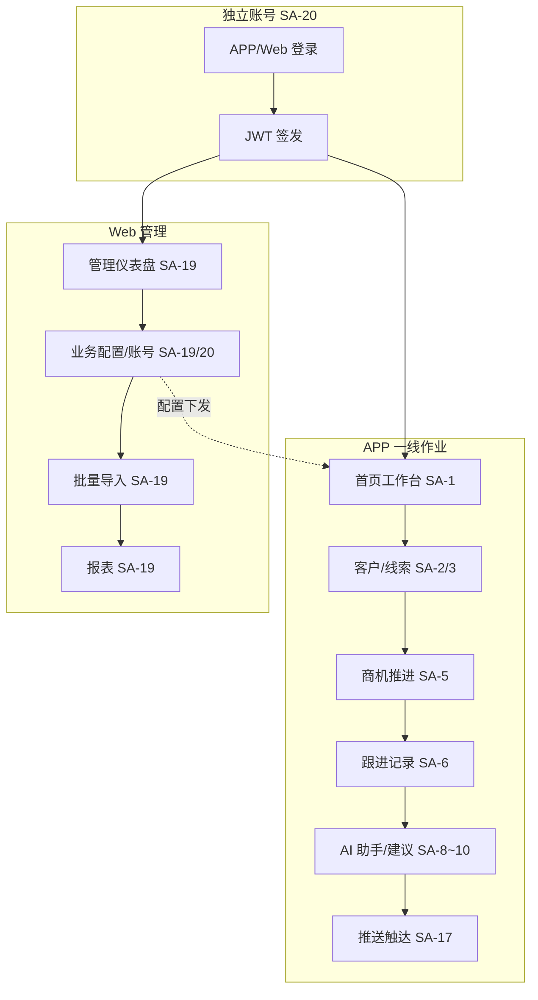

# AI 智能 CRM 管理 PRD 设计评审文档

## 文档信息

| 项目 | 内容 |
|------|------|
| 文档名称 | AI 智能 CRM 管理 PRD 设计评审文档 |
| 文档版本 | V1.0 |
| 文档状态 | **冻结版**（Web MVP · 步骤4 G2-A 2026-06-08；原生 APP 页留步骤5） |
| 适用范围 | `ai-smart-crm`（APP：iOS+Android；Web：`/ai-smart-crm-admin`） |
| 关联文档 | `01-需求说明书.md`（V1.2）、`产品设计文档.md`、**`04-界面设计文档.md`**、`SDD-v1.0.md`、`SDD-v1.0.json`、`页面-路由-接口-数据表映射表.md` |

> 详尽度要求（强制）：每模块「（1）功能需求」至少 3 条，覆盖对象范围/处理规则/结果约束。

## 版本变更记录

| 版本 | 变更日期 | 变更摘要 | 责任人 | 评审轮次 | 评审结论 |
|------|----------|----------|--------|----------|----------|
| V1.0 | 2026-06-08 | Web MVP G2-A 冻结；APP 原生留步骤5 | AI产品组 | 第2轮 | **通过** |
| V1.0 | 2026-06-05 | 首版：双端 MVP 模块 PRD 基线 | AI产品组 | 第1轮 | 待评审 |

---

## 一、项目概述

### 1.1 项目简述

建设 AI 智能 CRM 双端子应用：APP 支撑外勤销售作业与 AI 辅助，Web 管理台支撑配置治理与批量运营，共用独立账号与 MongoDB 业务 API。

### 1.2 项目目标

1. MVP 双端同期上线：一线 CRM 闭环 + 独立账号 + Web 基础治理
2. AI 辅助可度量：话术采纳、跟进建议、意向评分可解释
3. 全链路可追溯：需求 SA → 模块 M → API → 表 → AT 一一映射

### 1.3 交付范围

- **APP 端**：登录、工作台、客户/线索/商机、跟进、AI 助手/建议、名片 OCR、推送、设置、双端构建
- **Web 端**：登录、仪表盘、主数据管理、业务配置、导入导出、基础报表、用户角色组织、审计
- **后端**：`AIEP-SERVER/src/apps/ai-smart-crm/` REST API + 独立账号服务
- **非本期**：AIEP SSO、小程序、应用商店运营、复杂审批流（R2）

### 1.4 业务流程（双端）

---

## 二、系统流程与评审准入

### 2.1 操作流程（评审关注）

| 流程 | 检查点 |
|------|--------|
| 登录 | 双端共用 API；Token 刷新；锁定与强制下线 |
| 导航 | APP Tab≤5；Web 侧栏≤8；深链/路由可直达 |
| 数据 | 列表分页；详情 360°；离线草稿与服务端冲突策略 |
| 表单 | 必填校验；防重提交；失败保留输入 |
| 异常 | 断网/超时/403/404/AI 降级均有文案与恢复动作 |

### 2.2 评审会前检查清单

| 序号 | 检查项 | 责任角色 | 完成 |
|------|--------|----------|------|
| 1 | 版本号、状态、评审轮次已更新 | 产品 | N |
| 2 | 需求说明书 V1.2 与 PRD/SDD 版本一致 | 产品 | N |
| 3 | 模块 M01~M21 与 SA-01~21 映射完整 | 产品/测试 | N |
| 4 | 页面-路由-接口-数据表映射表已更新 | 产研 | N |
| 5 | MVP 接口契约已冻结 | 研发 | N |
| 6 | 物理模型与 SDD §7 一致 | 研发 | N |
| 7 | 权限边界到页面+接口 | 产研 | N |
| 8 | 关键异常路径已定义 | 产研测 | N |
| 9 | DoD 与 GWT 可执行 | 测试 | N |
| 10 | 遗留问题清单已建立 | 产品 | N |

---

## 三、功能说明

### 3.0 模块编号清单（强制）

| 模块 | 名称 | 需求 | 客户端 | 切片 |
|------|------|------|--------|------|
| M01 | 销售工作台 | SA-1 | APP | MVP |
| M02 | 客户管理 | SA-2 | APP+Web | MVP |
| M03 | 线索管理 | SA-3 | APP+Web | MVP |
| M04 | 联系人管理 | SA-4 | APP+Web | MVP |
| M05 | 商机与销售漏斗 | SA-5 | APP+Web | MVP |
| M06 | 活动与跟进 | SA-6 | APP+Web | MVP |
| M07 | 合同与回款 | SA-7 | APP+Web | R1 |
| M08 | AI 客户画像与评分 | SA-8 | APP | MVP |
| M09 | AI 销售助手 | SA-9 | APP | MVP |
| M10 | AI 跟进建议 | SA-10 | APP | MVP |
| M11 | AI 销售预测 | SA-11 | APP+Web | R1 |
| M12 | AI 知识库 | SA-12 | APP+Web | R1 |
| M13 | 客户服务工单 | SA-13 | APP+Web | R1 |
| M14 | 移动端数据采集 | SA-14 | APP | MVP |
| M15 | 报表与简报 | SA-15 | APP+Web | MVP简报/R1全量 |
| M16 | APP 设置与个人中心 | SA-16 | APP | MVP |
| M17 | 消息推送与触达 | SA-17 | APP | MVP |
| M18 | APP 构建与发布 | SA-18 | APP | MVP |
| M19 | Web 管理台 | SA-19 | Web | MVP |
| M20 | 独立账号与认证 | SA-20 | APP+Web | MVP |
| M21 | Web 子应用打包 | SA-21 | Web | MVP |

---

### 3.1 M01 销售工作台（APP）

#### （1）功能需求

1. 支持**个人维度** KPI 卡片（待跟进、新增线索、在途金额、赢单率），可按本周/本月切换时间范围。
2. 支持**待办聚合**（待跟进商机、新分配线索、AI 建议、工单），点击卡片跳转对应详情深链。
3. 输出**漏斗摘要条**与 AI 洞察卡片，无数据时展示引导空态（去新建线索/记跟进）。

#### （2）功能流程

启动 APP → 校验 Token → 首页 Tab → 并行请求 KPI/待办/漏斗 → 渲染；下拉刷新重拉。

#### （3）功能设计

- 页面：`AppHomePage`；FAB 展开「记跟进/扫名片/新建线索」
- 权限：销售看本人；主管可切换「团队」Tab（只读简报，详 SA-15）
- 加载：骨架屏；失败显示重试条

#### （4）数据存储设计

- 读：`crm_opportunity`、`crm_lead`、`crm_ai_suggestion`、`crm_ticket` 聚合
- 缓存：客户端内存缓存 KPI 摘要 5min

#### （5）注意事项

指标口径与 Web 报表一致，定义见 SDD `success_metrics`。

#### （6）输入/输出与异常

- 输入：用户 ID、时间范围、数据权限范围
- 输出：KPI 对象、待办列表、漏斗摘要
- 异常：401 跳登录；超时显示缓存+刷新；空数据展示空态
- 验收：Given 已登录有商机，When 进入首页，Then KPI 与待办渲染且可跳转

---

### 3.2 M02 客户管理（APP + Web）

#### （1）功能需求

1. 支持客户**列表筛选**（名称、行业、级别、标签、负责人、时间）与分页排序。
2. 支持客户**新增/编辑/停用**，必填名称+类型+负责人；标签多选与 A/B/C/D 分级。
3. 支持客户**360° 详情**：分段展示联系人、商机、时间线、合同、工单、AI 画像；APP 顶部外呼/记跟进/AI 助手操作栏。

#### （2）功能流程

列表筛选 → 进详情 → Tab 切换关联数据 → 编辑保存 → 列表刷新。

#### （3）功能设计

- APP：`CustomerListPage` / `CustomerDetailPage`
- Web：`AdminCustomerList` / `AdminCustomerDetail`（表格+抽屉）
- 合并：Web 提供重复客户合并；APP 仅提示重复

#### （4）数据存储设计

- 表：`crm_customer`、`crm_customer_tag`（嵌入或关联）
- 权限：本人/团队/全公司按角色过滤 `owner_id`

#### （6）输入/输出与异常

- 异常：重复客户提示合并；403 隐藏他人数据；停用二次确认
- 验收：Given 销售角色，When 查询客户列表，Then 仅返回权限范围内记录

---

### 3.3 M03 线索管理（APP + Web）

#### （1）功能需求

1. 支持线索**录入**（APP 快速表单 ≤4 必填项；Web 完整表单）、列表筛选与状态流转。
2. 支持**公海池**领取与分配（规则 Web 配置）；超领/保护期冲突阻断并提示。
3. 支持**一键转化**为客户+联系人+初始商机，保留来源链路与评分。

#### （4）数据存储设计

- 表：`crm_lead`；状态枚举 `LEAD_STATUS`（见 SDD §6）
- 公海规则读 `crm_config_pool`

#### （6）验收

Given 公海有可领线索，When 销售领取，Then 负责人更新且推送通知（SA-17）

---

### 3.4 M04 联系人管理（APP + Web）

#### （1）功能需求

1. 支持联系人 CRUD，关联客户；字段含决策角色标签。
2. 支持**主联系人唯一**约束，变更写审计日志。
3. 详情展示关联商机与活动摘要。

#### （4）数据存储设计

- 表：`crm_contact`；`is_primary` 唯一索引（per customer）

---

### 3.5 M05 商机与销售漏斗（APP + Web）

#### （1）功能需求

1. 支持商机**列表视图**（默认）与 APP **横向阶段看板**，Web 可选看板+列表。
2. 支持阶段**切换**（ActionSheet/下拉），必填项未满足时引导补全；回退须填原因。
3. 支持**赢单/输单**关闭，输单原因必选；赢单可跳转合同（R1 完整，MVP 可登记意向）。

#### （3）功能设计

- 阶段颜色读 `crm_config_stage`
- APP 长按/右滑改阶段；防误触二次确认关单

#### （6）验收

Given 商机在阶段 A，When 切换至 B，Then 时间线新增阶段变更记录

---

### 3.6 M06 活动与跟进（APP + Web）

#### （1）功能需求

1. 支持活动类型电话/拜访/微信/会议/其他，关联客户/商机/联系人。
2. APP 支持**快速跟进**（最少字段）、**外呼**（tel:）、**语音转文字**（可选）、**离线草稿**。
3. 支持下次跟进时间与**推送提醒**（SA-17）；时间线倒序聚合。

#### （4）数据存储设计

- 表：`crm_activity`；离线草稿 `crm_offline_draft`（客户端 local + 服务端同步表）

#### （6）异常

弱网草稿本地保存；恢复后提示同步；冲突以服务端为准

---

### 3.7 M07 合同与回款（R1 摘要）

合同 CRUD、回款计划与到账登记、与商机关联；Web 完整维护，APP 只读+简易登记。详见 R1 PRD 增量。

---

### 3.8 M08 AI 客户画像与评分（APP）

#### （1）功能需求

1. 展示意向分 0–100、等级、较上周变化及 **Top3 影响因子**。
2. 客户/商机/活动变更后**异步重算**；列表展示最近评分时间。
3. AI 不可用时展示**缓存分**并标记「待更新」；支持「不准」反馈。

#### （4）数据存储设计

- 表：`crm_ai_score`、`crm_ai_feedback`

#### （6）验收

Given 客户有 3 次跟进，When 打开画像卡片，Then 展示分数与可解释因子

---

### 3.9 M09 AI 销售助手（APP）

#### （1）功能需求

1. 客户/商机详情唤起 **Bottom Sheet** 对话；场景：话术/微信草稿/异议应对。
2. 生成内容**流式输出**，须用户确认后复制；记录采纳/弃用。
3. **配额限流**与敏感词过滤；超时降级提示。

#### （4）数据存储设计

- 表：`crm_ai_chat_log`；调用 AI 网关 API `POST /api/ai-smart-crm/ai/assistant`

---

### 3.10 M10 AI 跟进建议（APP）

#### （1）功能需求

1. 批处理+事件触发产生建议（停滞、阶段变更等）。
2. 首页待办与消息 Tab 双入口；支持采纳/忽略/延后。
3. 高优先级建议可触发推送（SA-17）。

#### （4）数据存储设计

- 表：`crm_ai_suggestion`

---

### 3.11 M11~M13（R1 摘要）

| 模块 | 要点 |
|------|------|
| M11 销售预测 | 个人/团队预测区间；Web 全量报表 |
| M12 知识库 | Web 维护；APP 检索问答 |
| M13 工单 | 双端列表+处理；推送到达 |

---

### 3.12 M14 移动端数据采集（APP）

#### （1）功能需求

1. **名片 OCR** 拍摄识别姓名/手机/公司/职位，确认后生成线索草稿。
2. **通讯录单选导入**（系统授权）生成线索。
3. **拍照附件**上传跟进/工单，压缩+进度条；重复手机号提示去重。

#### （6）验收

Given 拍摄清晰名片，When OCR 完成，Then 表单预填且可编辑后保存

---

### 3.13 M15 报表与简报

- **APP MVP**：个人/团队简报卡片（SA-15）
- **Web MVP**：管理仪表盘 + 基础漏斗/排行
- **R1**：全量导出与多维下钻

---

### 3.14 M16 APP 设置与个人中心

消息开关、免打扰、脱敏、缓存清理、版本检查；登录依赖 M20。

---

### 3.15 M17 消息推送与触达

推送类型、深链参数、合并策略、回执上报；对接厂商通道（个推/极光，SDD 配置）。

---

### 3.16 M18 APP 构建与发布

uni-app 工程 `AIEP-APP/ai-smart-crm/`（建议路径）；双端构建、环境配置、埋点。

---

### 3.17 M19 Web 管理台

#### （1）功能需求

1. **管理仪表盘**与主数据列表（客户/线索/商机等）批量操作。
2. **业务配置**：销售阶段、字典标签、公海规则、AI 配置发布。
3. **导入导出**：Excel 模板、异步导入、行级错误报告；报表导出。

#### （3）功能设计

- 侧栏导航见产品设计文档 §2.2
- 高风险操作二次确认；审计写 `crm_audit_log`

---

### 3.18 M20 独立账号与认证（APP + Web）

#### （1）功能需求

1. 管理员 Web **创建用户**、分配角色、重置密码；本期不做开放注册。
2. **登录/刷新/登出**；JWT 双 Token；失败锁定与强制下线。
3. **组织树**与数据权限：本人/团队/全公司。

#### （4）数据存储设计

- 表：`crm_user`、`crm_role`、`crm_organization`、`crm_user_session`

---

### 3.19 M21 Web 子应用打包

`build:ai-smart-crm-admin` → `dist/ai-smart-crm-admin/`；Hash 路由嵌入 AIEP。

---

### 3.20 详尽度与防遗漏检查

| 检查项 | 要求 | 结果 |
|--------|------|------|
| 功能需求详尽度 | 每模块≥3条能力点 | 待评审 |
| 模块说明完整性 | 含需求/流程/设计/存储/异常 | MVP 模块已填 |
| SA-M 映射 | 一一可追溯 | 通过 |
| 模块-接口映射 | 见映射表 | 待研发确认 |
| 异常与恢复 | 每模块≥1条 | MVP 已填 |
| 验收可执行 | GWT 见 SDD §10 | 待测试确认 |

---

## 四、非功能需求

1. **性能**：APP 首屏 ≤2s；Web 首屏 ≤3s；列表分页 P95 ≤2s
2. **可用性**：弱网草稿恢复 ≥95%；登录成功率 ≥99.5%
3. **兼容**：iOS 14+、Android 8+；Web Chrome/Edge 最新两版
4. **安全**：HTTPS、密码 bcrypt、敏感字段脱敏、审计日志
5. **可维护性**：双端共用 API；SDD JSON 机读校验
6. **可测试性**：MVP 每个 AT 有 API 测试用例

---

## 五、物理模型（摘要）

| 模块 | 核心表 |
|------|--------|
| M20 | crm_user, crm_role, crm_organization |
| M02~06 | crm_customer, crm_lead, crm_contact, crm_opportunity, crm_activity |
| M08~10 | crm_ai_score, crm_ai_suggestion, crm_ai_chat_log |
| M17 | crm_notification |
| M19 | crm_config_stage, crm_config_dict, crm_config_pool, crm_import_batch, crm_audit_log |

字段级全量 DDL 见 `02-研发与测试/数据库设计文档.md`（G2 后补齐）。

---

## 六、标准编码（摘要）

| 属性 | 编码 | 枚举 |
|------|------|------|
| 线索状态 | LEAD_STATUS | NEW/FOLLOWING/CONVERTED/INVALID/POOL |
| 商机阶段 | OPP_STAGE | 动态配置，内置 LEAD/QUALIFY/PROPOSAL/NEGOTIATE/WON/LOST |
| 活动类型 | ACTIVITY_TYPE | CALL/VISIT/WECHAT/MEETING/OTHER |
| 工单状态 | TICKET_STATUS | PENDING/PROCESSING/WAIT_CONFIRM/CLOSED |
| 客户级别 | CUSTOMER_LEVEL | A/B/C/D |

---

## 七、DoD 验收清单（MVP 摘要）

| 功能项 | 开发 DoD | 测试标准 | 交付物 |
|--------|----------|----------|--------|
| 双端登录 | JWT 流程通 | AT-20-01~03 | 登录录屏 |
| 首页工作台 | KPI+待办 | AT-01 | 截图 |
| 客户商机闭环 | CRUD+跟进 | AT-02~06 | 流程录屏 |
| AI 助手 | 可复制+留痕 | AT-08~09 | 日志 |
| Web 配置导入 | 发布+导入报告 | AT-19~20 | 导出文件 |
| 双端打包 | 构建成功 | AT-18/21 | 构建日志 |

---

## 评审结论（会后填写）

- 评审轮次：第1轮
- 对应版本：V1.0
- 评审结果：待评审
- 必改项数量：—
- 结论说明：待填写

---

## 附件：设计评审问题清单

| 轮次 | 版本 | 模块 | 问题 | 等级 | 状态 |
|------|------|------|------|------|------|
| 第1轮 | V1.0 | — | 待评审收集 | — | 待处理 |
