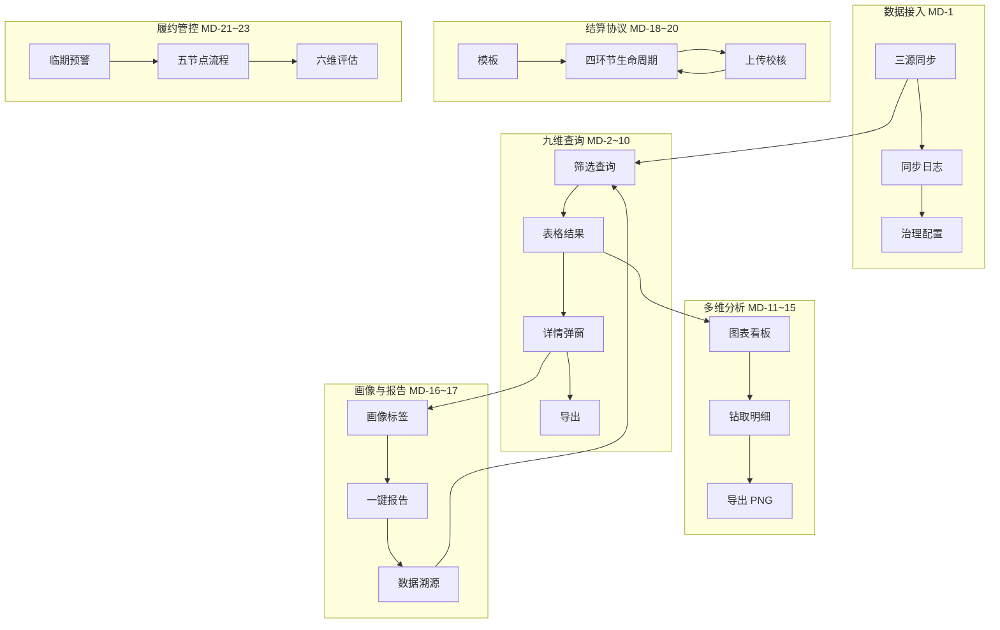

# 售电公司营销分析 Demo PRD 设计评审文档

## 文档信息

| 项目 | 内容 |
|------|------|
| 文档名称 | 售电公司营销分析 Demo PRD 设计评审文档 |
| 文档版本 | V1.1 |
| 文档状态 | **冻结版**（步骤4 PO 确认，2026-06-06） |
| 适用范围 | `marketing-demo`（Web：`/marketing-demo`） |
| 关联文档 | `01-需求说明书.md`（V1.1-demo）、`产品设计文档.md`、**`04-界面设计文档.md`（V1.1 已冻结）**、`17-需求确认单.md`、**`SDD-v1.0`**、**`页面-路由-接口-数据表映射表.md`** |

> 详尽度要求（强制）：每模块「功能需求」至少 3 条，覆盖对象范围/处理规则/结果约束。

## 版本变更记录

| 版本 | 变更日期 | 变更摘要 | 责任人 | 评审轮次 | 评审结论 |
|------|----------|----------|--------|----------|----------|
| V1.1 | 2026-06-06 | 步骤4 界面确认冻结；G2-A 全项通过；PRD 升版 | AI产品组 | 第2轮 | **通过** |
| V1.0 | 2026-06-06 | 首版：全量 MD-1～23 模块 PRD 基线 + 界面草案引用 | AI产品组 | 第1轮 | 待评审 |

---

## 一、项目概述

### 1.1 项目简述

建设售电公司营销分析 Web Demo 子应用，覆盖数据接入、九维查询、四维分析、业务画像、一键报告、结算协议与履约管控全链路。界面遵循 YXUI，数据以 Mock API 仿真，具备可替换接口契约。

### 1.2 项目目标

1. MD-1～MD-23 100% 交付，每条需求 C1～C6 闭环验收通过
2. 端到端主链路可走通：接入→查询→分析→画像→报告→协议→履约
3. 独立打包 + 主应用嵌入双模式可访问

### 1.3 交付范围

- **前端**：29 页面、Mock Store、YXUI 样式作用域、ECharts 看板
- **文档**：需求确认单、产品设计、界面设计、PRD（本文档）、SDD、映射表
- **非本期**：真实外部系统对接、短信/OCR/移动端/复杂工作流引擎

### 1.4 业务流程

---

## 二、系统流程与评审准入

### 2.1 操作流程（评审关注）

| 流程 | 检查点 |
|------|--------|
| 导航 | 侧栏→页签→内容区；29 路由与菜单一致 |
| 查询 | 筛选校验；分页重置；四态完整 |
| 同步 | 立即同步 loading；日志追加；查询数据更新 |
| 导出 | 异步进度；成功下载；失败重试 |
| 协议 | 四环节状态机；审核驳回可恢复 |
| 履约 | 临期配置持久化；五节点留痕 |
| 跨模块 | companyId 关联；溯源 query 带参跳转 |
| 异常 | 超时/空结果/校验失败均有文案与动作 |

### 2.2 评审会前检查清单

| 序号 | 检查项 | 责任角色 | 完成 |
| --- | --- | --- | --- |
| 1 | 版本号、状态已更新 | 产品 | Y |
| 2 | 需求追踪矩阵与 PRD 一致 | 产品/测试 | Y |
| 3 | 29 页界面清单与路由一致 | 产品/研发 | Y |
| 4 | 页面-路由-接口映射 | 产品/研发 | N（G2-B） |
| 5 | Mock API 契约 | 研发 | N（G2-B） |
| 6 | 权限边界 | 产品 | Y（Demo 2 角色） |
| 7 | 关键异常路径 | 产品/研发 | Y |
| 8 | DoD 与 AT 编号 | 测试 | N（SDD 定稿后） |
| 9 | 界面原型可访问 | 研发 | Y |
| 10 | validate:sub-app-registry 通过 | 研发 | Y |

---

## 三、用户故事（P0 全量）

| 编号 | 用户故事 | 需求 | 验收标准（摘要） |
|------|----------|------|------------------|
| US-01 | 作为管理员，我希望配置并触发三源数据同步，以便下游模块使用最新数据 | MD-1 | Given 接入总览 When 立即同步 Then 日志追加且 MD-2 可查到新数据 |
| US-02 | 作为管理员，我希望查看工商 14 类接入明细 | MD-1.1 | Given 工商任务 When 打开详情 Then 14 Tab 均有样例 |
| US-03 | 作为业务员，我希望在九个维度完整查询并导出 | MD-2~10 | Given 任一查询页 When 筛选提交 Then 四态正确且可导出 |
| US-04 | 作为分析师，我希望完成四维分析并钻取明细 | MD-11~15 | Given 分析看板 When 点击钻取 Then 明细弹窗或跳转查询页 |
| US-05 | 作为分析师，我希望维护企业画像标签并追溯历史 | MD-16 | Given 画像详情 When 增删标签 Then 历史轴追加且可导出 PDF |
| US-06 | 作为管理者，我希望用标准模板生成多格式报告并溯源 | MD-17 | Given 报告生成 When 完成 Then 可下载且溯源跳转查询页 |
| US-07 | 作为协议员，我希望维护多版本协议模板 | MD-18 | Given 模板页 When CRUD Then 生命周期可引用 |
| US-08 | 作为协议员，我希望完成签订/变更/续签/作废全流程 | MD-19 | Given 生命周期页 When 走四环节 Then 状态可追溯 |
| US-09 | 作为协议员，我希望上传并校核协议后入库 | MD-20 | Given 上传页 When 校核通过 Then 生命周期可见 |
| US-10 | 作为履约员，我希望配置临期天数并查看预警列表 | MD-21 | Given 临期页 When 保存配置 Then 列表预警刷新 |
| US-11 | 作为履约员，我希望跟踪五节点履约流程 | MD-22 | Given 流程页 When 逐节点操作 Then 时间轴留痕 |
| US-12 | 作为履约员，我希望生成六维履约评估报告 | MD-23 | Given 评估页 When 评估 Then 等级+报告+建议工单 |

---

## 四、模块功能需求

### M01 数据接入（MD-1）

**（1）三源同步看板**

- 对象：天眼查工商、山东电力交易中心、营销结算中台
- 规则：支持立即同步与计划时间展示；同步结果写 Mock 库
- 结果：看板指标、日志列表即时刷新

**（2）工商 14 类明细**

- 对象：MD-1.1 定义的 14 类数据
- 规则：Tab 分栏展示；按企业匹配；禁止空 Tab
- 结果：弹窗可查阅；同步后 MD-2 可读

**（3）接入治理配置**

- 对象：脱敏规则、权限矩阵、更新策略
- 规则：表单校验；保存 Mock 持久化
- 结果：再次进入数据一致；查询页按规则脱敏展示

### M02 综合查询（MD-2～MD-10）

**（1）统一查询范式**

- 对象：九维查询页
- 规则：MdQueryLayout + queryConfigs 驱动；分页 10/20/50
- 结果：筛选→表格→详情→导出闭环

**（2）特殊交互**

- MD-3 未结清欠费行高亮 `#E6A23D`
- MD-4 临期保函与 MD-21 配置联动
- MD-7 宽表横向滚动；钻取至 MD-11
- MD-8 套餐详情弹窗；MD-10 日损益折线+弹窗

**（3）跨模块跳转**

- 详情弹窗可跳转画像 `/profile/:companyId`、报告生成带参

### M03 多维分析（MD-11～MD-15）

**（1）四维看板**

- 经营效益：月季年 Tab + 全省对比 + 成本构成
- 市场表现：份额/交易行为/用户结构/区域四 Tab + 热力图
- 风险预警：五级分布 + 预警列表 + 详情弹窗
- 对比分析：选企 1～5 + 同业/趋势/标杆三模式

**（2）钻取与导出（MD-15）**

- 强制 4 条钻取路径（见 04-界面设计文档 §3.3）
- 图表 PNG 导出 Mock 下载

### M04 业务画像（MD-16）

- 五类标签 + 自定义标签 CRUD
- 变更历史时间轴
- 画像 PDF 导出 Mock

### M05 一键报告（MD-17）

- 三种标准模板 + 自定义 + 个人模板库
- 分步表单：模板→企业→模块→预览
- PDF/Word/Excel 导出 + 数据溯源跳转

### M06 结算协议（MD-18～MD-20）

- 模板多版本 CRUD（抽屉表单）
- 生命周期四环节状态机 + 留痕时间轴
- 批量上传 + Mock 字段提取 + 校核通过/驳回

### M07 履约管控（MD-21～MD-23）

- 临期天数配置持久化 + 预警列表
- 五节点流程可视化 + 节点详情弹窗
- 六维评估 + 五级结果 + 报告弹窗 + 建议工单 Mock

### M08 工程集成（MD-24）

- `npm run build:marketing-demo` 成功
- `validate:sub-app-registry --app marketing-demo` 通过
- 样式作用域 `.marketing-demo-scope` 不污染主应用

---

## 五、非功能需求（PRD 口径）

| 编号 | 需求 | 验收 |
|------|------|------|
| NFR-1 | YXUI 规范 | 主色/布局/字号抽检 |
| NFR-3 | 真实交互 | 全部操作走 Mock API |
| NFR-7 | 权限 Demo | 2 角色按钮可见性 |
| NFR-10 | 独立打包 | build 产物可打开 |
| NFR-11 | 完整闭环 | C1～C6 逐条验收 |

---

## 六、界面与 PRD 映射

| 模块 | 页面数 | 界面详设章节 |
|------|--------|--------------|
| M01 | 5 | 04-界面设计 §三.2、§五.1 |
| M02 | 9 | 04-界面设计 §四 |
| M03 | 4 | 04-界面设计 §三.3 |
| M04 | 2 | 04-界面设计 §八 |
| M05 | 2 | 04-界面设计 §五.2 |
| M06 | 3 | 04-界面设计 §五.3、§九 |
| M07 | 3 | 04-界面设计 §五.4、§七 |
| 工作台 | 1 | 04-界面设计 §三.1 |

---

## 七、遗留问题与风险

| 编号 | 问题 | 影响 | 计划 |
|------|------|------|------|
| R-01 | ~~SDD 与映射表未定稿~~ | — | **G2-B 已补齐**（2026-06-06） |
| R-02 | OQ-1/OQ-2 生产嵌入方式未定 | 仅 Demo | 生产前闭合 |
| R-03 | 部分页面 Mock 闭环待 G3 逐项验收 | 质量 | 步骤5 测试（进行中） |

---

## 八、评审结论（待填写）

| 评审轮次 | 日期 | 参与人 | 结论 | 遗留项 |
|----------|------|--------|------|--------|
| 第2轮 | 2026-06-06 | PO/TL/研发/测试 | **通过** | 进入步骤5 G3 开发测试 |
| 第1轮 | 2026-06-06 | PO/TL/研发/测试 | 通过（草案） | SDD、映射表、G2-A 冻结 |

---

## 九、变更记录

| 版本 | 日期 | 变更摘要 |
|------|------|----------|
| V1.1 | 2026-06-06 | 步骤4 PRD 冻结版 |
| V1.0 | 2026-06-06 | 步骤3 PRD 草案首版 |
