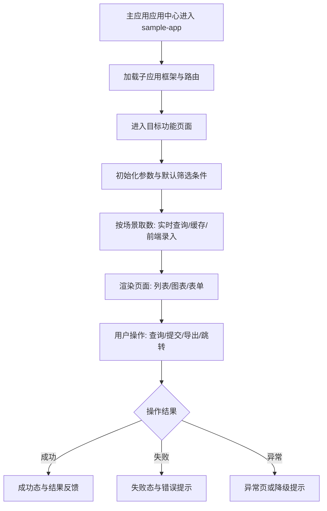
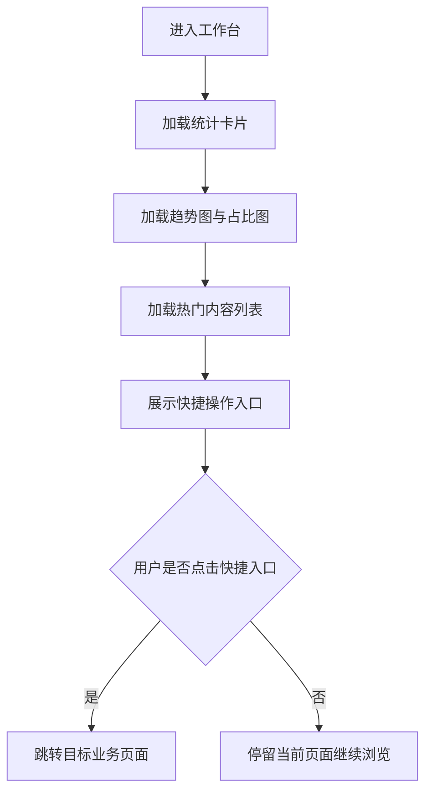
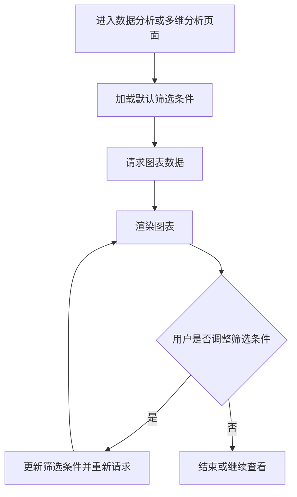
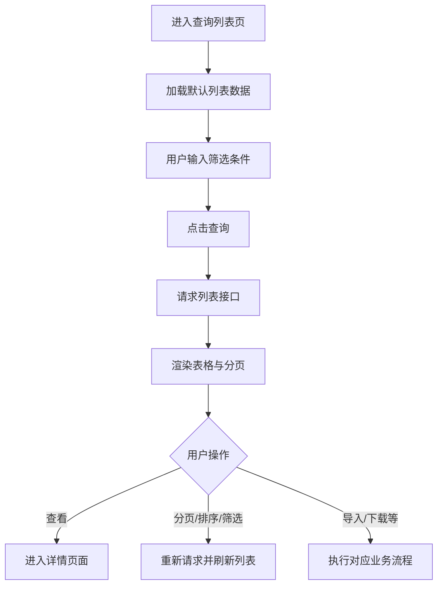
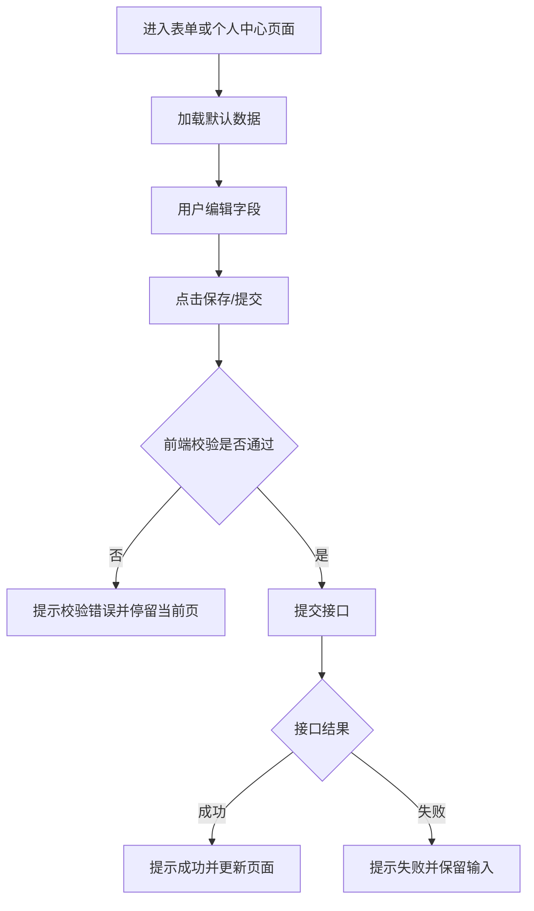
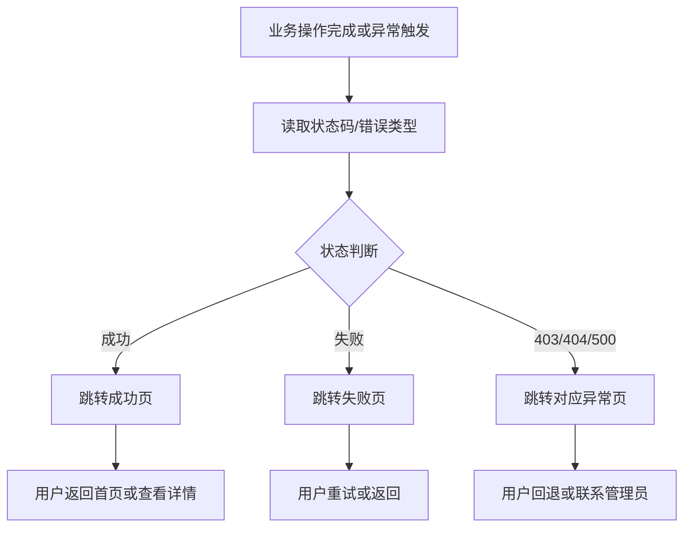

# 示例应用（sample-app）PRD设计评审文档

## 文档信息

| 项目 | 内容 |
|------|------|
| 文档名称 | 示例应用（sample-app）PRD设计评审文档 |
| 文档版本 | V1.0 |
| 文档状态 | 待评审 |
| 适用范围 | `sample-app` 子应用（主应用路由前缀 `/sample-app`） |
| 关联文档 | `需求说明书.md`、`产品设计文档.md` |

## 版本变更记录

> 维护原则：本文档始终保留最新全量内容；历史迭代通过本表和正文变更标记追溯。

| 版本 | 变更日期 | 变更章节 | 变更摘要 | 责任人 | 评审轮次 | 评审结论 |
|------|------|------|------|------|------|------|
| V1.0 | 2026-04-11 | 首版 | 建立可评审 PRD 基线（流程、功能、数据、评审清单） | 待填写 | 第1轮 | 待评审 |

## 变更标记规范

> 目标：一份文档兼顾“全量可读”和“版本可追踪”。

- 正文保持最新有效内容，不维护并行多份版本。  
- 本轮新增内容使用：`【Vx.y新增】`。  
- 本轮调整内容使用：`【Vx.y调整】`。  
- 本轮删除内容使用：`【Vx.y删除】`（保留说明，不保留无效正文）。  
- 每次迭代评审后，更新本页“版本变更记录”和“评审问题清单”状态。  

---

## 一、项目概述

### 1.1 项目简述

`sample-app` 是多子应用架构中的示例业务子应用，用于展示企业级后台系统常见页面形态与交互模式，包括仪表盘、可视化、列表、表单、详情、结果、异常、个人中心等模块。

本 PRD 目标是将“展示型设计文档”提升为“可评审交付开发文档”，确保研发、测试、产品在范围、流程、数据、权限、编码上达成一致。

### 1.2 项目目标

1. 提供可执行的功能说明与验收标准，支持开发直接落地。  
2. 定义统一的数据来源、存储方式与权限边界，降低返工风险。  
3. 提供评审问题闭环机制（问题清单、责任人、时间点、解决状态）。

### 1.3 交付范围

- 前端范围：`sample-app` 相关页面、路由、状态管理、接口调用与交互。
- 文档范围：流程、功能设计、数据设计、物理模型、标准编码、评审问题清单。
- 不在本期范围：后端服务详细架构设计、跨系统权限平台改造（如需另立专项）。

---

## 二、系统流程

### 2.1 系统整体业务流程

### 2.2 功能流程（通用）

### 2.3 操作流程（评审关注）

- 导航流程：菜单点击、路由跳转、当前激活状态是否一致。  
- 数据流程：查询条件、分页、排序、筛选、导出链路是否闭环。  
- 表单流程：校验、提交、失败回显、重试逻辑是否可执行。  
- 异常流程：403/404/500 的触发场景和用户回退路径。  

### 2.4 评审准入标准

评审前需满足以下条件：

1. 页面信息架构已稳定，一级/二级菜单不再频繁变更。  
2. 核心交互已明确（按钮行为、校验、异常处理、权限规则）。  
3. 接口清单或 Mock 契约已提供（字段与类型可对齐）。  
4. 本文档中的“物理模型”和“标准编码”章节至少完成首版。  

### 2.5 评审会前检查清单（会前勾选）

> 使用方式：会议开始前由产品、研发、测试共同确认；未满足项需标注风险和补齐时间。

| 序号 | 检查项 | 责任角色 | 是否完成（Y/N） | 备注 |
|------|------|------|------|------|
| 1 | 文档版本号、评审轮次、状态已更新 | 产品 | N | 待填写 |
| 2 | 本轮变更范围已在正文完成 `【Vx.y新增/调整/删除】` 标记 | 产品 | N | 待填写 |
| 3 | 需求追踪矩阵（SA 编号）与本轮变更项一致 | 产品/测试 | N | 待填写 |
| 4 | 页面-路由-接口-数据表映射表已同步更新 | 产品/研发 | N | 待填写 |
| 5 | 接口契约（关键入参/出参/错误码/幂等）已冻结或标注风险 | 研发 | N | 待填写 |
| 6 | 物理模型与标准编码已对齐，无冲突字段定义 | 研发 | N | 待填写 |
| 7 | 权限边界（可见/可编辑/可导出）已明确到页面与接口级 | 产品/研发 | N | 待填写 |
| 8 | 关键异常路径（403/404/500、提交失败、重试）已定义 | 产品/研发/测试 | N | 待填写 |
| 9 | DoD 验收清单覆盖本轮必改项，测试样例可执行 | 测试 | N | 待填写 |
| 10 | 遗留问题清单已更新状态并标注关闭计划 | 产品/研发/测试 | N | 待填写 |

---

## 三、功能说明

> 说明：以下按“一级功能模块”组织。每个模块均包含：功能需求、功能流程、功能设计、数据存储设计、注意事项。  
> 子功能详细原型可附在章节末尾或附件。

### 3.1 仪表盘模块

#### （1）功能需求

- 展示核心业务概览指标（总量、趋势、排行、占比）。  
- 支持用户快速定位业务状态并跳转至相关功能。  
- 数据默认按“最近7天”展示，可扩展时间维度。  

#### （2）功能流程

#### （3）功能设计

- 设计思路：信息分层（总览 > 趋势 > 明细）。  
- 交互说明：卡片与图表支持悬浮提示；快捷入口支持一键跳转。  
- 业务逻辑：优先展示核心指标，异常时显示降级提示。  
- 权限说明：无查看权限时展示无权限提示并提供回退入口。  

#### （4）数据存储设计

- 涉及表：`dashboard_metric_snapshot`、`dashboard_trend_daily`、`hot_content_rank`、`content_type_ratio`。  
- 存储方式：  
  - 实时查询：页面进入时读取最新快照数据。  
  - 定时入库：按天汇总写入趋势表（T+0 可重算）。  
  - 前端缓存：Pinia 内存缓存 1-5 分钟，减少重复请求。  
- 标码内容：`METRIC_TYPE`、`CONTENT_TYPE`、`STAT_CYCLE`。  
- 关联逻辑：  
  - `dashboard_metric_snapshot.stat_date = dashboard_trend_daily.stat_date`（同统计日口径对齐）。  
  - `hot_content_rank.content_id = content_collection_item.content_id`（热门内容指向内容明细）。  
  - `content_type_ratio.content_type` 使用 `CONTENT_TYPE` 统一编码。  
- 数据权限：按 `role_data_scope.scope_code` 过滤可见组织与指标范围。  

#### （5）注意事项

- 指标口径必须在评审时明确（统计周期、去重规则）。  
- 图表颜色与主题需遵循统一设计规范。  

---

### 3.2 数据可视化模块

#### （1）功能需求

- 提供数据分析与多维分析页面，支持趋势、占比、对比展示。  
- 支持用户按维度筛选并查看图表结果。  

#### （2）功能流程

#### （3）功能设计

- 原型说明：以图表主导，数据表格为辅。  
- 交互设计：图表 hover 提示、筛选联动、空态提示。  
- 业务逻辑：无数据时展示空态，不显示错误图形。  
- 数据权限：仅展示用户有权限的数据维度。  

#### （4）数据存储设计

- 涉及表：`viz_dataset`、`viz_dimension_value`、`viz_chart_snapshot`。  
- 存储方式：  
  - 实时查询：按筛选条件聚合查询 `viz_dataset`。  
  - 定时快照：图表固定看板按小时写入 `viz_chart_snapshot`。  
  - 前端录入：无；筛选条件仅保留在前端状态。  
- 标码内容：`VIZ_CHART_TYPE`、`DIMENSION_CODE`、`TIME_GRAIN`。  
- 关联逻辑：  
  - `viz_dataset.dimension_code -> viz_dimension_value.dimension_code`。  
  - `viz_chart_snapshot.dataset_id -> viz_dataset.dataset_id`。  
  - 页面筛选项与 `DIMENSION_CODE` 一一映射，禁止自由字符串。  
- 数据权限：按用户可见维度白名单过滤（组织、业务线、区域）。  

#### （5）注意事项

- 明确图表刷新频率和并发策略，避免重复请求。  
- 图表导出（如需）必须在本期范围中明确。  

---

### 3.3 列表与查询模块

#### （1）功能需求

- 支持查询、筛选、分页、排序。  
- 支持操作按钮（新建、导入、下载、查看等）的行为定义。  

#### （2）功能流程

#### （3）功能设计

- 操作说明：每个按钮需定义触发条件、结果反馈、失败提示。  
- 业务逻辑：查询条件为空时的默认行为；分页与筛选联动规则。  
- 数据权限：按组织、角色过滤可见数据。  

#### （4）数据存储设计

- 涉及表：`content_collection`、`content_collection_item`、`import_task`、`export_task`。  
- 存储方式：  
  - 实时查询：列表、分页、排序直接查询 `content_collection`。  
  - 前端录入：新建/编辑通过表单提交写入主表。  
  - 异步任务：导入导出写入任务表，后台异步执行。  
- 标码内容：`CONTENT_STATUS`、`CONTENT_TYPE`、`FILTER_TYPE`、`IMPORT_TASK_STATUS`、`EXPORT_TASK_STATUS`。  
- 关联逻辑：  
  - `content_collection.id = content_collection_item.collection_id`（一对多）。  
  - `import_task.collection_id`/`export_task.collection_id` 关联集合主表。  
  - 列表“状态/体裁/筛选方式”字段必须使用标准编码入参和回参。  
- 数据权限：按创建人、组织、角色范围过滤集合数据。  

#### （5）注意事项

- “批量导入/下载/列设置”等按钮必须在评审时明确实现范围。  
- 排序字段需明确后端支持能力，避免前后端口径不一致。  

---

### 3.4 表单与个人中心模块

#### （1）功能需求

- 支持分步表单、分组表单、个人资料维护、用户设置。  
- 支持字段校验、保存、重置、结果反馈。  

#### （2）功能流程

#### （3）功能设计

- 交互说明：必填项、格式校验、错误信息展示位置。  
- 设计描述：表单分组、步骤状态、按钮可用态切换规则。  
- 数据权限：用户仅可编辑其授权范围字段。  

#### （4）数据存储设计

- 涉及表：`user_profile`、`user_security`、`user_notice_config`、`form_step_draft`、`form_submit_record`。  
- 存储方式：  
  - 实时查询：加载用户信息与配置。  
  - 前端录入：用户编辑后提交写入；分步表单可暂存草稿。  
  - 定时任务：无（仅业务提交触发写入）。  
- 标码内容：`NOTICE_TYPE`、`SECURITY_LEVEL`、`FORM_STEP_STATUS`。  
- 关联逻辑：  
  - `user_profile.user_id = user_security.user_id = user_notice_config.user_id`（一对一扩展）。  
  - `form_step_draft.user_id` 与用户主档关联，`form_submit_record.draft_id -> form_step_draft.id`。  
  - 通知配置按 `NOTICE_TYPE` 拆分多条记录。  
- 数据权限：用户仅可维护本人数据；管理员可按权限代管。  

#### （5）注意事项

- 密码、安全手机、安全邮箱等安全项需明确脱敏规则。  
- 提交失败后需保留用户输入，避免重复录入。  

---

### 3.5 结果与异常模块

#### （1）功能需求

- 提供成功/失败/403/404/500 等标准结果页。  
- 提供明确回退路径（返回首页、重试、联系管理员等）。  

#### （2）功能流程

#### （3）功能设计

- 设计重点：信息明确、操作清晰、路径可恢复。  
- 业务逻辑：不同错误类型映射不同页面。  
- 权限逻辑：403 页面需提示权限申请路径。  

#### （4）数据存储设计

- 涉及表：`result_log`、`exception_log`。  
- 存储方式：  
  - 实时写入：关键操作完成后记录结果日志。  
  - 异常上报：捕获异常后写入异常日志并附带追踪ID。  
  - 前端临时态：页面展示时保留最近一次结果状态。  
- 标码内容：`RESULT_TYPE`、`ERROR_TYPE`、`RETRY_FLAG`。  
- 关联逻辑：  
  - `result_log.trace_id = exception_log.trace_id`（同一次请求链路追踪）。  
  - `result_log.operator_id -> user_profile.user_id`。  
- 数据权限：异常日志仅管理员和运维角色可见。  

#### （5）注意事项

- 错误文案需可国际化。  
- 页面跳转不得造成死循环重定向。  

---

## 四、其他非功能需求

1. **性能要求**：首屏可交互时间、图表渲染耗时、列表查询响应时长需定义目标值。  
2. **可用性要求**：关键路径成功率、错误提示可理解性、回退路径可执行。  
3. **兼容性要求**：主流现代浏览器可用；最低支持版本需评审明确。  
4. **安全要求**：敏感数据脱敏、权限校验、关键操作审计。  
5. **可维护性要求**：模块化结构、统一命名规范、文档同步更新机制。  
6. **可测试性要求**：核心流程具备可验证用例（单测/集成测试/UAT 用例）。  

---

## 五、物理模型

> 说明：本章节为评审交付版“全量表清单 + 核心字段模型”。后续如新增功能，必须先补表清单再进入开发排期。

### 5.1 全量表清单（本期）

| 所属功能 | 表名 | 用途 |
|------|------|------|
| 仪表盘 | `dashboard_metric_snapshot` | 指标快照 |
| 仪表盘 | `dashboard_trend_daily` | 趋势日汇总 |
| 仪表盘 | `hot_content_rank` | 热门内容排行 |
| 仪表盘 | `content_type_ratio` | 内容类型占比 |
| 数据可视化 | `viz_dataset` | 可视化分析明细数据 |
| 数据可视化 | `viz_dimension_value` | 维度字典与显示值 |
| 数据可视化 | `viz_chart_snapshot` | 图表快照 |
| 列表与查询 | `content_collection` | 内容集合主表 |
| 列表与查询 | `content_collection_item` | 内容集合明细表 |
| 列表与查询 | `import_task` | 批量导入任务 |
| 列表与查询 | `export_task` | 数据导出任务 |
| 表单与个人中心 | `user_profile` | 用户基础信息 |
| 表单与个人中心 | `user_security` | 用户安全配置 |
| 表单与个人中心 | `user_notice_config` | 用户通知配置 |
| 表单与个人中心 | `form_step_draft` | 分步表单草稿 |
| 表单与个人中心 | `form_submit_record` | 表单提交记录 |
| 结果与异常 | `result_log` | 操作结果日志 |
| 结果与异常 | `exception_log` | 异常日志 |
| 权限与范围 | `role_data_scope` | 角色数据范围 |

### 5.2 核心字段物理模型

| 所属功能 | 库表 | 字段 | 字段类型 | 长度 | 标码 | 主键/外键 | 说明 |
|------|------|------|------|------|------|------|------|
| 仪表盘 | `dashboard_metric_snapshot` | `id` | bigint | 20 | - | PK | 主键 |
| 仪表盘 | `dashboard_metric_snapshot` | `metric_type` | varchar | 32 | `METRIC_TYPE` | - | 指标类型 |
| 仪表盘 | `dashboard_metric_snapshot` | `metric_value` | decimal | 18,2 | - | - | 指标值 |
| 仪表盘 | `dashboard_metric_snapshot` | `stat_date` | date | - | - | - | 统计日期 |
| 仪表盘 | `dashboard_trend_daily` | `id` | bigint | 20 | - | PK | 主键 |
| 仪表盘 | `dashboard_trend_daily` | `metric_type` | varchar | 32 | `METRIC_TYPE` | - | 趋势指标 |
| 仪表盘 | `dashboard_trend_daily` | `stat_date` | date | - | - | UK | 统计日期 |
| 仪表盘 | `hot_content_rank` | `id` | bigint | 20 | - | PK | 主键 |
| 仪表盘 | `hot_content_rank` | `content_id` | varchar | 64 | - | FK | 对应内容ID |
| 仪表盘 | `hot_content_rank` | `rank_no` | int | 11 | - | - | 排名 |
| 仪表盘 | `content_type_ratio` | `id` | bigint | 20 | - | PK | 主键 |
| 仪表盘 | `content_type_ratio` | `content_type` | varchar | 32 | `CONTENT_TYPE` | - | 内容体裁 |
| 仪表盘 | `content_type_ratio` | `ratio_value` | decimal | 8,4 | - | - | 占比值 |
| 数据可视化 | `viz_dataset` | `dataset_id` | varchar | 64 | - | PK | 数据集ID |
| 数据可视化 | `viz_dataset` | `dimension_code` | varchar | 32 | `DIMENSION_CODE` | FK | 维度编码 |
| 数据可视化 | `viz_dataset` | `metric_value` | decimal | 18,2 | - | - | 指标值 |
| 数据可视化 | `viz_dataset` | `stat_time` | datetime | - | - | - | 统计时间 |
| 数据可视化 | `viz_dimension_value` | `id` | bigint | 20 | - | PK | 主键 |
| 数据可视化 | `viz_dimension_value` | `dimension_code` | varchar | 32 | `DIMENSION_CODE` | - | 维度编码 |
| 数据可视化 | `viz_dimension_value` | `dimension_name` | varchar | 64 | - | - | 维度名称 |
| 数据可视化 | `viz_chart_snapshot` | `id` | bigint | 20 | - | PK | 主键 |
| 数据可视化 | `viz_chart_snapshot` | `dataset_id` | varchar | 64 | - | FK | 数据集ID |
| 数据可视化 | `viz_chart_snapshot` | `chart_type` | varchar | 32 | `VIZ_CHART_TYPE` | - | 图表类型 |
| 列表与查询 | `content_collection` | `id` | bigint | 20 | - | PK | 主键 |
| 列表与查询 | `content_collection` | `collection_no` | varchar | 32 | - | UK | 集合编号 |
| 列表与查询 | `content_collection` | `content_type` | varchar | 32 | `CONTENT_TYPE` | - | 内容体裁 |
| 列表与查询 | `content_collection` | `filter_type` | varchar | 32 | `FILTER_TYPE` | - | 筛选方式 |
| 列表与查询 | `content_collection` | `status` | varchar | 16 | `CONTENT_STATUS` | - | 状态 |
| 列表与查询 | `content_collection_item` | `id` | bigint | 20 | - | PK | 主键 |
| 列表与查询 | `content_collection_item` | `collection_id` | bigint | 20 | - | FK | 关联主表ID |
| 列表与查询 | `content_collection_item` | `content_id` | varchar | 64 | - | - | 内容ID |
| 列表与查询 | `import_task` | `task_id` | varchar | 64 | - | PK | 导入任务ID |
| 列表与查询 | `import_task` | `collection_id` | bigint | 20 | - | FK | 集合ID |
| 列表与查询 | `import_task` | `status` | varchar | 16 | `IMPORT_TASK_STATUS` | - | 任务状态 |
| 列表与查询 | `export_task` | `task_id` | varchar | 64 | - | PK | 导出任务ID |
| 列表与查询 | `export_task` | `collection_id` | bigint | 20 | - | FK | 集合ID |
| 列表与查询 | `export_task` | `task_type` | varchar | 32 | `EXPORT_TASK_TYPE` | - | 导出类型 |
| 列表与查询 | `export_task` | `status` | varchar | 16 | `EXPORT_TASK_STATUS` | - | 任务状态 |
| 表单与个人中心 | `user_profile` | `user_id` | varchar | 64 | - | PK | 用户ID |
| 表单与个人中心 | `user_profile` | `email` | varchar | 128 | - | - | 邮箱 |
| 表单与个人中心 | `user_profile` | `phone` | varchar | 32 | - | - | 手机号 |
| 表单与个人中心 | `user_security` | `id` | bigint | 20 | - | PK | 主键 |
| 表单与个人中心 | `user_security` | `user_id` | varchar | 64 | - | FK | 用户ID |
| 表单与个人中心 | `user_security` | `security_level` | varchar | 16 | `SECURITY_LEVEL` | - | 安全等级 |
| 表单与个人中心 | `user_notice_config` | `id` | bigint | 20 | - | PK | 主键 |
| 表单与个人中心 | `user_notice_config` | `user_id` | varchar | 64 | - | FK | 用户ID |
| 表单与个人中心 | `user_notice_config` | `notice_type` | varchar | 16 | `NOTICE_TYPE` | - | 通知类型 |
| 表单与个人中心 | `user_notice_config` | `enabled` | tinyint | 1 | - | - | 是否启用 |
| 表单与个人中心 | `form_step_draft` | `id` | bigint | 20 | - | PK | 草稿ID |
| 表单与个人中心 | `form_step_draft` | `user_id` | varchar | 64 | - | FK | 用户ID |
| 表单与个人中心 | `form_step_draft` | `status` | varchar | 16 | `FORM_STEP_STATUS` | - | 草稿状态 |
| 表单与个人中心 | `form_submit_record` | `id` | bigint | 20 | - | PK | 提交记录ID |
| 表单与个人中心 | `form_submit_record` | `draft_id` | bigint | 20 | - | FK | 草稿ID |
| 表单与个人中心 | `form_submit_record` | `submit_result` | varchar | 16 | `RESULT_TYPE` | - | 提交结果 |
| 结果与异常 | `result_log` | `id` | bigint | 20 | - | PK | 主键 |
| 结果与异常 | `result_log` | `trace_id` | varchar | 64 | - | UK | 链路追踪ID |
| 结果与异常 | `result_log` | `result_type` | varchar | 16 | `RESULT_TYPE` | - | 结果类型 |
| 结果与异常 | `exception_log` | `id` | bigint | 20 | - | PK | 主键 |
| 结果与异常 | `exception_log` | `trace_id` | varchar | 64 | - | FK | 链路追踪ID |
| 结果与异常 | `exception_log` | `error_type` | varchar | 16 | `ERROR_TYPE` | - | 异常类型 |
| 权限与范围 | `role_data_scope` | `id` | bigint | 20 | - | PK | 主键 |
| 权限与范围 | `role_data_scope` | `role_code` | varchar | 32 | - | - | 角色编码 |
| 权限与范围 | `role_data_scope` | `scope_code` | varchar | 32 | `DATA_SCOPE` | - | 数据范围编码 |

---

## 六、标准编码

### 6.1 状态类编码

| 属性名称 | 编码类型 | 枚举值 | 含义 |
|------|------|------|------|
| 内容状态 | `CONTENT_STATUS` | `online` / `offline` | 已上线 / 已下线 |
| 统计周期 | `STAT_CYCLE` | `D` / `W` / `M` | 日 / 周 / 月 |
| 导出任务状态 | `EXPORT_TASK_STATUS` | `processing` / `done` / `failed` | 处理中 / 已完成 / 失败 |
| 导入任务状态 | `IMPORT_TASK_STATUS` | `processing` / `done` / `failed` | 处理中 / 已完成 / 失败 |
| 分步表单状态 | `FORM_STEP_STATUS` | `draft` / `submitted` / `cancelled` | 草稿 / 已提交 / 已取消 |
| 结果类型 | `RESULT_TYPE` | `success` / `failed` | 成功 / 失败 |
| 异常类型 | `ERROR_TYPE` | `403` / `404` / `500` | 无权限 / 未找到 / 服务异常 |

### 6.2 业务类编码

| 属性名称 | 编码类型 | 枚举值 | 含义 |
|------|------|------|------|
| 内容体裁 | `CONTENT_TYPE` | `img` / `horizontalVideo` / `verticalVideo` | 图文 / 横版短视频 / 竖版小视频 |
| 筛选方式 | `FILTER_TYPE` | `artificial` / `rules` | 人工筛选 / 规则筛选 |
| 指标类型 | `METRIC_TYPE` | `totalContent` / `activeContent` / `newComment` / `dailyGrowth` | 总内容 / 投放中 / 日新增评论 / 较昨日新增 |
| 图表类型 | `VIZ_CHART_TYPE` | `line` / `bar` / `pie` / `radar` / `scatter` | 折线 / 柱状 / 饼图 / 雷达 / 散点 |
| 维度编码 | `DIMENSION_CODE` | `channel` / `author` / `region` / `topic` | 渠道 / 作者 / 区域 / 主题 |
| 时间粒度 | `TIME_GRAIN` | `hour` / `day` / `week` / `month` | 小时 / 天 / 周 / 月 |
| 通知类型 | `NOTICE_TYPE` | `system` / `email` / `sms` | 系统通知 / 邮件通知 / 短信通知 |
| 安全等级 | `SECURITY_LEVEL` | `L1` / `L2` / `L3` | 低 / 中 / 高 |
| 导出任务类型 | `EXPORT_TASK_TYPE` | `userList` / `orderDetail` / `contentList` | 用户列表 / 订单明细 / 内容列表 |
| 数据范围 | `DATA_SCOPE` | `self` / `department` / `all` | 本人 / 部门 / 全部 |

---

## 七、开发实施交付附录（可直接开工）

### 7.1 页面-路由-接口-数据表映射表

| 一级功能 | 二级功能/页面 | 路由 | 接口（建议） | 读写表 | 备注 |
|------|------|------|------|------|------|
| 仪表盘 | 工作台 | `/sample-app/dashboard/workplace` | `GET /api/dashboard/overview` | `dashboard_metric_snapshot`、`dashboard_trend_daily`、`hot_content_rank`、`content_type_ratio` | 首屏聚合接口 |
| 仪表盘 | 实时监控 | `/sample-app/dashboard/monitor` | `GET /api/dashboard/monitor/realtime` | `dashboard_metric_snapshot`、`exception_log` | 支持轮询 |
| 数据可视化 | 数据分析 | `/sample-app/visualization/data-analysis` | `GET /api/viz/data-analysis` | `viz_dataset`、`viz_dimension_value` | 按筛选条件查询 |
| 数据可视化 | 多维数据分析 | `/sample-app/visualization/multi-dimension-data-analysis` | `GET /api/viz/multi-dimension` | `viz_dataset`、`viz_dimension_value`、`viz_chart_snapshot` | 多维联动 |
| 列表与查询 | 查询表格 | `/sample-app/list/search-table` | `GET /api/content/collections` | `content_collection`、`content_collection_item` | 支持分页筛选排序 |
| 列表与查询 | 新建集合 | `/sample-app/list/search-table` | `POST /api/content/collections` | `content_collection` | 表单提交写入 |
| 列表与查询 | 批量导入 | `/sample-app/list/search-table` | `POST /api/content/import` | `import_task`、`content_collection_item` | 异步任务 |
| 列表与查询 | 数据导出 | `/sample-app/list/search-table` | `POST /api/content/export` | `export_task` | 异步任务 |
| 列表与查询 | 卡片列表 | `/sample-app/list/card` | `GET /api/content/cards` | `content_collection` | 标签切换查询 |
| 表单与个人中心 | 分步表单 | `/sample-app/form/step` | `POST /api/form/step/submit` | `form_step_draft`、`form_submit_record` | 支持草稿 |
| 表单与个人中心 | 分组表单 | `/sample-app/form/group` | `POST /api/form/group/submit` | `form_submit_record` | 一次性提交 |
| 表单与个人中心 | 个人资料 | `/sample-app/user/info` | `GET/PUT /api/user/profile` | `user_profile` | 用户自维护 |
| 表单与个人中心 | 用户设置 | `/sample-app/user/setting` | `GET/PUT /api/user/settings` | `user_security`、`user_notice_config` | 安全项与通知项 |
| 结果与异常 | 成功/失败页 | `/sample-app/result/success`、`/sample-app/result/error` | `POST /api/result/log` | `result_log` | 记录关键操作结果 |
| 结果与异常 | 异常页 | `/sample-app/exception/403|404|500` | `POST /api/exception/log` | `exception_log` | 记录异常链路 |

### 7.2 接口契约清单（字段级）

> 说明：以下为首批必须冻结的契约。字段变更需走评审变更单。

| 接口 | 方法 | 关键入参 | 关键出参 | 错误码 | 幂等要求 |
|------|------|------|------|------|------|
| `/api/content/collections` | GET | `pageNo`、`pageSize`、`collectionNo`、`contentType`、`filterType`、`status` | `total`、`list[].id`、`list[].collectionNo`、`list[].status` | `4001` 参数错误、`5000` 服务异常 | 查询接口天然幂等 |
| `/api/content/collections` | POST | `collectionName`、`contentType`、`filterType` | `id`、`collectionNo` | `4001` 参数错误、`4090` 编号冲突 | `requestId` 防重复提交 |
| `/api/content/import` | POST | `collectionId`、`fileId` | `taskId`、`status` | `4002` 文件非法、`5000` 服务异常 | 相同 `fileId` + `collectionId` 30s 内去重 |
| `/api/content/export` | POST | `collectionId`、`taskType` | `taskId`、`status` | `4001` 参数错误、`4030` 无导出权限 | `requestId` 幂等 |
| `/api/user/profile` | PUT | `nickname`、`email`、`phone`、`bio` | `success`、`updatedAt` | `4001` 参数错误、`4030` 无权限 | 按 `userId` 幂等覆盖 |
| `/api/user/settings` | PUT | `securityLevel`、`noticeConfig[]` | `success` | `4001` 参数错误、`4030` 无权限 | 按 `userId` 幂等覆盖 |
| `/api/form/step/submit` | POST | `draftId`、`stepData` | `submitId`、`resultType` | `4001` 参数错误、`4220` 校验失败 | `draftId` + `stepNo` 幂等 |
| `/api/dashboard/overview` | GET | `statCycle`、`startDate`、`endDate` | `metricCards[]`、`trend[]`、`rankList[]`、`ratio[]` | `4001` 参数错误、`5000` 服务异常 | 查询接口天然幂等 |

### 7.3 DoD 验收清单（开发/测试共用）

| 功能项 | 开发完成标准（DoD） | 测试验收标准 | 交付物 |
|------|------|------|------|
| 查询表格 | 已实现分页、筛选、排序、查看；参数与契约一致 | 覆盖正常/空态/异常/越界页码 | 接口联调记录、测试用例 |
| 批量导入 | 已支持文件校验、任务创建、状态查询 | 非法文件、重复导入、失败回执可验证 | 任务流转截图、错误码清单 |
| 数据导出 | 已支持导出任务创建与下载控制 | 无权限、处理中、完成三态可验证 | 导出任务记录、下载日志 |
| 用户设置 | 已支持基本信息与通知配置保存 | 字段校验、权限控制、保存回显一致 | 接口文档、页面录屏 |
| 分步表单 | 已支持草稿保存、校验、提交 | 步骤切换、失败保留输入、重复提交幂等 | 提交记录、错误处理说明 |
| 数据可视化 | 已支持筛选联动和图表刷新 | 条件切换正确、无数据空态正确 | 图表验收截图、性能记录 |
| 结果与异常 | 已实现成功/失败/异常页路由与日志上报 | 403/404/500 跳转正确，traceId 可追踪 | 异常链路报告、日志样例 |

---

## 附件：设计评审问题清单

> 使用说明：每次评审会后更新本表，确保问题可跟踪、可关闭、可追溯。

| 评审轮次 | 关联版本 | 一级功能 | 二级功能 | 问题内容 | 调整方案 | 问题等级 | 问题状态 | 提出人员 | 提出时间 | 设计人员 | 解决时间 |
|------|------|------|------|------|------|------|------|------|------|------|------|
| 第1轮 | V1.0 | 列表与查询 | 查询表格 | “批量导入”按钮无明确业务流程与校验要求 | 补充导入模板、字段校验、错误回执规则 | 高 | 待处理 | 待填写 | 待填写 | 待填写 | 待填写 |
| 第1轮 | V1.0 | 表单与个人中心 | 用户设置 | 安全设置中“修改/设置”操作缺少成功失败反馈定义 | 增加交互状态机与提示文案规范 | 中 | 待处理 | 待填写 | 待填写 | 待填写 | 待填写 |
| 第1轮 | V1.0 | 数据可视化 | 多维分析 | 图表筛选项与接口参数映射未定义 | 增加筛选字段-接口参数对照表 | 高 | 待处理 | 待填写 | 待填写 | 待填写 | 待填写 |

---

## 评审结论（会后填写）

- 评审轮次：`第N轮`
- 对应版本：`Vx.y`
- 评审结果：`通过 / 有条件通过 / 不通过`
- 必改项数量：`0`
- 建议项数量：`0`
- 遗留未关闭问题数：`0`
- 下次评审时间：`YYYY-MM-DD`
- 结论说明：`待填写`

