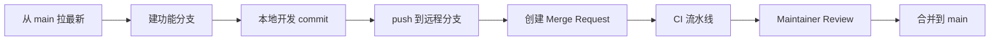

# Git 权限落地指南（场景 A：防错改）

> 目标：**防止团队成员 merge 错主平台或其他子应用**。  
> 权威说明：`核心文档/框架核心文档/平台化方案.md` §4.11、§4.12  
> **公司内网私有 Git 若不支持 Teams / CODEOWNERS**：见下文 **§0 内网 Git 兼容**，以 **CI 路径校验 + 人工 Review** 为主。

## 0. 公司内网私有 Git（不一定有 GitHub Teams）

很多内网 Git **只有「仓库读/写」或「项目成员」**，没有 GitHub 式的 Org Team、CODEOWNERS 自动指派。仍可防错改，按平台能力选档：

| 档位 | 平台能力（示例） | 怎么做 |
|------|------------------|--------|
| **L1 完整** | GitHub Enterprise、GitLab EE 按路径 Owner、Gitee 企业版 CodeOwner | 按 §1 使用 `.github/CODEOWNERS` + 分支/MR 保护 |
| **L2 部分** | GitLab CE **保护分支** + MR 指定 Reviewer；工蜂/Codeup 合并请求审批 | CODEOWNERS **当对照表**；MR 里**手工**指定对应组 Reviewer；CI 必过 |
| **L3 仅 CI** | 有 Runner/Jenkins，Git 无路径权限 | **`npm run validate:pr-path-ownership`**（规划）读 `platform/access/teams/*.yaml`，改错路径 → CI fail |
| **L4 仅仓库级** | 只能整仓授权 | **拆仓**：框架 core + 各团队 Spoke 私有仓（写权限隔离）；Monorepo 无法机读防错改 |
| **L5 纯 Git** | 无 MR、无 CI | 仅流程：PR 模板 + 指定 Reviewer 名单；**无法强制** |

**内网常见对照**（以贵司管理界面为准，名称可能不同）：

| 能力 | GitLab | Gitee 企业 | 工蜂 / Codeup 等 |
|------|--------|------------|------------------|
| 保护 main | Settings → Protected branches | 分支保护 | 保护分支 / 评审合并 |
| 按路径 Owner | CODEOWNERS + Approval rules | 代码所有者 | 部分支持，需确认 |
| 用户组 | Group / Subgroup 成员 | 企业团队 | 项目成员组 |
| CI 门禁 | GitLab CI | Gitee Go | 流水线 |

**内网最小组合（推荐）**：**L2 或 L3**

1. `main` 禁止直接 push，必须合并请求/MR  
2. MR 指定 Reviewer（对照 `platform/access/teams/*.yaml` 里的维护人名单）  
3. 跑现有 `validate:sub-app-registry`、`validate:sdd`  
4. （可选）启用 `validate:pr-path-ownership`，不依赖 Git 高级权限  

**`.github/CODEOWNERS` 在内网**：即使平台不识别，也**保留**作「路径 → 该找谁 Review」的**文档真值**，与 `teams/*.yaml` 一致。

**`team-leads`**：仅是「跨 app 管理者」的**组名约定**；内网若无 Team，在 `teams/*.yaml` 或 README 里维护 **maintainers 名单**，MR 时指定这些人即可。

### 0.1 GitLab 风格项目成员（Maintainer / Developer / Reporter）

贵司界面为 **项目级三角角色**（与 GitLab 一致）时，**没有 GitHub Team**，用下表映射 AIEP 防错改方案：

| 平台角色 | 典型权限 | 对应 AIEP 谁 | 防错改作用 |
|----------|----------|--------------|------------|
| **MAINTAINER** | 管成员、保护分支、**可 merge 到受保护分支** | 框架负责人 + 各子应用 **Lead**（`teams/*.yaml` 的 `maintainers`） | **唯一能合进 main 的人（推荐）** |
| **DEVELOPER** | 建分支、推分支、提 **Merge Request** | 各团队日常研发 | 可改自己分支；**不应**能直合 main |
| **REPORTER** | 只读、可评论 MR | PO、测试、只看不改 | 不能 push，避免误改 |
| Guest（若有） | 更只读 | 外部访客 | 仅浏览 |

**当前截图状态**（仅 1 名 Maintainer：李同超，0 Developer）：

- 适合 **强管控起步**：所有合进 `main` 经 Maintainer 审批  
- 团队研发应加为 **DEVELOPER**（不是 Maintainer），避免人人能 merge  
- 跨 app 管理者：再加 1～2 名 **MAINTAINER**（等同 `leads.yaml`），或仍由李同超统一 merge

**必配：保护分支**（Settings → Repository → Protected branches → `main` / `master`）：

| 选项 | 建议值 |
|------|--------|
| Allowed to merge | **Maintainers**（或 Maintainers + Developers 若信任 Developer 互审——**不推荐**防错改） |
| Allowed to push | **No one**（禁止直推 main） |
| Allowed to force push | 关闭 |

流程变为：

```text
Developer 推 feature 分支 → 提 Merge Request → Maintainer（或对应 app Lead）Review → 合并
```

**单仓 Monorepo 下**：Developer 仍可能在 MR 里改 `marketing-demo` 或 `subApps.js`——平台**不会**按路径拦，须：

1. **MR 指定 Reviewer**：改 CRM 路径 → 指定 CRM Lead；改主平台 → 指定框架 Maintainer  
2. 对照 `platform/access/teams/*.yaml` 的 `maintainers` 与 `.github/CODEOWNERS`（当对照表）  
3. CI：`validate:sub-app-registry`、`validate:sdd`（已有或内网流水线等价物）  
4. （可选）GitLab 若版本支持：仓库根 **`CODEOWNERS`** + **Approval rules**（则升为 §0 档位 L1/L2）

**`platform/access/teams/*.yaml` 与界面角色同步**：

```yaml
maintainers:
  - git_username: litongchao    # → 项目里 MAINTAINER
developers:                      # 可选字段，与 DEVELOPER 名单对账
  - git_username: zhangsan
reporters: []
```

新人入 CRM 团队：在项目成员里加 **Developer**；Lead 保持 **Maintainer**。不必改 manifest 逐 app。

**管理者 A 改 B 的子应用（GitLab 角色版）**：

| 需求 | 做法 |
|------|------|
| A 协助，B 把关 merge | A=Developer 提 MR，B= Maintainer approve |
| A 也能 merge B 的 app | 将 A 升为 **MAINTAINER**（人数控制在 leads 级别） |
| 只让 A 看 Demo | **REPORTER** |

**若只有仓库级角色、仍要硬隔离写权限**：拆 **框架项目 + 各团队项目**（Spoke），CRM 项目里 CRM 为 Developer，框架项目仅框架 Maintainer 为 Developer。

---

## 1. 一次性配置（GitHub / GitLab 等支持 Code Owners 时）

### 1.1 创建 GitHub Teams（内网无此功能则跳过，见 §0）

| Team | 成员 |
|------|------|
| `framework-maintainers` | 框架/主平台维护人（1～3 人） |
| `team-leads` | 各子应用管理者（跨 app approve，§4.11.8 方式 2） |
| `team-crm` | CRM 子应用研发 |
| `team-marketing` | 营销 Demo 研发 |

Org **Owner** 天然可审全部路径，不必重复加 Team。

### 1.2 替换占位符

1. 编辑 `.github/CODEOWNERS`：全局替换 `@YOUR-ORG` → `@你的Org名`
2. 编辑 `platform/access/teams/*.yaml`：替换 `YOUR-ORG`
3. 编辑 `platform/access/manifest.yaml`：`super_admins` 填 Org Owner 的 GitHub 用户名

### 1.3 保护 `main` 分支

Repository → Settings → Branches → Branch protection rules → `main`：

- [x] Require a pull request before merging
- [x] Require review from **Code Owners**
- [x] Require status checks to pass（至少 `SDD Gate` / `validate:sub-app-registry` 若已配 CI）
- [x] Do not allow bypassing the above settings（除 Owner 外）
- [ ] （可选）Require 2 approvals — 需 A、B 双签时使用

## 2. 成员各自分支 → 合并到 main（GitLab / 内网 MR 流程）

成员用 **Developer** 角色时，**不能**（也不应）直接 push `main`；在 **保护分支** 已开启时，标准路径如下。

### 2.1 流程总览



### 2.2 成员操作（Developer）

```bash
# 1. 同步主分支
git checkout main
git pull origin main

# 2. 建自己的功能分支（命名建议见 §2.4）
git checkout -b feat/crm-customer-list-zhangsan

# 3. 开发、提交（只改本团队路径为佳）
git add ...
git commit -m "feat(crm): 客户列表筛选"

# 4. 推到远程（首次）
git push -u origin feat/crm-customer-list-zhangsan
```

然后在 Git 网页：**Merge Request（合并请求）** → Source = 你的分支，Target = **`main`** → 创建。

### 2.3 合并前谁做什么

| 步骤 | 谁 | 做什么 |
|------|-----|--------|
| 1 | Developer | 填 MR 标题/说明；关联子应用 `app-code`；自测 |
| 2 | Developer | **指定 Reviewer**（见下表） |
| 3 | CI | 跑门禁（registry、sdd 等，若已配） |
| 4 | Maintainer | Review  diff；通过点 **Approve** |
| 5 | Maintainer 或平台 | 点 **Merge**（合并进 main） |

**Reviewer 怎么选**（单仓 Monorepo）：

| MR 主要改动路径 | 指定 Reviewer |
|-----------------|---------------|
| `AIEP-WEB/src/apps/marketing-demo/` | 营销 Lead（Maintainer） |
| `AIEP-WEB/src/apps/ai-smart-crm-admin/` | CRM Lead |
| `subApps.js`、`router/`、根 `package.json` | 框架 Maintainer（如李同超） |
| 既有 app 又改主平台接入 | **两个都要**：app Lead + 框架 Maintainer |

对照 `platform/access/teams/*.yaml` 里 `maintainers` 的 Git 用户名。

### 2.4 分支命名建议

```text
feat/<app-code>-<简述>           例：feat/marketing-demo-dashboard-filter
fix/<app-code>-<简述>           例：fix/ai-smart-crm-login
chore/framework-<简述>          例：chore/framework-bump-vite
team/<team>/scaffold-<app-code> 新建子应用
```

避免多人共用无名分支如 `dev`、`test`。

### 2.5 保护分支（管理员一次性配置）

**Settings → Repository → Protected branches → `main`**：

| 配置项 | 建议 |
|--------|------|
| Allowed to merge | **Maintainers** |
| Allowed to push | **No one** |
| Require approval before merge | 开启（若平台有） |

效果：

- Developer **可以** push `feat/xxx` 分支  
- Developer **不能** push / merge 进 `main`  
- 只有 Maintainer **Merge** 按钮（或 Maintainer approve 后由平台合并）

### 2.6 合并方式（GitLab 常见选项）

| 方式 | 说明 | 建议 |
|------|------|------|
| **Merge commit** | 保留分支合并点 | 团队熟悉 Git 时用 |
| **Squash and merge** | 压成一个 commit 进 main | 历史更干净，**常用** |
| **Rebase and merge** | 线性历史 | 需团队统一规范 |

选一种写入团队约定即可；AIEP 对三种都兼容。

### 2.7 合并后

```bash
# 成员本地同步
git checkout main
git pull origin main
git branch -d feat/crm-customer-list-zhangsan   # 可选：删本地分支
```

远程功能分支可在 Git 网页 **Delete source branch**（合并时勾选）。

### 2.8 常见问题

| 问题 | 原因 | 处理 |
|------|------|------|
| push 被拒绝：`main` is protected | 正常 | 推 feature 分支，走 MR |
| 没有 Merge 按钮 | 角色是 Developer | 请 Maintainer 合并 |
| MR 改了别人 app | 误改路径 | Reviewer 拒绝；要求改分支只含本 team 路径 |
| 与 main 冲突 | main 已有新提交 | MR 页 **Rebase** / 本地 `git rebase origin/main` 后 force push 功能分支 |

---

## 3. 日常：新人加入团队

**GitLab 内网**：项目成员 → 角色选 **Developer**；Lead 保持 **Maintainer**。不必改 manifest 逐人列表。

（GitHub Org 仍可用：`gh api orgs/.../teams/...`）

## 4. 新建子应用 Checklist（同一 MR）

- [ ] `AIEP-WEB/src/apps/<folder>/` 源码
- [ ] `AIEP-WEB/src/docs/子应用文档/<app-code>/` 四段文档
- [ ] `AIEP-WEB/build/vite.<folder>.config.js` + `build/<folder>.html`
- [ ] 根 `package.json` 增加 `dev:<folder>`、`build:<folder>`（须 **framework-maintainers** review）
- [ ] `AIEP-WEB/src/config/subApps.js` + `router/index.js`（须 **framework-maintainers** review）
- [ ] **`.github/CODEOWNERS` 追加 4 行**（app 目录、文档、build 配置）
- [ ] `platform/access/teams/team-xxx.yaml` 的 `apps` 追加一项
- [ ] `npm run validate:sub-app-registry -- --app <app-code>`

### CODEOWNERS 追加模板

```text
/AIEP-WEB/src/apps/<folder>/ @YOUR-ORG/team-xxx @YOUR-ORG/team-leads
/AIEP-WEB/src/docs/子应用文档/<app-code>/ @YOUR-ORG/team-xxx @YOUR-ORG/team-leads
/AIEP-WEB/build/vite.<folder>.config.js @YOUR-ORG/team-xxx @YOUR-ORG/team-leads
/AIEP-WEB/build/<folder>.html @YOUR-ORG/team-xxx @YOUR-ORG/team-leads
```

## 5. 跨团队与临时接管

### 5.1 部分子应用临时接管（非整 Team 接管）

常见需求：**A 只接 marketing-demo，不接 B 团队其它 app**。Git 项目角色仍是 Developer/Maintainer **整仓级别**，因此用 **app 粒度约定 + MR 路径 + Reviewer** 实现「部分接管」：

| 维度 | 整 Team 接管（不做） | **部分 app 接管（推荐）** |
|------|----------------------|---------------------------|
| 范围 | B 团队全部 app | **仅** `app_code` 列出的一个或几个 |
| Git 角色 | 把 A 加进 B 全员 | **不必**；A 仍为 Developer 即可 |
| 登记 | 改 Team 成员 | `manifest` / `handoffs.example.yaml` 一条 + MR 标题 |
| Review | B 任意 Lead | **该 app** 在 `teams/*.yaml` 里的 `maintainers` |
| 分支 | — | `handoff/<app-code>-<简述>-<A用户名>` |

**登记示例**（复制到 `manifest.yaml` 的 `user_grants` 或参考 `handoffs.example.yaml`）：

```yaml
user_grants:
  - user: git_username:zhangsan
    app_code: marketing-demo      # 只此 app，不含同 Team 其它 app
    role: developer
    grant_type: allow
    reason: partial-temporary-handoff
    expires_at: 2026-07-31
    owner_team: team-marketing
    approved_by: git_username:li-lead
```

**A 一次接多个（仍非整 Team）**：写 **多条** `user_grants`，每条一个 `app_code`；或一条 MR 只含多个 app 路径且 **每个 app 的 Maintainer 都 Approve**。

**MR Checklist（部分接管）**：

- [ ] 标题含 `[临时接管 marketing-demo]`（写清 **app-code**）
- [ ] diff **仅**该 app 目录 + 对应文档 + 对应 `build/vite.*` / `build/*.html`
- [ ] **未**修改同 Team 其它 `apps/<其它folder>/`
- [ ] 若必须改 `subApps.js` / router → **单独 MR**，框架 Maintainer + 该 app Maintainer
- [ ] Reviewer = `platform/access/teams/team-marketing.yaml` 中该 app 的 `maintainers`
- [ ] `expires_at` 到期 → 删除登记条目；A 不再代提该 app 的 handoff 分支

**不会出问题的关键**：  
部分接管 **不** 靠「给 A 开特殊分支权限」，而靠 **MR 只含该 app 路径 + 该 app Maintainer 审 + 禁止夹带主平台/其它 app**。

### 5.2 其它跨团队场景

| 需求 | 做法 |
|------|------|
| A 提 MR，B 团队 merge | 常规 MR，B maintainers Review |
| A 可审多个 app（长期） | 写入 `teams/leads.yaml`，MR 指定为 Reviewer |
| A 长期负责 B 的**某一个** app | `user_grants` 长期条目 + 该 app CODEOWNERS 行可加 A 的 Git 用户名（若平台支持） |
| 留痕 | `handoffs.example.yaml` / manifest + MR 描述 |

## 6. 本地与 Agent

- 本地仍可 clone 全仓、打开任意文件；**merge 进 main** 时由 CODEOWNERS 拦截误改。
- Cursor Agent 改错路径时，依赖 PR Review，勿直 push `main`。
