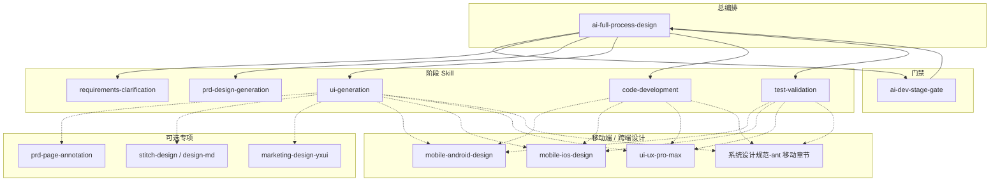

# AI+全流程设计 Skill 设计文档（草案）

> **文档状态**：V0.4（审查问题已修复；Skill 已落地）  
> **版本**：V0.4  
> **日期**：2026-06-06  
> **Skill 入口**：项目 `.cursor/skills/ai-full-process-design/SKILL.md` · 全局 `~/.cursor/skills/ai-full-process-design/SKILL.md`（同步）
> **定位**：将《AI+产品全流程执行手册》固化为 **单一编排 Skill**，Agent 按本 Skill 逐步执行，不再依赖口头记忆或分散文档检索。

---

## 一、为什么要做这一个 Skill

### 1.1 现状

| 资产 | 位置 | 问题 |
|------|------|------|
| 执行手册（六步） | `AI+产品全流程执行手册-执行版.md` | 人读友好，Agent 不会自动加载 |
| 治理手册（Gate/SDD） | `AI+产品全流程执行手册-治理版.md` | 规则分散，与执行版需人工对照 |
| 阶段 Skill（6+1） | `AIEP-WEB/src/skills/*` | 阶段细则 |
| **总编排 Skill** | 项目 `.cursor/skills/ai-full-process-design/` + 全局 `~/.cursor/skills/ai-full-process-design/` | **已落地**（V0.4） |
| **移动端 / 域规范 Skill** | `.cursor/skills/` | 已纳入 §4.1 路由 |
| 子应用模板 | `02-子应用通用模板/` | 路径、命名、关卡产物需 Agent 记忆 |
| 样例子应用 | `marketing-demo`、`sample-app` 等 | 实践参考，但未写入 Skill 触发条件 |

当前 `ai-dev-stage-gate` 与 **`ai-full-process-design`** 配合使用：前者输出 pass/fail/blocked，后者负责步骤推断、形态路由、落盘与脚本。

### 1.2 目标 Skill 的职责（一个入口管全程）

拟命名：**`ai-full-process-design`**（备选：`ai-product-lifecycle`）

| 职责 | 说明 |
|------|------|
| **阶段识别** | 根据子应用目录现有产物，判断当前处于六步中的哪一步 |
| **阶段路由** | 调用对应子 Skill（见 §四），或按本 Skill 内嵌最小指令执行 |
| **产物落盘** | 规定文件路径、命名、模板来源，禁止写错目录 |
| **门禁编排** | 每步结束输出 `pass/fail/blocked`，映射 Gate-1～4、G2-A/G2-B |
| **红线拦截** | SDD 未签禁开发、PRD 未冻禁提测、测试/CI 未过禁发布 |
| **Fast Track 分支** | 满足条件时走简化路径，产物集缩小 |
| **校验命令** | 在关键节点调用 `validate:sdd`、`coverage:acceptance`、`validate:sub-app-registry` 等 |
| **形态路由** | 按 `platform_type`（Web / 移动 H5 / Android / iOS）加载对应设计规范 Skill（见 §4.1） |

### 1.3 与现有 Skill 的关系



**原则**：

- **`ai-full-process-design`** = 总导演（何时做、做什么、写哪、能不能进下一步）
- **`ai-dev-stage-gate`** = 门禁裁判（每步前后调用，输出标准状态块）
- **阶段 Skill** = 执行细则（章节结构、澄清问题、交付物模板）
- **域规范 Skill**（如 `marketing-design-yxui`）= Web 营销域设计真值，不替代 Gate
- **移动端 Skill**（§4.1）= 步骤 3～5 的 **UI/UX 与实现约束**；六步主线与 Gate **不变**

---

## 二、权威来源（Skill 内必须引用，不得自创口径）

| 优先级 | 文档 | 用途 |
|--------|------|------|
| 1 | `AI+产品全流程执行手册-执行版.md` | 六步动作、产物、放行条件、Fast Track、AI 口径 |
| 2 | `AI+产品全流程执行手册-治理版.md` | Gate-1～4、SDD 最小章节、追溯链、CI/CD |
| 3 | `02-子应用通用模板/README-子应用文档模板使用说明.md` | 文档真值层级、目录结构、关卡最小产物 |
| 4 | `AIEP-WEB/src/skills/SKILLS-DIRECTORY.md` | Web 主线子 Skill 索引 |
| 5 | `.cursor/skills/` 下移动端与域规范 Skill | 见 §4.1 形态路由表 |
| 6 | `核心文档/框架核心文档/` | 创建指南、打包指南、设计规范（Arco / Ant 移动 / 营销等） |

**双真值（强制）**：

- **SDD**：API、数据模型、GWT 验收、风险回滚  
- **体验真值**：`03-PRD设计评审文档.md`（评审主文档）+ `04-界面设计文档.md`（页面/交互细节）+ 可交互原型  
- **禁止**在 04 或 PRD 中重复定义 API 契约（须引用 SDD）

---

## 三、六步主线（Skill 执行状态机）

### 3.0 应用形态 `platform_type`（步骤 1 必标记）

全流程六步与 Gate **不因端类型而减少**；差异体现在 **设计规范 Skill、代码落盘路径、构建命令、U1～U6 补充项**。

| `platform_type` | 说明 | 设计规范文档 | 必加载 Skill（步骤 3～5） |
|-----------------|------|--------------|---------------------------|
| `web-admin` | Web 管理端（Arco，AIEP 子应用默认） | `系统设计规范.md` | —（可选 `ui-ux-pro-max`） |
| `web-marketing` | 营销域 Web 管理端 | `营销设计规范.md` | `marketing-design-yxui` |
| `web-mobile-h5` | 移动 Web / H5 / 主应用内移动页（Vue） | `系统设计规范-ant.md` §九 | `ui-ux-pro-max`（推荐） |
| `native-android` | Android 原生（Kotlin / Jetpack Compose） | Material Design 3 | `mobile-android-design` |
| `native-ios` | iOS 原生（Swift / SwiftUI） | Apple HIG | `mobile-ios-design` |

**步骤 1 产出扩展**：在 `01-需求说明书.md` 元信息中写入 `platform_type`（单选；混合项目拆为多交付物分别标记）。

**禁止**：

- 移动端项目使用 Arco `系统设计规范.md` 作为主 UI 真值  
- Web 管理端误加载 `mobile-android-design` / `mobile-ios-design`  
- 未标记 `platform_type` 即进入步骤 3

### 3.1 流程总览

```
步骤:  1        2              3              4              5              6
       需求生成  需求确认        界面生成        界面确认        开发测试        发布上线
产物:  草案     确认单+SDD     全量界面+PRD草案  G2-A+PRD冻结   测试验收        发布记录
Gate:  —     Gate-1+Gate-2    —           Gate-3        (G2/G3复检)    Gate-4
              G2-B+G2脚本签                  G2-A人工
```

> Gate-2（SDD 签署）在 **步骤 2 末** 满足；Gate-3 在 **步骤 4 末** 满足；步骤 5 **入口**须复检 Gate-2 + Gate-3。

> **界面环节硬约束**：步骤 4「界面确认」**不是**写文档确认，而是 **拿步骤 3 已落地的全量功能界面** 与客户（PO/业务方）逐页确认；**全量界面未齐，禁止进入步骤 4**。

### 3.2 逐步定义（Agent 执行单元）

#### 步骤 1：需求生成

| 项 | 内容 |
|----|------|
| **子 Skill** | `requirements-clarification` |
| **输入** | 业务目标、问题描述、成功指标 |
| **动作** | 澄清范围/不做项；验收场景（正常/异常/边界）；标记标准流程或 Fast Track |
| **唯一核心产物** | `01-需求与设计/01-需求说明书.md`（需求草案） |
| **放行** | 需求草案完整，PO 确认进入评审 |
| **Gate** | 无（Gate 前准备） |

#### 步骤 2：需求确认

| 项 | 内容 |
|----|------|
| **子 Skill** | `requirements-clarification`（范围复核） |
| **SDD** | 模板 **`07-SDD模板-可机读版.md`** + **`11-SDD-JSON模板.json`**（**禁止**用 `prd-design-generation` 代替） |
| **G2-B** | 模板 **`20-G2-B技术补齐评审记录.md`** |
| **Fast Track** | 模板 **`15-SDD-Lite`** + **`18-FastTrack登记单`** |
| **输入** | 需求草案 |
| **动作** | 评审范围/优先级/验收；编写 SDD 草案；完成 G2-B 技术补齐；冻结边界 |
| **唯一核心产物** | `17-需求确认单.md`（PO + TL 双签） |
| **附带产物** | `SDD-v<x>.md/json`、`20-G2-B技术补齐评审记录.md`、`04-AI治理与审计/SDD校验清单.md` |
| **脚本** | `npm run validate:sdd -- --app {app-code} --gate G2`（仓库根目录） |
| **放行** | 需求确认单双签 + SDD 签署 + G2-B pass + G2 脚本 pass |
| **Gate** | **Gate-1** + **Gate-2** |

#### 步骤 3：界面生成

| 项 | 内容 |
|----|------|
| **子 Skill** | `ui-generation`（**step3-prototype**）+ `prd-design-generation`（03-PRD 草案） |
| **输入** | 需求确认单、**全量页面范围清单**（来自需求说明书 / PRD 页面清单） |
| **动作** | **先生成全部功能界面的可交互原型**（见 §3.3）；再同步撰写 PRD/界面设计文档；对齐 SDD 字段；每页补齐 loading/empty/error；Web 子应用完成主应用接入 |
| **唯一核心产物** | **全量可交互功能界面**（代码级原型，可演示、可点击走通主流程） |
| **文档产物** | `01-需求与设计/03-PRD设计评审文档.md`（PRD 草案）、`04-界面设计文档.md`、`产品设计文档.md` |
| **Web 子应用附加** | 全部页面 Vue 文件 + 路由注册 + `subApps.js`、嵌入路由、`App.vue`；`npm run validate:sub-app-registry -- --app <app-code>` |
| **放行** | ① U1～U6 全过；② PRD/04 与原型一致；③ Web：`validate:sub-app-registry` + **`npm run build:{app-code}`**（须先在根 `package.json` 注册脚本） |
| **Gate** | 无（Gate 前准备） |
| **禁止** | 仅输出线框/文档而无可演示界面；仅做 MVP 子集即进入步骤 4 |

#### 步骤 4：界面确认

| 项 | 内容 |
|----|------|
| **子 Skill** | `ui-generation`（**step4-confirm**）+ `prd-design-generation`（PRD 冻结，须 G2-A 后） |
| **输入** | 步骤 3 全量界面、PRD 草案、需求确认单 |
| **动作** | 组织客户/PO 走查；填写 **`19-G2-A界面确认记录.md`**；冻结 PRD；完成映射表 |
| **唯一核心产物** | **`01-需求与设计/19-G2-A界面确认记录.md`**（人工「通过」） |
| **文档产物** | `03-PRD`（冻结版，状态字段）、`页面-路由-接口-数据表映射表.md` |
| **脚本** | `npm run validate:sdd -- --app {app-code} --gate G3` |
| **放行** | ① G2-A 文件人工通过；② 映射表完成；③ G3 脚本 pass |
| **Gate** | **Gate-3** |
| **Agent** | 无 PO/客户确认 → **`blocked`**；**禁止** Agent 自填 G2-A「通过」或 PRD「冻结」 |

#### 步骤 3 ↔ 4 边界（§3.3，强制）

**原则**：步骤 3 = **把界面都做出来**；步骤 4 = **拿做出来的界面给客户确认**。

| 维度 | 步骤 3 界面生成 | 步骤 4 界面确认 |
|------|-----------------|-----------------|
| 主要产出 | 可运行代码 + PRD 草案 | 客户确认结论 + PRD 冻结 |
| 页面完成度 | **100% 页面清单** | 不再新增页面（仅按客户意见微调） |
| 数据 | Mock / 假数据可接受 | 与 PRD 描述一致即可，仍可为 Mock |
| 交互 | 主流程可点击走通 | 客户验证后的最终交互口径 |
| 参与方 | DEV + 产品（内部） | **客户 / PO / 业务方**（必须） |

**进入步骤 4 的前置检查表（Agent 必须逐项核对）**：

| # | 检查项 | 通过标准 |
|---|--------|----------|
| U1 | 页面/屏幕清单完整 | PRD/04 中每一 **页面ID** 均有路由/Screen；**含主流程弹窗/抽屉**，纯 Tooltip 不计 |
| U2 | 界面可访问 | 从应用入口可导航至全部页面，无 404 / 空白占位页 |
| U3 | 主流程可走通 | 每条 P0 用户故事至少有一条可演示路径 |
| U4 | 四态可见 | 列表/详情等关键页具备 loading / empty / error（可切换 Mock） |
| U5 | 可构建 | `npm run build:{app-code}` 成功 |
| U6 | 文档一致 | PRD 草案中的页面数、名称与代码路由/屏幕清单一致 |

**移动端 / 原生补充（`platform_type` ∈ `web-mobile-h5` | `native-android` | `native-ios` 时执行）**：

| # | 检查项 | 通过标准 |
|---|--------|----------|
| UM1 | 触控可用性 | 可点击区域 ≥ `44×44`（H5/Ant）或平台规范最小触控目标 |
| UM2 | 移动导航 | Tab / Stack / 抽屉等导航与 `04-界面设计文档` 信息架构一致 |
| UM3 | 竖屏基准 | H5 以 `375px` 基准可演示；原生以目标设备/simulator 可运行 |
| UM4 | 移动四态 | 弱网/断网/超时文案与反馈符合 Ant §9.6 或原生 Skill 要求 |
| UM5 | 单手可达 | P0 主操作在拇指可达区（H5 底部 Tab/主按钮；原生遵循 Skill） |

**构建/运行命令（按形态替换 U5）**：

| `platform_type` | U5 通过标准 |
|-----------------|-------------|
| `web-admin` / `web-marketing` / `web-mobile-h5` | `npm run build:{app-code}` 成功 |
| `native-android` | `./gradlew assembleDebug` 或项目约定构建命令成功 |
| `native-ios` | Xcode `build` 或 `xcodebuild` 成功 |

**任一项未通过 → 门禁 `blocked`，退回步骤 3 补齐界面，不得发起客户确认。**

**客户确认方式（步骤 4 至少一种）**：

- 会议走查：按页面清单逐页演示，记录确认结论  
- 书面确认：PO 在 G2-A 记录或 PRD 评审结论中签字「界面确认通过」  
- 标注确认：启用 `prd-page-annotation` 时，客户对标注页逐页确认

**客户提出修改时**：

- 纯样式/文案 → 在步骤 4 内改原型 + 更新 PRD，重新走查 affected 页面  
- 增删页面或变更字段契约 → 回退步骤 3（补界面）或步骤 2（改 SDD），再重新确认

#### 步骤 5：开发测试

| 项 | 内容 |
|----|------|
| **子 Skill** | `code-development` → `test-validation` |
| **输入** | 需求确认单、PRD 冻结版 |
| **动作** | 按 SDD 实现；G3 任务表含 `FE-INTEG-01`；Mock→真实 API；执行 GWT 验收 |
| **唯一核心产物** | `02-研发与测试/` 下测试验收报告（或 `验收脚本-GWT.md` + 门禁检查单结论） |
| **附带产物** | `详细设计文档.md`、`14-G3开发任务拆解表.md`、`数据库设计文档.md`（若有表变更） |
| **放行** | 验收通过率 100%，阻断级缺陷为 0 |
| **Gate** | 步骤 5 **入口**须 Gate-2 + Gate-3 均已 pass；步骤 5 **结束** + 测试放行 |

> **Gate-2 与 Gate-3 时序说明**（须在 Skill 中写死，避免误解）：  
> - **Gate-2（SDD 签署）** 通过后 → 允许契约类编码  
> - **Gate-3（PRD 冻结 + 映射表）** 通过后 → 允许联调提测  
> - PRD 未冻结时，可在 Gate-2 后做部分实现，**不得提测**

#### 步骤 6：发布上线

| 项 | 内容 |
|----|------|
| **子 Skill** | 无独立 Skill；由总 Skill + `test-validation` 结论驱动 |
| **输入** | 测试验收报告、CI/CD 结果 |
| **动作** | 版本/回滚/变更说明/监控；追溯归档；复盘 |
| **唯一核心产物** | `03-发布与复盘/发布记录单.md`（或按模板命名） |
| **放行** | CI/CD 全绿、回滚可用、追溯链完整 |
| **Gate** | **Gate-4**（测试 → 发布） |

---

## 四、子 Skill 路由矩阵

### 4.1 应用形态与 Skill 路由（Web + 移动端）

#### 4.1.1 Skill 资产位置

| Skill | 路径 | 标签 |
|-------|------|------|
| 全流程编排 | `.cursor/skills/ai-full-process-design/` | **已落地 V0.4** |
| 阶段门禁 | `AIEP-WEB/src/skills/ai-dev-stage-gate/` | 主线 |
| 需求 / PRD / UI / 开发 / 测试 | `AIEP-WEB/src/skills/{stage}/` | 主线 |
| **Android 原生 UI** | `.cursor/skills/mobile-android-design/` | 移动端 |
| **iOS 原生 UI** | `.cursor/skills/mobile-ios-design/` | 移动端 |
| **跨端 UI/UX 智能** | `.cursor/skills/ui-ux-pro-max/` | Web + 移动 H5 |
| 营销 Web UI | `.cursor/skills/marketing-design-yxui/` | 域规范 |
| PRD 页面标注 | `.cursor/skills/prd-page-annotation/` | 可选 |

#### 4.1.2 按 `platform_type` 的阶段 Skill 组合

| 步骤 | `web-admin` | `web-marketing` | `web-mobile-h5` | `native-android` | `native-ios` |
|------|-------------|-----------------|-----------------|------------------|--------------|
| 1 需求生成 | `requirements-clarification` | 同左 | 同左 + 标记移动场景 | 同左 + 标记原生 | 同左 + 标记原生 |
| 2 需求确认 | SDD 07/11 + `20-G2-B` + `17-需求确认单` | 同左 | 同左 | 同左 | 同左 |
| 3 界面生成 | `ui-generation` step3 + `prd-design-generation` | + `marketing-design-yxui` | + `ui-ux-pro-max` | **`mobile-android-design`** 主导 + 04 文档 | **`mobile-ios-design`** 主导 + 04 文档 |
| 4 界面确认 | `ui-generation`（客户确认） | 同左 | 同左；可走查 **真机/模拟器** | 同左；**Simulator/真机** 逐屏确认 | 同左 |
| 5 开发测试 | `code-development` + `test-validation` | + `marketing-design-yxui` 审查 | + `ui-ux-pro-max` UX 审查 | + `mobile-android-design` 合规审查 | + `mobile-ios-design` 合规审查 |
| 6 发布上线 | `ai-dev-stage-gate` + CI | 同左 | 同左 | 同左 + 应用商店/内测渠道检查 | 同左 |

**步骤 3 可选共用 Skill（各形态均可用）**：`stitch-design`、`design-md`、`prd-page-annotation`（标注模式）

#### 4.1.3 移动端 Skill 加载时机（强制）

| Skill | 必须 Read 的时机 | 用途 |
|-------|------------------|------|
| `mobile-android-design` | `platform_type=native-android` 且步骤 ≥3 | Compose 布局、Material 3 主题、导航、无障碍 |
| `mobile-ios-design` | `platform_type=native-ios` 且步骤 ≥3 | SwiftUI、HIG、NavigationStack/TabView、Dynamic Type |
| `ui-ux-pro-max` | `platform_type=web-mobile-h5` 且步骤 ≥3 | 配色/字体/UX 指南；可用 `scripts/search.py` 检索 |
| `marketing-design-yxui` | `platform_type=web-marketing` 且步骤 ≥3 | YXUI Token、查询区、壳层（**不用于移动端**） |

#### 4.1.4 专项触发矩阵（移动端扩展）

| 触发场景 | 建议 Skill 组合 |
|----------|-----------------|
| 新建 Android 原生子项目 | `requirements-clarification` → … → `ui-generation` + **`mobile-android-design`** |
| 新建 iOS 原生子项目 | 同上 + **`mobile-ios-design`** |
| AIEP 内移动 H5 页（Vue） | `ui-generation` + **`ui-ux-pro-max`** + `系统设计规范-ant.md` |
| 移动 H5 已实现、需 PRD 标注 | `prd-page-annotation` |
| 跨 Web + iOS + Android 视觉对齐 | 各端分别加载对应 Skill；`ui-ux-pro-max` 仅作 **跨端配色/信息架构** 参考，不替代原生 Skill |
| 营销 Web 管理端 | `marketing-design-yxui`（**非移动端**） |

### 4.2 通用六步路由（默认 `web-admin`）

| 当前步骤 | 必调 Skill | 可选 Skill | 必跑脚本（如有） |
|----------|------------|------------|------------------|
| 1 需求生成 | `requirements-clarification` | — | — |
| 2 需求确认 | `requirements-clarification` + **SDD 07/11** + **20-G2-B** | Fast Track：`15-SDD-Lite` | `validate:sdd --gate G2` |
| 3 界面生成 | `ui-generation` step3 + `prd-design-generation` | §4.1.2 形态 Skill | `validate:sub-app-registry`、`build:{app-code}` |
| 4 界面确认 | `ui-generation` step4 + `prd-design-generation` | `prd-page-annotation` | U1～U6、UM*、`validate:sdd --gate G3` |
| 5 开发测试 | `code-development`、`test-validation` | §4.1.2 形态 Skill | `validate:sdd` G2+G3、`coverage:acceptance` |
| 6 发布上线 | `ai-dev-stage-gate` | — | CI 流水线 |

### 4.3 脚本调用时机（仓库根目录）

| 时机 | 命令 |
|------|------|
| 步骤 2 末 | `npm run validate:sdd -- --app {app-code} --gate G2` |
| 步骤 3（Web） | `npm run validate:sub-app-registry -- --app {app-code}` |
| 步骤 3 末 | `npm run build:{app-code}`（须已注册 script） |
| 步骤 4 末 | `npm run validate:sdd -- --app {app-code} --gate G3` |
| 步骤 5 | `npm run coverage:acceptance -- --app {app-code}` |

### 4.4 Skill 路径约定（D1 已定）

| 类型 | 路径 |
|------|------|
| 总编排、移动、域规范 | `.cursor/skills/` |
| 六步阶段 Skill | `AIEP-WEB/src/skills/` |
| `prd-page-annotation` | **仅** `.cursor/skills/prd-page-annotation/` |

**模板根路径（统一参数）**：

```text
{TEMPLATE_REPO_PATH} = 核心文档/AI+产品落地/02-子应用通用模板/
{APP_DOCS_ROOT}      = AIEP-WEB/src/docs/子应用文档/{app-code}/
```

---

## 五、子应用文档目录（Skill 落盘规范）

```
AIEP-WEB/src/docs/子应用文档/{app-code}/
├── 01-需求与设计/
│   ├── 01-需求说明书.md          # platform_type、flow_type
│   ├── 17-需求确认单.md
│   ├── 20-G2-B技术补齐评审记录.md
│   ├── 19-G2-A界面确认记录.md    # 步骤4唯一G2-A落盘
│   ├── 03-PRD设计评审文档.md
│   ├── 04-界面设计文档.md
│   ├── 产品设计文档.md
│   ├── SDD-v1.0.md + .json
│   └── 页面-路由-接口-数据表映射表.md
├── 02-研发与测试/
│   ├── 详细设计文档.md
│   ├── 数据库设计文档.md
│   ├── 14-G3开发任务拆解表.md
│   └── 验收脚本-GWT.md
├── 03-发布与复盘/
│   ├── 应用操作说明书.md
│   └── 发布记录单.md
└── 04-AI治理与审计/
    ├── gate-config.json
    ├── SDD校验清单.md
    ├── G2-G3关卡自动门禁检查.md
    └── gate-report.json          # 脚本输出
```

**代码落盘**（按 `platform_type`）：

| `platform_type` | 代码根路径（约定） |
|-----------------|-------------------|
| `web-admin` / `web-marketing` / `web-mobile-h5` | `AIEP-WEB/src/apps/{app-code}/` + `AIEP-WEB/build/vite.{app-code}.config.js` |
| `web-mobile-h5` | 移动页通常位于 `src/apps/{app-code}/views/mobile/`；样例：`sample-app/views/mobile/MobileCasesPage.vue` |
| `native-android` | 独立工程目录（如 `{app-code}-android/`），在需求说明书声明路径 |
| `native-ios` | 独立工程目录（如 `{app-code}-ios/`），在需求说明书声明路径 |

**文档落盘**（各形态 **统一**）：

```text
AIEP-WEB/src/docs/子应用文档/{app-code}/
```

原生项目的 `04-界面设计文档.md` 须注明：目标平台、屏幕清单、Simulator/真机演示方式。

---

## 六、三条红线 + 门禁速查（Skill 必须拦截）

| 红线 | 条件 | Agent 行为 |
|------|------|------------|
| 红线 1 | SDD 未签署 | **禁止**进入全面开发与上线承诺 |
| 红线 2 | PRD 未冻结 | **禁止**联调提测 |
| 红线 3 | 测试未过 / CI 失败 / 追溯链不完整 | **禁止**发布 |

| Gate | 最小产物 | 签署/确认 |
|------|----------|-----------|
| Gate-1 | 需求说明书 + 需求确认单 + SDD 草案 | PO + TL |
| Gate-2 | SDD.md + SDD.json + SDD校验清单通过 | SDD 签署 |
| Gate-3 | **全量界面客户确认（G2-A）** + PRD 冻结 + 映射表 | **`19-G2-A界面确认记录.md` 人工通过** + PO 冻结 |
| Gate-4 | 测试验收 + CI 全绿 + 发布记录单 | 发布负责人 |

**G2-A / G2-B（UI-first 子门禁）**：

- **G2-A**：`19-G2-A界面确认记录.md` 人工通过（步骤 4）  
- **G2-B**：`20-G2-B技术补齐评审记录.md`（步骤 2）  
- 二者任一未通过 → **禁止** `code-development`
- **G2-A 前置**：步骤 3 全量界面已生成，不得用文档或部分页面代替客户确认

---

## 七、Fast Track 分支

**适用（同时满足）**：

- 影响页面 ≤ 2  
- 不新增核心数据表  
- 不改变外部 API 主契约  
- 开发测试 ≤ 3 人日  

**简化**：步骤 3 仍须生成 **全部受影响页面** 的可交互界面；步骤 4 仍须 **客户对全量界面确认** 后，方可合并 PRD 冻结与映射表（不可跳过客户走查）。

**必留产物**：需求卡、`SDD-Lite`、`测试验收报告`、`发布记录单`、`18-FastTrack登记单`

**禁用**：权限、计费、合规、审计、跨系统事务、核心链路性能改造。

Skill 须在步骤 1 显式标记 `flow_type: standard | fast_track`，后续按分支检查产物清单。

---

## 八、Agent 单次会话执行协议（Skill 核心工作流）

用户说「按 AI 全流程做 {app-code}」或「推进 marketing-demo 到界面确认」时，Agent **必须**按以下顺序执行：

### 8.1 启动（每次会话开头）

1. 读取 `{APP_DOCS_ROOT}` 现有文件，**推断当前步骤**（见 §8.2）  
2. 调用 `ai-dev-stage-gate` 逻辑，输出 **阶段门禁状态块**（模板见 §九）  
3. 若用户指定目标步骤，校验前置 Gate；不满足则 `blocked` 并列出补齐项  
4. 确认 `flow_type`（标准 / Fast Track）  
5. 读取 `01-需求说明书.md` 中的 **`platform_type`**；缺失则 `blocked`，退回步骤 1 补充

### 8.2 步骤推断规则

| 若存在且有效 | 推断当前步骤 |
|--------------|--------------|
| 无需求说明书 | 步骤 1 |
| 有需求说明书，无需求确认单双签 | 步骤 2 |
| 有需求确认单，**全量界面未齐**（§3.3 U1～U6 任一未过） | **步骤 3** |
| 全量界面已齐，**`19-G2-A` 无人工「通过」** 或 PRD 未冻结 | **步骤 4** |
| PRD 已冻结 + 映射表完成，无测试验收结论 | 步骤 5 |
| 测试已通过，无发布记录 | 步骤 6 |

> 不得因「已有 PRD 草案」就推断为步骤 4；**无全量可交互界面 = 仍在步骤 3**。

### 8.3 阶段执行（每一步）

1. 加载对应 **子 Skill**（Read SKILL.md）+ **§4.1.2 形态 Skill**（若适用）  
2. 从 `{TEMPLATE_REPO_PATH}` 复制模板到 `{APP_DOCS_ROOT}`（若不存在）  
3. 仅产出 **当前步骤** 定义的必交付物，不越步  
4. 代码变更仅限当前步骤允许范围：  
   - **步骤 3**：允许新建全部页面、路由、Mock、样式；目标 = 全量可演示界面  
   - **步骤 4**：仅允许按客户反馈微调界面；**禁止**大规模新页面；目标 = G2-A 确认 + PRD 冻结  
   - **步骤 5**：Mock → 真实 API/DB 实现  
5. 运行步骤关联脚本，记录命令与结果  
6. **步骤 3→4 切换前**：必须输出 §3.3 U1～U6 检查表并全部 ✅；移动类追加 UM1～UM5  
7. 再次输出 **阶段门禁状态块**  
8. 仅当结论为 `pass` 时，询问或自动进入下一步（以用户指令为准）

### 8.4 变更与回退

- 契约变更：**先改 SDD/PRD**，再改代码  
- 界面确认后字段变更：更新映射表 + 重新 G2-B  
- 任何 Gate 失败：保持当前步骤，输出 **最小补齐动作**（不超过 3 条）

### 8.5 AI 使用边界（来自执行版 §8）

| AI 可做 | AI 不可替代 |
|---------|-------------|
| 需求拆解初稿、SDD 草案、用例初稿、发布说明初稿 | SDD 签署、界面冻结确认、发布放行决策 |
| 加速器，须过 Gate 校验 | Gate 不通过 → 人工修订 |

**失败兜底**：超时 / 幻觉 / 结构不合规 / 关键字段缺失 → 30 分钟内切换人工模板直填。

---

## 九、标准输出模板（Skill 强制格式）

### 9.1 阶段门禁状态块（每步首尾各一次）

```markdown
## 阶段门禁状态
- **子应用**：{app-code}
- **流程类型**：standard | fast_track
- **当前步骤**：{1~6 名称}
- **推断依据**：{现有文件列表}
- **必需输入**：{…} ✅ / ❌
- **必交付物**：{…} ✅ / ❌
- **Gate 结论**：Gate-{N} — pass / fail / blocked
- **门禁总评**：pass / fail / blocked
- **缺失项**：
  1. …
- **下一动作**：
  1. …
- **platform_type**：{web-admin | web-marketing | web-mobile-h5 | native-android | native-ios}
- **形态 Skill**：{已加载 / 未加载} — {skill 名称列表}
- **红线检查**：R1 SDD签署 / R2 PRD冻结 / R3 测试CI — 未触发 ⚠️
- **界面全量检查（步骤 3→4）**：U1～U6 — ✅ / ❌；UM1～UM5 — ✅ / ❌ / N/A
```

### 9.2 步骤完成摘要

```markdown
## 步骤 {N} 完成摘要
- **产物路径**：…
- **模板来源**：…
- **脚本结果**：…
- **待 PO/TL 确认**：…
- **建议下一步**：步骤 {N+1} — {名称}
```

### 9.3 站会七问（执行版 §9，可选附在日报）

1. 当前处于哪一步？  
2. 当前唯一产物是否齐全？  
3. 当前放行条件是否满足？  
4. 是否触发三条红线？  
5. 是否 Fast Track？  
6. 是否触发 AI 兜底？  
7. 当前门槛：Gate-2 / Gate-3 / 其他？

---

## 十、Skill 文件结构（V0.4 已落地）

```text
.cursor/skills/ai-full-process-design/     # 项目（团队共享）
~/.cursor/skills/ai-full-process-design/    # 全局（跨项目，内容同步）
├── SKILL.md
├── workflow.md
├── gates.md
├── paths.md
├── reference.md
└── examples.md
```

阶段 Skill 见 `AIEP-WEB/src/skills/SKILLS-DIRECTORY.md`。

### 10.1 拟议 SKILL.md frontmatter

```yaml
---
name: ai-full-process-design
description: >-
  Orchestrates the full AI+ product lifecycle for sub-apps: 需求生成 through 发布上线.
  Routes to stage skills, enforces Gate-1~4 and SDD/PRD dual truth, manages doc paths
  under AIEP-WEB/src/docs/子应用文档/. Use when creating or advancing a sub-app,
  全流程, 六步, Gate, SDD, PRD冻结, 需求确认, 界面确认, Fast Track,
  移动端, Android, iOS, H5, SwiftUI, Compose, platform_type, or app-code delivery.
---
```

### 10.2 触发关键词（description 必含）

`AI+全流程`、`六步流程`、`需求生成`、`需求确认`、`界面生成`、`界面确认`、`开发测试`、`发布上线`、`Gate-1`～`Gate-4`、`子应用立项`、`platform_type`、`web-mobile-h5`、`native-android`、`native-ios`、`移动 H5`、`SwiftUI`、`Compose`、`{app-code}` 推进

### 10.3 与 `ai-dev-stage-gate` 的分工

| 能力 | ai-dev-stage-gate | ai-full-process-design |
|------|-------------------|------------------------|
| 判定 pass/fail/blocked | ✅ 主责 | 调用并展示 |
| 推断当前步骤 | ❌ | ✅ |
| 路由子 Skill | ❌ | ✅ |
| 文档落盘路径 | ❌ | ✅ |
| 运行 validate 脚本 | ❌ | ✅ |
| Fast Track 分支 | 简略 | ✅ 完整 |

**建议**：保留 `ai-dev-stage-gate` 为轻量门禁；`ai-full-process-design` 为 **默认入口**，内部每步调用 gate 检查。

---

## 十一、验收标准（Skill 本身的质量门槛）

评审通过前，本设计文档须满足：

- [x] §4.1 移动端 Skill 路由与 `platform_type` 五类完整  
- [x] 步骤 3/4 边界清晰  
- [x] Skill 已落地项目 + 全局 `~/.cursor/skills/ai-full-process-design/`  
- [x] 子 Skill 与 V0.4 对齐  
- [x] marketing-demo 迁移 `19-G2-A` 至独立文件  

评审通过后维护：

1. 试跑 `marketing-demo` 步骤推断 + G2/G3 脚本 — ✅ `infer:process-step` + `validate:sdd --gate G3`
2. 模板 README 补充 19/20 模板索引  

---

## 十二、待评审决策项

请 PO/TL 确认以下口径后，再生成 Skill：

| # | 决策项 | V0.4 结论 |
|---|--------|-----------|
| D1 | Skill 存放位置 | 总编排+移动/域 → `.cursor/skills/`；阶段 → `AIEP-WEB/src/skills/` |
| D2 | ai-dev-stage-gate | 保留独立，由总 Skill 调用 |
| D3 | 测试报告 | `验收脚本-GWT.md` + `G2-G3关卡自动门禁检查.md` |
| D4 | PRD vs 04 | 03=评审主文档；04=体验细节真值；19-G2-A=确认举证 |
| D5 | 步骤推断 | Agent 默认推断 + 用户可指定步骤 |
| D6 | disable-model-invocation | 默认 false（可发现） |
| D7 | 原生代码目录 | `{app-code}-android/`、`{app-code}-ios/`（需求说明书声明） |
| D8 | web-mobile-h5 + ui-ux-pro-max | **推荐**加载，不强制 |

---

## 十三、版本记录

| 版本 | 日期 | 说明 |
|------|------|------|
| V0.4 | 2026-06-06 | 审查修复：Gate 时间线、步骤2 SDD/G2-B、19/20 落盘、步骤4 blocked、脚本时机、Skill 落地、子 Skill 对齐 |
| V0.3 | 2026-06-06 | 移动端 Skill 与 platform_type |
| V0.2 | 2026-06-06 | 明确步骤 3 须 **全量功能界面** 落地、步骤 4 须 **拿界面向客户确认**（§3.3 U1～U6）；更新 Gate-3 / G2-A / 步骤推断 |
| V0.1 | 2026-06-06 | 初稿：基于执行版/治理版/现有 stage skills 整理，待评审 |

---

## 附录 A：marketing-demo 对照（试跑基准）

| 步骤 | 预期产物 | marketing-demo 现状 |
|------|----------|---------------------|
| 1 | 01-需求说明书 | ✅ |
| 2 | 17-需求确认单 + SDD | ✅ |
| 3 | **全量**可交互界面 + PRD 草案 | ✅（29 页原型） |
| 4 | `19-G2-A` 人工通过 + PRD 冻结 + 映射表 | ✅ PRD V1.1 冻结 |
| 5 | G3 任务表 + 验收 | ✅ |
| 6 | 发布记录 | ✅ V1.1-demo 2026-06-08 |

**另**：`sample-app`（Fast Track 闭环）、`ai-smart-crm`（Web MVP）均已 **步骤 6 完成**（2026-06-08）；见 `03-V0.4宣贯纪要.md`。

附录用于 Skill 试跑时作为 **阶段推断** 回归样例。

---

## 附录 B：sample-app 移动 H5 对照（`web-mobile-h5`）

| 项 | 路径 / 说明 |
|----|-------------|
| `platform_type` | `web-mobile-h5` |
| 样例页面 | `AIEP-WEB/src/apps/sample-app/views/mobile/MobileCasesPage.vue` |
| 路由 | `/mobile/cases` |
| 设计规范 | `核心文档/框架核心文档/系统设计规范-ant.md` §九 |
| 推荐 Skill | `ui-ux-pro-max` + `ui-generation` |
| 步骤 3 目标 | 移动模板页全量可演示（非仅 Desktop 壳） |
| 步骤 4 目标 | 客户在 **375px 视口或真机** 走查确认 |

原生 Android / iOS 试跑基准待立项后按附录 B 同结构补充。
