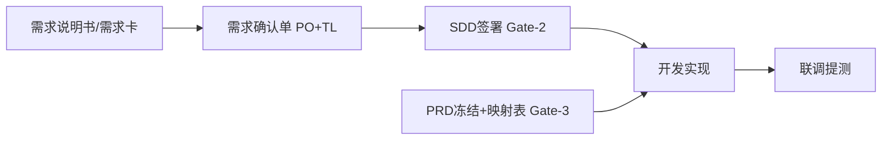

# SDD 范式规则优缺点分析与调整方案（可执行版）

**文档版本**：V2.0  
**编制日期**：2026-06-04  
**文档定位**：本文件为 **SDD 范式落地的唯一执行手册**——含分析结论、文件级改动登记、目录规范、准备清单与分阶段勾选任务；按章节顺序执行即可完成项目调整。  
**适用范围**：`AIEP-DEV` 及《AI+产品落地》体系下的子应用交付  

**规则来源索引**：

| 层级 | 路径 | 角色 |
|------|------|------|
| 法定红线 | `01-AI全流程设计/AI+产品全流程执行手册-治理版.md` | Gate、SDD 最小章节、追溯链 |
| 一线执行 | `01-AI全流程设计/AI+产品全流程执行手册-执行版.md` | 六步、Fast Track、AI 口径 |
| 主流程 | `03-其他过程文档-参考/项目全链路执行方案.md` | P1～P6、SDD/PRD 分工 |
| 制度条款 | `03-其他过程文档-参考/产品设计小组规范方案-制度篇（合并镜像）.md` | 必须/禁止、L1～L4 |
| 框架（不变） | `核心文档/框架核心文档/` 下 `系统设计规范.md`、`创建指南.md`、`子应用打包指南.md` | 统一风格、独立打包 |
| 模板资产 | `02-子应用通用模板/` | 填报与门禁 |
| 实践样例 | `AIEP-WEB/src/docs/子应用文档/power-fee-protocol-check/`、`sample-app/` | 对照迁移 |

---

## 一、SDD 范式规则体系概览

### 1.1 核心定义

1. **双真值分离**：接口、数据模型、验收（GWT）、风险与回滚 → **SDD**；页面、交互、原型体验 → **PRD**。  
2. **门禁举证**：Gate-1～4 + G2/G3 检查单；未满足不得进入下一环节。  
3. **变更顺序**：先改 SDD（及必要时 PRD）再改代码。  
4. **机读 + 人签**：`SDD.md` + `SDD.json`；签署/冻结须人工。  
5. **全链路追溯**：`需求ID → SDD条目 → 提交 → 用例 → 发布单`。

### 1.2 Gate 双门槛（须在培训与站会中固定口径）

| 门槛 | 治理映射 | 允许做什么 | 禁止做什么 |
|------|----------|------------|------------|
| **开发准入（Gate-2）** | SDD 已签署 | 全面开发排期、契约类编码、AI 按 SDD 生成后端/接口 | 无签署 SDD 承诺上线日期 |
| **联调提测（Gate-3）** | PRD 已冻结 + 映射表完成 | 联调、提测、按 GWT 验收 | PRD 未冻结即提测 |



**常见误解纠正**：PRD 未冻结时**可**在 SDD 已签署前提下做部分实现；**不可**进入联调提测。

---

## 二、优点分析（摘要）

- **契约单一事实源**，降低群聊当合同与返工。  
- **GWT + acceptance_id** 测试左移。  
- **Fast Track + SDD-Lite** 小需求可裁剪文档量。  
- **机读 JSON + G2/G3** 为 CI 与 AI 编码预留接口。  
- **映射表** 对齐界面字段与 SDD/API。

---

## 三、缺点与风险分析（摘要）

| 类别 | 核心问题 |
|------|----------|
| 成本 | 全量 SDD 11 章 + 多文档并行；双格式 MD/JSON 易漂移 |
| 边界 | SDD §8 与 PRD 页面状态重复；六套「必填」与 SDD/PRD 双真值冲突 |
| 自动化 | 无 `sdd-validate`、无 Schema、SDD-Lite 模板缺失 |
| 认知 | 多入口方案（全链路 / 直连 / Discover-Define）口径不一 |
| AI | 页面标注与正式 PRD 双轨 |

---

## 四、内外矛盾与归口（执行时必须消解）

| 编号 | 归口结论 | 执行动作见 §十 |
|------|----------|----------------|
| C-01 | 主真值 = SDD + PRD + 需求说明书 + 操作说明书 | 改 `产品升级方案` §3.2 |
| C-02 | PRD 关联 SDD 版本 + 映射表，不再强制关联「详细设计」为主契约 | 改 `03-PRD设计评审文档模板` |
| C-03 | SDD 直连 = Fast Track 子流程 | 改 `AI工作流程方案-SDD直连编码` 文首 |
| C-04 | Define 阶段必须产出 SDD 机读稿 | 改 `AI+产品落地方案` §5.2 |
| C-05 | 新增 SDD-Lite 模板（序号见 §八，用 **15** 避免与 `10-版本变更记录` 冲突） | 新建 `15-SDD-Lite*` |
| C-06 | 交付 `sdd.schema.json` + `scripts/sdd-validate.mjs` | 见 P2 任务 |

---

## 五、不变项（本调整不改动以下要求）

> **SDD 范式调整仅改变「契约文档怎么写、何时能开发/提测」，不改变工程架构与 UI 工程约束。**

| 不变项 | 约束来源 | 执行要求 |
|--------|----------|----------|
| **统一风格** | `核心文档/框架核心文档/系统设计规范.md`、`创建指南.md` §3.3.4 | 子应用 UI/组件与主系统一致；不得因减负跳过设计规范 |
| **子应用独立打包** | `子应用打包指南.md`、`创建指南.md` | 每子应用独立 `build/vite.<app>.config.js`、`dist/<app>/`、Hash 路由、`base: './'` |
| **真实交互红线** | `产品升级方案` §3.3、SDD/PRD 中的 GWT 与异常策略 | 禁止伪过滤、无回写提交、关键链路无异常覆盖 |
| **治理版红线** | `AI+产品全流程执行手册-治理版.md` | Gate、追溯链、先 SDD 后代码 — **不得降级** |

---

## 六、文档真值层级（写入 README 的标准条文）

以下内容 **须合并进** `02-子应用通用模板/README-子应用文档模板使用说明.md` 新增 **「§0 文档真值层级」**（P0 必做）。

### 6.1 四类主文档（唯一契约真值）

| 类型 | 正式文件名建议 | 职责 |
|------|----------------|------|
| **需求锚定** | `01-需求说明书.md`（制度中的「需求卡」与此合并，**禁止再建新名**） | 范围、SA-xx、不做项、成功指标 |
| **契约真值** | `SDD-v<x>.md` + `SDD-v<x>.json` | API、数模、GWT、风险、与 API 相关的页面状态 |
| **体验真值** | `03-PRD设计评审文档.md` + 原型链接 | 页面、交互、文案、纯 UI 状态机 |
| **运维说明** | `应用操作说明书.md` | 运行、使用、排障 |

### 6.2 附件文档（可选，不得与 SDD API 冲突）

| 模板序号 | 文件 | 定位 |
|----------|------|------|
| 02 | 产品设计文档 | 轻量：定位、信息架构、风格策略 |
| 04 | 详细设计文档 | 页面时序补充；**不**作为接口真值 |
| 05 | 数据库设计文档 | 全量 DDL；SDD §7 须引用或摘录一致 |
| 01～06 其余 | 按关卡逐步补齐，见 §8.3 |

### 6.3 治理与门禁文档（AI 项目必用）

| 用途 | 文件 |
|------|------|
| SDD 评审 | `08-SDD校验清单`（子应用目录内） |
| 关卡检查 | `09-G2-G3关卡自动门禁检查` |
| 机读配置 | `04-AI治理与审计/gate-config.json`（从 `13-gate-config.json` 复制） |
| 任务拆解 | `14-G3开发任务拆解表` |
| 映射 | `01-需求与设计/页面-路由-接口-数据表映射表.md`（与 `16-映射表模板` 同构） |

---

## 七、子应用标准目录（新建/迁移一律遵循）

根路径：`AIEP-WEB/src/docs/子应用文档/<app-code>/`（与 `gate-config` 中 `paths` 一致）。

```text
<app-code>/
├── 01-需求与设计/
│   ├── 01-需求说明书.md
│   ├── 02-产品设计文档.md          # 可选，轻量
│   ├── 03-PRD设计评审文档.md
│   ├── SDD-v1.0.md                 # 全量 SDD；Fast Track 可用 SDD-Lite-v1.0.md
│   ├── SDD-v1.0.json               # 机读主源（见 §9.3）
│   └── 页面-路由-接口-数据表映射表.md   # Gate-3 必须
├── 02-研发与测试/
│   ├── 01-详细设计文档.md          # 可选附件
│   ├── 02-数据库设计文档.md        # 可选附件
│   ├── 03-验收脚本-GWT.md          # 可与 SDD §10 同步维护
│   ├── 04-G3开发任务拆解表.md
│   ├── 05-G2-G3相关检查表…         # 按项目裁剪
│   └── 06-联调与提测准入检查表.md
├── 03-发布与复盘/
│   └── 01-应用操作说明书.md
└── 04-AI治理与审计/
    ├── gate-config.json
    ├── SDD校验清单.md
    ├── G2-G3关卡自动门禁检查.md
    ├── gate-report.json            # P2 后由脚本生成
    └── 版本变更记录.md
```

**命名统一规则**：同一子应用内 SDD 文件前缀固定为 `SDD-v` 或 `SDD-Lite-v`；禁止混用无前缀 `SDD-v1.0` 与序号前缀 `05-SDD`（存量迁移时重命名，见 §十二）。

---

## 八、模板资产变更登记（须在 `02-子应用通用模板/` 落实）

| 动作 | 路径 | 说明 |
|------|------|------|
| **修订** | `README-子应用文档模板使用说明.md` | 增加 §0 真值层级、§8.3 关卡最小产物、不变项引用 |
| **修订** | `07-SDD模板-可机读版.md` | §8 边界、技术栈无默认值、越界检查说明 |
| **修订** | `08-SDD校验清单模板.md` | 增加「SDD/PRD 越界」「MD/JSON 一致」行 |
| **新建** | `15-SDD-Lite模板.md`、`15-SDD-Lite.json` | Fast Track 专用（**不用 10**，已占用版本变更记录） |
| **新建** | `16-界面元素与SDD字段映射表模板.md` | 与运行时 `页面-路由-接口-数据表映射表.md` 同构 |
| **新建** | `17-需求确认单模板.md` | Gate-1：引用需求说明书 + SDD 摘要 + PO/TL 签章栏 |
| **新建** | `18-FastTrack登记单模板.md` | 记录执行版 §7 四条适用条件 |
| **保留** | `10-版本变更记录模板.md`、`13-gate-config.json`、`14-G3…` | 序号不变 |
| **P2 新建** | `AIEP-WEB/scripts/sdd.schema.json` | JSON Schema |
| **P2 新建** | `AIEP-WEB/scripts/sdd-validate.mjs` | 输出符合 `12-G2-G3自动门禁脚本契约` |

---

## 九、落地前决策清单（开工前 1 日内完成，□ 勾选）

| □ | 决策项 | 建议默认 |
|---|--------|----------|
| □ | 生效日期 | 指定 YYYY-MM-DD 后新需求一律用本方案 |
| □ | 在途项目策略 | A：只补 SDD/映射表；B：下次大版本全量对齐 |
| □ | 需求锚定名称 | **统一为「需求说明书」**（=`需求卡` 举证载体） |
| □ | Fast Track 审批人 | PO + TL 书面登记 |
| □ | 客户确认归档位置 | 九功 / 文档库路径：________ |
| □ | 试点子应用 | 全量：`power-fee-protocol-check`；Fast Track：`sample-app` |
| □ | MD/JSON 策略 | A：JSON 主源；B：双写 + 24h 同步检查（试点期可选 B） |
| □ | P2 前 G2/G3 执行方式 | 人工勾选检查单；脚本就绪后改 CI 阻断 |
| □ | 缺陷平台字段 | 增加 `sdd_id`、`F-xx`、`AT-xx` |
| □ | 项目 AI 阶次 | L1/L2/L3（L4 须 P2 完成） |

---

## 十、分阶段执行任务清单（直接按序执行）

### 10.1 阶段 1：口径统一（第 1～2 周）

| □ | 任务 ID | 操作 | 涉及文件 |
|---|---------|------|----------|
| ☑ | P0-1 | 在 README 增加 **§0 文档真值层级**（复制 §六全文） | `02-子应用通用模板/README-子应用文档模板使用说明.md` |
| ☑ | P0-2 | 修订 §3.2：四类主文档 + 附件说明；删除「六份均为强制」表述 | `03-其他过程文档-参考/产品升级方案.md` |
| ☑ | P0-3 | 文首增加「本方案为 Fast Track 子流程，签署见执行版 §7」 | `03-其他过程文档-参考/AI工作流程方案-SDD直连编码.md` |
| ☑ | P0-4 | §三 增补 Gate 双门槛图（可复制 §1.2） | `03-其他过程文档-参考/项目全链路执行方案.md` |
| ☑ | P0-5 | 关联文档改为：`SDD-v<x>.md`、`页面-路由-接口-数据表映射表.md` | `02-子应用通用模板/03-PRD设计评审文档模板.md` |
| ☑ | P0-6 | Define 输出增加：`SDD-v0.1.json`（草案）、`SDD校验清单` | `03-其他过程文档-参考/AI+产品落地方案.md` §5.2 |
| ☑ | P0-7 | 执行版 §9 站会检查增加第 8 项：「当前门槛：Gate-2 / Gate-3」 | `01-AI全流程设计/AI+产品全流程执行手册-执行版.md` |
| □ | P0-8 | 全员宣贯 1 次；发布 §九决策结果 | 会议纪要归档 |

**阶段 1 完成标准**：新项目 Kickoff 只发 README §0 + 本方案 §七目录；无「以详细设计/接口说明书为契约」口径。

---

### 10.2 阶段 2：模板与边界（第 3～4 周）

| □ | 任务 ID | 操作 | 涉及文件 |
|---|---------|------|----------|
| ☑ | P1-1 | 增加 §8 归属说明 + §6/§10 与 PRD 边界 | `07-SDD模板-可机读版.md` |
| ☑ | P1-2 | 新建 SDD-Lite 模板（章节：元信息、范围、API 摘要、核心数模、P0 GWT、风险） | `15-SDD-Lite模板.md`、`15-SDD-Lite.json` |
| ☑ | P1-3 | 新建映射表模板 | `16-界面元素与SDD字段映射表模板.md` |
| ☑ | P1-4 | 新建需求确认单、Fast Track 登记单 | `17-需求确认单模板.md`、`18-FastTrack登记单模板.md` |
| ☑ | P1-5 | 校验清单增加越界、MD/JSON 一致项 | `08-SDD校验清单模板.md` |
| ☑ | P1-6 | README 模板清单表增加 15～18；§3.1 注明 02/04/05 为附件 | `README-子应用文档模板使用说明.md` |
| ☑ | P1-7 | **试点 A**：`power-fee-protocol-check` SDD 重命名 | `SDD-v2.1.md`、`SDD-v2.1.json`；`03-gate-config.json` 已更新 |
| ☑ | P1-8 | **试点 B**：`sample-app` Fast Track + SDD-Lite + 登记单 | `18-FastTrack登记单.md`、`SDD-Lite-v1.0.*` |

**阶段 2 完成标准**：`15-SDD-Lite` 可被复制使用；至少 1 个子应用映射表 + SDD JSON 通过人工 `08` 清单。

---

### 10.3 阶段 3：工具与 CI（第 5～8 周）

| □ | 任务 ID | 操作 | 涉及文件 |
|---|---------|------|----------|
| ☑ | P2-1 | 编写 `sdd.schema.json` | `AIEP-WEB/scripts/sdd.schema.json` |
| ☑ | P2-2 | 编写 `sdd-validate.mjs` | `AIEP-WEB/scripts/sdd-validate.mjs` |
| ☑ | P2-3 | 根 `package.json` 增加 `validate:sdd`、`coverage:acceptance` | `package.json` |
| ☑ | P2-4 | PR 模板 | `.github/pull_request_template.md` |
| ☑ | P2-5 | `acceptance-coverage.mjs` | `AIEP-WEB/scripts/acceptance-coverage.mjs` |
| ☑ | P2-6 | `prd-page-annotation` 与 PRD/SDD 对齐 | `.cursor/skills/prd-page-annotation/SKILL.md` |
| ☑ | P2-7 | `power-fee-protocol-check` G2 校验通过 + `gate-report.json` | `04-AI治理与审计/` |
| □ | P2-8 | PO 书面批准首个 L4 子应用 | 版本变更记录或纪要 |
| ☑ | P2-9 | CI 流水线接入 `validate:sdd` | `.github/workflows/sdd-gate.yml` |

**阶段 3 完成标准**：`npm run validate:sdd -- --app power-fee-protocol-check` 返回 `status: passed`；G2 检查单「脚本校验」可实证勾选。

---

### 10.4 阶段 4：度量与治理（第 9～12 周）

| □ | 任务 ID | 操作 |
|---|---------|------|
| □ | P3-1 | 建立月度台账（五指标见 §11） |
| □ | P3-2 | 督导小组每周抽查：无 SDD 变更的契约 MR、Fast Track 违规 |
| □ | P3-3 | 复盘后更新 `08`/`07` 检查项；治理版 CORE 变更则同步执行版 |
| □ | P3-4 | 第二子应用完整 G2/G3 留痕 |

---

## 十一、关卡最小产物速查（进入下一关前只查本表）

| 关卡 | 必须存在 | 禁止 |
|------|----------|------|
| **需求确认（Gate-1）** | `01-需求说明书.md`、`17-需求确认单`（双签）、SDD 草案 | 无需求说明书写 SDD |
| **开发准入（Gate-2）** | `SDD-v*.md` + `SDD-v*.json`、`08-SDD校验清单` 通过、SDD 签署 | 未签署全面排期开发 |
| **联调提测（Gate-3）** | `03-PRD` 冻结、`页面-路由-接口-数据表映射表.md`、客户原型确认纪要 | 未冻结 PRD 提测 |
| **Fast Track** | `18-FastTrack登记单` + `15-SDD-Lite*` + `测试验收报告` | 超执行版 §7 四条件仍走 Lite |
| **发布（Gate-4）** | 测试报告、CI 绿、追溯链、发布记录单 | 追溯链缺环 |

---

## 十二、存量子应用迁移步骤

| 子应用 | 当前状态 | 迁移动作 |
|--------|----------|----------|
| `power-fee-protocol-check` | SDD/PRD/映射表较全 | ① 统一 SDD 文件名为 `SDD-v2.1.*`；② MD/JSON 逐字段对齐；③ 首批接入 `sdd-validate` |
| `sample-app` | 有 SDD、映射表 | ① 选 1 需求走 `15-SDD-Lite` 试点；② 补齐 `gate-config` 与 `08` 清单 |
| **其他在途** | 仅 01～06 传统套 | ① 从 PRD/详细设计抽出 API/GWT 合入 SDD；② 标 02/04/05 为附件；③ 补映射表 |

**迁移禁止**：删除 `创建指南`/`打包指南` 要求的 `src/apps/<app>/` 结构与 `build/vite.*.config.js`。

---

## 十三、组织、工具与 AI 准备

| 类别 | 准备内容 | 责任人 |
|------|----------|--------|
| **角色** | PO、TL、PM、研发接口人、测试接口人写入各子应用 `gate-config.owners` | PM |
| **站会** | 使用执行版 §9 八项检查（含 Gate-2/3 类型） | PO |
| **培训** | 1～2h：双真值、双门槛、Fast Track、不变项（§五） | 设计组负责人 |
| **AI** | 固定 SDD 生成 Prompt（输出须过 `11` 字段）；禁止私人提示词作官方依据 | PM + TL |
| **缺陷平台** | 字段：`sdd_id`、`feature_id`、`acceptance_id` | 测试负责人 |
| **脱敏** | 外部 AI 输入走 `AI输入审批单模板` | 安全/PM |

---

## 十四、度量指标（P3 起统计）

| 指标 | 定义 | 首期目标 | 数据来源 |
|------|------|----------|----------|
| SDD 一次复核通过率 | 首次 `08` 清单即通过 | ≥60% → 75% | SDD 校验清单 |
| PRD 冻结后映射表变更次数 | 冻结后映射表版本 diff 条数/需求 | ≤2 | 映射表版本记录 |
| 缺陷回溯 SDD 比例 | 缺陷带 `F-xx`/`AT-xx` 占比 | ≥70% | 缺陷平台 |
| 文档-代码漂移 | 契约相关 MR 无 SDD 版本变更 | →0 | Git + SDD 变更记录 |
| Fast Track 违规率 | 登记单条件不满足仍用 Lite | <10% | `18-FastTrack登记单` |

**P3 启动前**：须录一版基线数据（至少 1 个子应用、近 1 个迭代）。

---

## 十五、目标态（一句话）

> 需求说明书锚定 → SDD 机读契约双签（Gate-2）→ 开发 → PRD 冻结与映射表（Gate-3）→ 联调提测 → G2/G3 脚本与追溯链在 CI 执行；小需求用 SDD-Lite；统一风格与独立打包仍由框架文档约束；禁止六套并行真值与群聊契约。

---

## 十六、实施路线图与责任

| 阶段 | 周期 | 交付物 | 责任 |
|------|------|--------|------|
| 1 口径统一 | 1～2 周 | §10.1 全部 □ | 产品设计组负责人 |
| 2 模板补齐 | 3～4 周 | §10.2 + 试点 | PM + TL |
| 3 工具落地 | 5～8 周 | §10.3 + `sdd-validate` | 研发负责人 |
| 4 度量复盘 | 9～12 周 | §十四台账 | PO + 督导 |

---

## 十七、文件变更总表（与 §十 一一对应）

| 优先级 | 路径 | 动作 |
|--------|------|------|
| P0 | `02-子应用通用模板/README-子应用文档模板使用说明.md` | 增 §0、§8.3、模板表 15～18 |
| P0 | `03-其他过程文档-参考/产品升级方案.md` | 改 §3.2 |
| P0 | `03-其他过程文档-参考/AI工作流程方案-SDD直连编码.md` | 文首定位 |
| P0 | `03-其他过程文档-参考/项目全链路执行方案.md` | §三 双门槛图 |
| P0 | `02-子应用通用模板/03-PRD设计评审文档模板.md` | 关联文档 |
| P0 | `03-其他过程文档-参考/AI+产品落地方案.md` | §5.2 产出 |
| P0 | `01-AI全流程设计/AI+产品全流程执行手册-执行版.md` | §9 第 8 项 |
| P1 | `02-子应用通用模板/07-SDD模板-可机读版.md` | 边界与栈中立 |
| P1 | `02-子应用通用模板/08-SDD校验清单模板.md` | 新检查项 |
| P1 | 新建 `15`～`18` 模板 | 见 §八 |
| P1 | `AIEP-WEB/src/docs/子应用文档/power-fee-protocol-check/` | 命名与 MD/JSON 对齐 |
| P1 | `AIEP-WEB/src/docs/子应用文档/sample-app/` | Fast Track 试点 |
| P2 | `AIEP-WEB/scripts/sdd.schema.json`、`sdd-validate.mjs` | 新建 |
| P2 | `AIEP-WEB/package.json` | 增加 validate 脚本 |
| P2 | `.github/pull_request_template.md` | PR 与 SDD 关联 |
| P2 | `.cursor/skills/prd-page-annotation/SKILL.md` | 与 PRD 联动 |
| — | `核心文档/框架核心文档/*` | **仅引用，不修改**（除非打包/风格规则本身变更） |

---

## 十八、结论

本方案 V2.0 将「分析 + 准备 + 文件路径 + 勾选任务 + 目录规范 + 不变项」合并为**单文档可执行**。实施时以 **§十任务清单** 为主线程，以 **§十七总表** 核对漏项；与《治理版》冲突时以《治理版》为准，凡 CORE 级规则变更须标注 `LEVEL` 并重新派生《执行版》。

---

*修订记录：V2.0 增补 §五～§十八可执行章节；模板序号 15～18 规避与 10/13 冲突；明确框架不变项与子应用目录标准。*

---

## 十九、落地进度（2026-06-04）

| 阶段 | 状态 | 已完成项 |
|------|------|----------|
| **P0 口径统一** | 已完成 | P0-1～P0-7（README §0、产品升级、直连方案、全链路 §3.1、PRD 关联、落地方案 Define、执行版 §9 第 8 项） |
| **P1 模板与边界** | 已完成 | P1-1～P1-6、P1-7（`15`～`18` 模板、`07`/`08` 修订、power-fee `SDD-v2.1.*` 重命名与 gate-config） |
| **P1 试点 B** | 已完成 | `sample-app`：`18-FastTrack登记单`、`SDD-Lite-v1.0.*` |
| **P2 工具** | 已完成 | 脚本 + `package.json` + PR 模板 + `sdd-gate.yml` CI + `prd-page-annotation`；`sample-app`/`power-fee` G2 均 passed |
| **P2 校验** | 已通过 | `power-fee-protocol-check` G2 passed；`sample-app` SDD 已补 AT-04/05 |
| **P3 度量** | 待办 | 月度台账与基线 |
