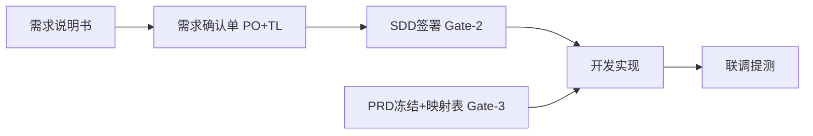
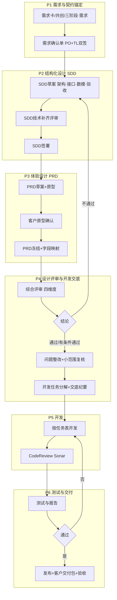

# 产品设计与项目全链路执行方案（合并版）

**文档版本**：V3.2（2026-06-08 · 对齐 Skill V0.4、Gate-1～4、19/20 落盘）

**本方案用途**：一份材料完成**对内执行说明**与对外**流程与客户对接说明**——回答四件事：**流程怎么走、客户与项目组如何对接、质量与门禁如何卡、模板与产物去哪找**。  
**文件地位**：产品设计与交付条线的**主执行文档**（全链路流程 + 对接 + 工程实践 + 模板索引）。正文中的「必须 / 禁止 / 应当」及 **§三「红线」** 即为本方案的**执行口径**。

---

## 阅读导航与阐述口径（建议汇报/宣贯时按此顺序讲）

### 1. 谁读哪一部分

| 章节         | 主要内容                           | 汇报时可重点讲                   | 执行时作何用         |
| ---------- | ------------------------------ | ------------------------- | -------------- |
| **战略篇**    | 转型动因、短中长期定位、四大主线、挑战与对策、2～3 年节奏 | 「我们要变成什么、抓手是什么」           | 与部门 OKR、年度重点对齐 |
| **§〇**     | 五段（P）相对历史七段的优化逻辑               | 「为何合并评审与交底、为何 SDD/PRD 收口」 | 裁剪流程、解释变革      |
| **§一～§四**  | 目标、客户/项目对接、五段×六步×门禁、流程图        | 「一条主链、三个红线」               | 周会/里程碑对照       |
| **§五**     | P1～P6 阶段职责、成果物、关键要求            | 按项目所处阶段节选                 | **阶段执行唯一细案**   |
| **§六～§十**  | AI 分级、角色、部门保障、评审与台账摘录、度量       | 「能力与保障、如何统计」              | 考核与复盘口径        |
| **附录 A～D** | 模板与仓库路径、版本记录、历史文档说明、**制度载体**   | 「证据与制度从哪取」                | 文档维护与审计        |

### 2. 与上级制度、模板的关系（阐述时一页说清）

| 材料                                                    | 在本方案中的角色                                                                      |
| ----------------------------------------------------- | ----------------------------------------------------------------------------- |
| **`ai-full-process-design` Skill（V0.4）**              | **Agent 默认入口**：步骤推断、形态路由、Gate 脚本、落盘路径；人读可跳过，Agent **必须**加载 |
| 《AI+全流程设计-Skill设计文档》                              | Skill 权威细则；与执行版/治理版对齐说明                                             |
| 《AI+产品全流程执行手册-**治理版**》                                | **Gate、红线、SDD/PRD 单一事实源**的法定定义；本方案**引用其结论**，不复制条文。                            |
| 《AI+产品全流程执行手册-**执行版**》                                | **六步顺序**与日常迭代节奏；本方案 **P1～P6** 与之对齐叙述。                                         |
| `**02-子应用通用模板/`**（相对路径见附录 A）                          | PRD、SDD、门禁检查等**填报模板**；本方案规定「何时产出、谁签」。                                         |
| **制度篇**（**附录 D** / 同目录 `**产品设计小组规范方案-制度篇（合并镜像）.md`**） | **条款级**必须/禁止/应当、台账字段、L1～L4 表、检查单等；本方案 **第二至五章（§二～§五）** 为流程级展开；条款细节**以制度篇为准**。 |
| `01-AI全流程设计/产品设计小组规范方案.md`                            | **入口页**（导航至本文件与制度篇），避免旧链接失效。                                                  |

### 3. 本文常用符号

| 符号            | 含义                                                  |
| ------------- | --------------------------------------------------- |
| **P1～P6**     | 五段主流程（见 **§三** 总表与 **§五** 详述）。                      |
| **六步**        | 需求生成 → 需求确认 → 界面生成 → 界面确认 → 开发测试 → 发布上线（《执行版》）。     |
| **Gate / 红线** | 未满足则不得进入下一环节的法定条件（以《治理版》为准）；Agent 判定见 Skill `gates.md`。 |
| **G2-A / G2-B** | 界面确认（19）与技术补齐（20）子门禁，Gate-3 / Gate-2 举证。 |
| **SDD / PRD** | 接口、数据、验收 vs 页面与交互的**唯一事实源**（本方案 **§一、§五**；字段级见制度篇）。 |

---

## 战略篇：部门转型与小组定位（与执行流程一体）

### 战略篇-1 核心思路

**转型方向**：从「需求承接 + 文档输出部门」→ **「AI 驱动的业务设计与价值交付部门」**。

**现状摘要**

1. 岗位价值偏后端，需求对接、文档、原型多，业务深度与话语权不足。
2. 技能偏传统产品设计，对代码与测试验收参与浅，与 AI 时代交付节奏不匹配。
3. AI 多用于文案、原型，未形成**标准化工作流**，提效有限。
4. 跟项目走、少沉淀，重复劳动多，个人与团队难形成可复用资产与核心竞争力。

**三大关键变化（转型抓手）**

| 维度       | 从      | 到                                                     |
| -------- | ------ | ----------------------------------------------------- |
| **交付物**  | 单纯文档   | **可运行方案**（原型 + 数据 + 规则 + 可对接开发/AI 生成代码的结构化 SDD/PRD）   |
| **工作方式** | 瀑布式偏重  | **敏捷迭代 + 快速验证**（与本方案 **P1～P6、第二章（§二）** 对齐）            |
| **能力结构** | 通用产品经理 | **业务专家 + AI 复合能力**（与本方案 **第六、七章** 及**制度篇第 5～8 章** 对齐） |

### 战略篇-2 小组定位（短 / 中 / 长期）

| 时期     | 定位             | 核心职责摘要                                                   |
| ------ | -------------- | -------------------------------------------------------- |
| **短期** | AI 辅助设计支撑部门    | 工具规范（**图颜、九功**）、客户对接优化、主攻业务方向评估；规范 SDD/PRD 产出，成为业务可靠设计伙伴 |
| **中期** | 智能化设计服务部门      | **AI + 设计**标准化流程深化；前置化、敏捷化客户体验；主攻领域专项优势，**被动执行 → 主动赋能**  |
| **长期** | 公司 AI 产品设计核心枢纽 | 输出可复用 AI 设计规范与方法论；体验与商业价值深度绑定；**敏捷化、智能化**团队品牌            |

### 战略篇-3 转型四大主线（与本文档章节对应）

| 主线           | 核心目标                           | 在本主文档中的落点                                                        |
| ------------ | ------------------------------ | ---------------------------------------------------------------- |
| **1. 工具驱动**  | 标准 AI 研发链路；设计产物直接驱动开发/AI 编码    | **第三～五章（§三～§五）、P2/P3**；SDD/PRD；**制度篇第 4～6 章**；图颜/九功见**制度篇 §4.4** |
| **2. 客户对接**  | 需求共创 + 体验前置；降变更、降返工            | **第二章（§二）**；三阶段、双周共创；目标 **需求变更 ↓30%+**（须先建基线）                    |
| **3. 业务能力**  | 1～2 个电力相关主攻方向做深（核算、电费账务、创新业务等） | **第七章** 角色与业务负责人；**制度篇第 2 章**；项目承接策略                             |
| **4. AI 应用** | 短期内部提效 + 中长期产品内 AI 能力          | **第六章**；**制度篇第 5、8 章**；每季度 1～2 试点；目标 **2～3 个 AI 驱动核心产品能力**       |

### 战略篇-4 核心挑战与解决方案（执行表）

| 挑战                          | 解决方案（可落地）                                                                                | 责任主体             |
| --------------------------- | ---------------------------------------------------------------------------------------- | ---------------- |
| 图颜、九功应用不足；SDD 等产物不规范、难适配 AI | 工具手册与场景标准；**每月**培训/考核；督导小组**每周**抽查文档；与绩效挂钩；优化 SDD 模板 AI 相关字段                             | 产品设计组负责人 + 骨干    |
| 客户对接不直接、体验前置不足              | **每项目指定核心设计人员**直面客户；**《用户体验前置需求清单》**；1～2 周迭代原型确认；**客户反馈台账**（24h 响应、3 工作日出方案）；**季度**满意度调研 | 项目设计负责人 + 客户对接专员 |
| 业务属性薄弱、主攻方向不清               | 联合业务调研，明确 **2～3 个主攻方向**；**季度**业务学习与考核；承接标准优先核心项目；每方向 **1 名业务联络员**                        | 产品设计组负责人 + 业务对接人 |
| AI 与新技术未系统化                 | **每月** AI 设计培训；**AI 技术探索小组**周研讨与试点案例；半年度 AI 应用评估；纳入绩效；与图颜/九功协同                           | AI 探索小组 + 全体成员   |

### 战略篇-5 人员能力要求（分层次）

**（一）基础能力**：熟练掌握 **图颜、九功**；按规范输出 SDD/PRD；AI-first 思维；直面客户与敏捷反馈；掌握公司核心业务流程与主攻方向行业规则；规范意识。  

**（二）提升能力**：AI 设计工具高阶应用、流程优化；精通 1～2 主攻业务；统筹跨部门；能培训指导新人。

### 战略篇-6 2～3 年发展规划（摘要）

| 阶段            | 时间    | 核心目标                            | 关键动作示例                                                      |
| ------------- | ----- | ------------------------------- | ----------------------------------------------------------- |
| **第一阶段：夯实基础** | 第 1 年 | 工具与设计产物规范落地；对接机制；主攻方向明确；AI 学习试点 | Q1 手册与模板、督导与探索小组；Q2 直面客户与反馈台账、满意度调研；Q3 主攻方向与学习路径；Q4 年度考核与复盘 |
| **第二阶段：深化提升** | 第 2 年 | 「AI+设计」标准流程；主攻领域优势；骨干能力         | 高级 AI 培训、方法论沉淀、创新项目、中期考核                                    |
| **第三阶段：价值引领** | 第 3 年 | 公司 AI 产品设计枢纽；规范与方法论对外；团队品牌      | 输出公司级规范、行业交流、AI 治理与安全                                       |

### 战略篇-7 会议讨论重点建议

1. 确认 **2～3 个主攻业务领域**与项目承接标准。
2. 审议 **图颜、九功** 应用手册与 SDD 模板及督导细则。
3. 确认**人员分层培养**与预算。
4. 优化 **AI 试点**机制、优先级与路径。
5. 结合公司节奏调整各阶段目标与时限。

---

## 〇、优化说明（相对原七阶段的调整）

> **承接说明**：下文「原模式 / 原七阶段」指公司既有**需求—设计—开发—测试—交付**七段习惯写法；本方案用 **P1～P6 五段**统一阐述，便于与《执行版》六步、门禁对齐讲解。

| 优化点  | 原模式                  | 融合后                                                                                        |
| ---- | -------------------- | ------------------------------------------------------------------------------------------ |
| 阶段数量 | 七段独立，（三）（四）均有方案讲解    | **五段主流程**：将**设计内部评审**与**开发交付评审**合并为**「设计评审与开发交底」一次闭环**（同一轮材料、一次问题清单、会后直接产出任务分解），避免方案重复讲解三轮 |
| 契约载体 | SRS + 多份设计说明 + 接口说明书 | **SDD**（API、数据模型、验收、风险）+ **PRD**（页面与交互）+ 原 SRS/架构文档**作为附件或 SDD 引用章节**，避免多套「真值」             |
| 客户对齐 | 分散在需求、原型确认           | **双周共创 + 三阶段确认**嵌入 P1/P3，纪要留痕                                                              |
| 对内协同 | 例会为主                 | **干系人台账 + 禁止群聊唯一契约**；与周会同步六步位置                                                             |
| AI   | 未显式                  | 项目声明 **L1～L4**；与六步映射见 **§六**                                                               |
| 角色   | 项目经理、产品经理、开发组长等      | 与 **PO / TL / PM** 对齐见 **§七**                                                              |
| 战略转型 | 部门定位、四大主线、2～3 年节奏    | 见文首 **战略篇**                                                                                |

---

## 一、方案定位与核心目标

聚焦「需求 - 设计 - 开发 - 测试 - 交付」全链路，原则：**责任到人、时间可控、成果可验**；并满足电力软件对**数据准确性、稳定性、合规**的要求。

**核心目标**

1. 降低跨角色协作内耗，减少执行混乱与返工。
2. **契约清晰**：接口与数据以 **SDD** 为准，页面与交互以 **PRD** 为准；开发、联调提测按**门禁举证**。
3. **对接前置**：客户共创与三阶段确认，控制需求变更与界面返工。
4. **AI 可管、质量可测**：AI 分级使用 + Sonar/JMeter/ZAP 等工程指标（沿用原模式要求）。
5. 缩短周期，提高客户满意度与部门交付效率。

---

## 二、项目与客户对接（全链路通用制度）

> **本节即**项目对内、对客户的**对接执行口径**（可直接写入项目计划或向客户说明）。条款级细则与表格与**制度篇第 3 章**一致；各阶段 **P1～P6** 执行时**须满足**本章，不得弱化。

### 2.1 目标

- **客户侧**：前置对齐真实场景与合规要求，减少理解偏差与后期返工。  
- **项目内侧**：研发/测试/项管与产品**同一套事实与排期规则**，避免群聊当合同、责任不清。

### 2.2 客户对接（对外）

#### 2.2.1 需求共创与沟通节奏

- **必须**：以**原型级可见成果**或关键流程 DEMO 作为对齐载体之一；场景描述优先于纯功能清单堆砌。  
- **必须**：默认**双周**至少一次客户共创会（频次加密须 **PO 书面确认**）；**会前 24h** 发出议程及上轮行动项完成情况。  
- **必须**：每次共创或阶段确认会产出**书面结论**（同意 / 修改点 / 待决项）；对客户承诺以**纪要或确认单**为准。  
- **建议**：**1～2 周**输出一轮可见成果（原型或 DEMO）做快速验证；验证结论须**回写**需求卡或 SDD，**不替代**门禁。

#### 2.2.2 三阶段确认（与客户书面证据）

| 阶段       | 确认内容                      | 责任方          | 必须证据                                         |
| -------- | ------------------------- | ------------ | -------------------------------------------- |
| **需求阶段** | 业务目标、范围边界、成功指标、不做项        | PO + 客户      | **需求确认单**（引用需求卡 + SDD 摘要）                    |
| **原型阶段** | 核心场景体验、关键状态与异常、与 SDD 字段一致 | PO/PM + 客户   | PRD 冻结前**评审纪要** + **界面元素 ↔ SDD 字段映射**（冻结前定稿） |
| **上线前**  | 预期效果、灰度范围、回滚与监控           | PO + TL + 客户 | **上线确认记录**（可与发布检查、验收合并）                      |

#### 2.2.3 客户对接规范（会议、保密、升级）

| 类别    | 标准                                                      |
| ----- | ------------------------------------------------------- |
| 纪要    | **必须**含：决议、待决项、行动项（**责任人 + 完成日期**）                      |
| 资料与保密 | **必须**：对外发送含真实或敏感数据的原型/样例前完成**脱敏与审批**（按部门流程）            |
| 分歧升级  | **应当**先书面列差异再上会；超过 **2 个工作日**未闭合的分歧，升级至 **PO + 客户侧负责人** |
| 联系人变更 | **必须**：客户对接人变更书面确认，并 **24h 内**更新干系人台账（见 2.3）            |

#### 2.2.4 对外承诺与范围变更追溯

- **必须**：范围、验收类承诺对应**需求 ID** 与 **SDD/PRD 版本号**。  
- **禁止**：口头变更未在下次共创或书面流程中**追认**即纳入开发排期或对外承诺日期。

#### 2.2.5 与客户的关键面对面节点（与部门保障对齐）

- **必须**在下列节点与客户**面对面沟通**（线上会议视同面对面）：**需求对齐与需求确认**、**设计/原型评审（含 P3 冻结前评审）**、**交付与验收**。  
- 上述节点均须有可归档的**纪要或确认单**。

### 2.3 项目组对内对接（对内）

#### 2.3.1 干系人台账（必须）

每个项目**必须**维护台账，至少包含：**PO、TL、PM、客户对接人、研发接口人、测试接口人**；人员变更 **24h 内**更新并知会全员。

#### 2.3.2 对接通道与契约载体

- **必须**：契约类信息（范围、验收、接口约定、排期前提）以**需求卡、SDD、PRD、确认单、纪要**为准。  
- **禁止**：以即时通讯聊天记录作为**唯一**契约依据。

#### 2.3.3 内部对齐节奏

- **应当**：项目组周会/迭代会与**执行版六步**对齐：同步当前处于哪一步、**唯一产物**是否齐备、是否触碰红线；阻塞项升级 **PO + TL**。  
- **禁止**：在未满足「需求确认 / SDD 签署 / PRD 冻结」对应门槛时，由产品或单方**对外承诺开发完成日期**。

#### 2.3.4 资料、工具与权限

- **必须**：按台账开通文档库、原型工具、代码仓库等权限；涉密材料链接**应当**标注密级。  
- **应当**：阶段成果物上传至**部门规定的文档库**（SVN/Git/对象存储等以现行制度为准）。

### 2.4 对接活动与五段流程（P1～P6）的对应关系

| 对接活动              | 主要发生阶段    | 说明                              |
| ----------------- | --------- | ------------------------------- |
| 双周共创、三阶段·需求、需求确认单 | **P1**    | 与客户锚定目标与范围                      |
| 原型确认、三阶段·原型、纪要    | **P3**    | 体验与界面契约对齐 SDD                   |
| 设计/开发交底会（内部）      | **P4**    | 对内交付任务与风险，客户可不参加但**若有承诺须已落纪要**  |
| 测试阶段演示与缺陷确认       | **P5～P6** | 产品经理确认缺陷优先级；**重大范围问题**回退至 2.2.4 |
| 部署培训、验收、运维协议      | **P6**    | 三阶段·上线前 + 客户交付                  |

---

## 三、总体流程：五段主流程 × 六步 × 门禁（总览表）

| 五段主流程                  | 对应《执行版》六步       | 关键门禁 / 必须证据                                                                                               | 原七阶段映射                |
| ---------------------- | --------------- | --------------------------------------------------------------------------------------------------------- | --------------------- |
| **P1 需求与契约锚定**         | 需求生成 → 需求确认     | 需求卡；**需求确认单 PO+TL 双签**；SRS/《技术可行性评估报告》可并存为附件                                                              | 原（一）+ 三阶段之需求段 + 小组对接  |
| **P2 结构化设计（SDD 为主）**   | 需求确认后、界面生成前     | **SDD** 含治理版最小章节；技术可行性、架构/数模进 SDD 或**显式引用**；《系统架构设计文档》建议作为 SDD 外部依赖或附件                                    | 原（二）技术部分 SDD 化        |
| **P3 体验设计与冻结（PRD 为主）** | 界面生成 → 界面确认     | **PRD 草案 + 原型**；客户对原型确认；**PRD 冻结 + 界面元素↔SDD 字段映射表**                                                       | 原（二）产品/原型部分 + 三阶段之原型段 |
| **P4 设计评审与开发交底**       | 界面确认后、开发测试入口    | **一次**综合评审：四维度（需求符合性、技术可行性、可测试性、成本）；**《产品设计评审报告》**；问题清单闭环；**《开发任务分解表》**《风险与应对》**《开发交底纪要》**（合并原 三+四 的重复讲解） | 原（三）+（四）优化合并          |
| **P5 软件开发**            | 开发测试（实现段）       | **SDD 已签署**后方可全面开发排期；**禁止**私自变更；变更须**先改 SDD** 再改代码；Code Review、Sonar、自测 100%                              | 原（五）                  |
| **P6 测试、发布与客户交付**      | 开发测试（测试段）→ 发布上线 | 测试报告双签；**Gate-4**；部署、交付包、验收报告、运维协议                                                                        | 原（六）+（七）+ 三阶段之上线前确认   |

**红线（结论口径；条文以《治理版》为准）**

- **未签署 SDD**，不得进入编码主链路。  
- **未冻结 PRD** 或未完成**界面元素 ↔ SDD 字段映射**，不得联调/提测。  
- **测试 / CI/CD / 追溯链**未满足《治理版》要求，不得发布。

### 3.1 Gate 双门槛（执行口径，避免与「能否写代码」混淆）

| 门槛 | 治理映射 | 允许 | 禁止 |
|------|----------|------|------|
| **开发准入（Gate-2）** | SDD 已签署 | 全面开发排期、按 SDD 实现接口与数据契约 | 未签署 SDD 对外承诺开发完成日 |
| **联调提测（Gate-3）** | PRD 已冻结 + 界面元素↔SDD 字段映射表 | 联调、提测、按 GWT 验收 | PRD 未冻结或映射表缺失即提测 |

**说明**：PRD 未冻结时，在 **SDD 已签署** 前提下可进行部分实现；**不得**进入联调/提测。详见 `03-其他过程文档-参考/调整方案.md` §1.2。

---

## 四、项目执行流程图（融合 / 优化 Mermaid）

---

## 五、分阶段执行规范（融合后详述）

> 下列各 **§5.x** 在保留原模式「人员 / 时间 / 内容 / 目标 / 成果物 / 关键要求」骨架基础上，**嵌入产品小组必须项**（**必须** / **禁止** 与治理红线一致处不再弱化）。**客户与项目组对接的通用制度见 §二。**

### 5.1 P1 需求与契约锚定（原「需求对接」升级）

1. **执行人员**
  - **主导**：产品经理、项目经理（**对应 PO/PM 职责时可由 PO 裁定范围**）；  
  - **协同**：部门经理、开发组长（技术预评估）、测试；**须维护干系人台账**（PO、TL、PM、客户对接人、研发/测试接口人，变更 24h 内更新）。
2. **执行时间**
  - 接到项目后立即启动；**默认双周客户共创**（加密须 PO 书面确认）；会前 24h 发议程与上轮行动项。
3. **核心内容**
  - **首次沟通**：核心场景、合规、非功能需求；  
  - **二次确认**：复杂需求输出《需求初稿》/需求卡草案，**项目经理与 PO 口径一致**后推进；  
  - **技术预研**：开发组长 + 1 名核心开发 →《技术可行性评估报告》，结论回写 **SDD 风险与外部依赖**草案；  
  - **三阶段确认（需求段）**：业务目标、范围、成功指标、不做项 → **需求确认单**（引用需求卡 + SDD 摘要）。
4. **阶段目标**
  - 形成可追溯需求基线，控制变更率；**书面确认率达标**。
5. **成果物**
  - 《软件需求规格说明书》（含 P0/P1/P2 优先级清单）— 可与**需求卡**并存；  
  - 《系统设计、开发计划》；  
  - 《技术可行性评估报告》；  
  - **需求确认单（PO+TL 双签）**；**会议纪要**（决议、待决项、行动项含责任人日期）。
6. **关键要求（融合）**
  - **必须**：对客户范围/验收类承诺对应**需求 ID 与 SDD 版本**；**禁止**口头变更未书面追认即排开发；  
  - **禁止**以即时通讯为**唯一**契约载体；  
  - 对外资料须**脱敏与审批**（按部门流程）。

---

### 5.2 P2 结构化设计（SDD）（原「产品设计」技术部分）

1. **执行人员**
  - **主导**：产品经理、开发组长（**TL 参与可实现性与风险**）；  
  - **协同**：架构师（若有）、测试（验收口径）。
2. **执行时间**
  - 需求确认通过后并行起草；**SDD 技术补齐评审**完成后进入签署队列。
3. **核心内容**
  - 以 **SDD** 为载体输出：模块边界、**API 契约**、**数据模型**、**Given/When/Then 验收**、非功能、风险与回滚、外部依赖；  
  - 《系统架构设计文档》（拓扑、技术栈 Spring Cloud Alibaba / Vue3 / DB 等）作为 **SDD 引用文档**或附件，**避免与 SDD 接口章节冲突**；  
  - 《数据库表结构文档》（PDM）纳入 SDD 数据模型章。
4. **阶段目标**
  - SDD 覆盖全部 **P0/P1** 能力；**SDD 签署前不得承诺开发完成日期**（与 **§2.3.3 排期衔接** 一致）。
5. **成果物**
  - **已签署的 SDD**（含版本、sdd_id）；机读 JSON/YAML 按治理版与 `07-SDD模板` 执行。
6. **关键要求（融合）**
  - **必须**：变更**先改 SDD** 再改实现；  
  - AI 辅助仅产出草案，**签署须人工**；**必须**声明 AI 阶次（L1～L4），越阶 PO 书面同意。

---

### 5.3 P3 体验设计与冻结（PRD）（原「产品设计」体验部分 + 三阶段原型段）

1. **执行人员**
  - **主导**：产品经理；**协同**：UI 设计师、开发组长（字段一致性）。
2. **执行时间**
  - 与 SDD 草案对齐迭代；**PRD 冻结前**预留客户确认窗口；复杂项 **提前 1～2 天**内部预审。
3. **核心内容**
  - **PRD**：页面范围、交互、状态机与 SDD 字段对齐；**原型**（Axure 等）链接写入 PRD；  
  - **三阶段确认（原型段）**：核心体验、异常态、与 SDD 字段一致 → 纪要 + 客户确认；  
  - 输出 **界面元素 ↔ SDD 字段映射表**。
4. **阶段目标**
  - 设计方案覆盖 P0/P1；**PRD 冻结**作为联调/提测前置。
5. **成果物**
  - 《系统原型》；《简要需求设计文档》/PRD 正文；**PRD 冻结版**；**字段映射表**。
6. **关键要求（融合）**
  - **必须**：原型经**产品经理 + 客户业务负责人**确认；  
  - 预留扩展接口等架构要求在 SDD 中已有体现，PRD 不重复写契约。

---

### 5.4 P4 设计评审与开发交底（合并原「设计内部评审」+「设计开发交付评审」）

> **优化点**：同一套最新材料（SDD 签前终稿 / 已签简版、PRD 冻结版、原型、任务风险初稿）**一次会议序列完成**：评审四维度 → 结论 → 问题整改与小范围复核 → **开发交底**（任务拆解、资源、Jira/阿基米德），避免「评审讲一遍、交底再讲一遍」。

1. **执行人员**
  - **主导**：产品经理；  
  - **评审组长**：开发组长 + 设计/UI 代表；  
  - **成员**：测试主管、开发工程师、其他产品经理；  
  - **开发交底**：开发负责人、核心开发认领、测试主管同步测试计划思路。
2. **执行时间**
  - **PRD 冻结与 SDD 签署完成后 1～2 个工作日**内召开（若政策要求 SDD 签署必须在评审后，则顺序为：内部评审通过 → SDD/PRD 终签 → 次日交底，**不得跳过问题闭环**）。
3. **核心内容**
  - **会前 1 天**：分发材料，评审成员预提问题；  
  - **评审段**（建议总时长可控）：讲解合并为「SDD+PRD+架构要点」**一轮**（可按 45+15 分钟弹性替代原各 30 分钟三轮）；四维度提意见；**《设计评审问题清单》**；结论：通过 / 有条件通过 / 不通过；  
  - **不通过**：返回 P2/P3；**有条件通过**：整改 + **小范围复核**（评审组长 + 2 名核心成员）；  
  - **交底段**：**模块化 + 时间轴**任务拆解（单任务建议 ≤3 工作日）、依赖关系、人岗匹配、**机动人员**、风险与模拟接口策略；验收标准**量化**；录入 **Jira**；关键节点同步 **阿基米德**（若使用）。
4. **阶段目标**
  - 设计问题整改率 **100%**；输出可跟踪开发计划，进度偏差率 **≤5%**。
5. **成果物**
  - 《产品设计评审报告》；《设计评审问题清单及整改记录》；**《开发任务分解表》**；《开发阶段风险及应对方案》；**《开发交底纪要》**（含任务 ID、责任人、起止时间、验收标准、依赖）。
6. **关键要求（融合）**
  - 任务验收标准与 SDD 中 **acceptance_id** 可对应；  
  - **禁止**在无证条件下进入全面开发：须已 **SDD 签署**且 **PRD 冻结 + 字段映射**（与 Gate 一致）。

---

### 5.5 P5 软件开发（同原「软件开发」，强化契约）

1. **执行人员**
  - **主体**：开发工程师；**监督**：开发组组长；**支持**：架构师、产品经理（需求答疑仅解释已签 SDD/冻结 PRD）。
2. **执行时间**
  - 按《开发任务分解表》执行；每日 15 分钟站会。
3. **核心内容**
  - Git 提交规范、Code Review、Sonar **≥85**、部门编码规范；  
  - **需求变更**：须《需求变更申请》+ **产品经理 + 开发组长 + 客户**确认，且**先更新 SDD/PRD 版本**再排期开发。
4. **阶段目标**
  - P0/P1 任务完成；无致命/严重代码缺陷；自测通过率 **100%** 提交测试。
5. **成果物**
  - 测试环境可运行版本；《每日开发进度跟踪表》；《代码审查记录》；《开发阶段风险处理记录》；**接口实现与已签 SDD 一致**（接口说明以 SDD 为准，可另附 swagger 导出作为索引）。
6. **关键要求（融合）**
  - **禁止**未批变更；**禁止**与 SDD 不一致的「口头接口」。

---

### 5.6 P6 测试、发布与客户交付（原测试 + 交付 + 发布治理）

1. **执行人员**
  - **测试段**：测试工程师主导，测试主管、开发、产品经理（缺陷优先级）；  
  - **交付段**：设计开发组组长统筹，开发部署、测试支持验收、产品经理答疑。
2. **执行时间**
  - 测试按计划；交付：小/中/大型 **2/3/5** 个工作日（可据实调整）。
3. **核心内容**
  - 测试计划/用例（P0/P1 **100%** 覆盖；整体覆盖率 **≥95%** 建议指标）；功能/性能（含**电力高峰场景**）/安全（OWASP ZAP）/兼容；缺陷 SLA；  
  - **三阶段确认（上线前）**：预期效果、灰度、回滚与监控；  
  - 测试报告经**开发组长 + 产品经理**签字；  
  - 部署手册、交付文档包、培训、客户验收、运维协议；**发布**须满足 **Gate-4**（测试、CI/CD、追溯链）。
4. **阶段目标**
  - 无致命/严重遗留缺陷（轻微可经 PM 确认遗留）；客户验收 **100%**；文档完整；满意度 **≥90**。
5. **成果物**
  - 《测试计划》《测试用例集》《测试报告》《缺陷跟踪记录》；  
  - 客户环境部署成果；交付文档包；《项目验收报告》；《运维支持协议》；**《发布记录单》**（按统一发布流程）。
6. **关键要求（融合）**
  - 验收不通过 **24h** 内整改方案；交付清单划清责任边界；**发布前**追溯链完整（治理版要求）。

---

## 六、AI 使用与全链路衔接（摘要）

| 六步（执行版）    | 建议 AI 阶次 | 禁止               |
| ---------- | -------- | ---------------- |
| 需求生成       | L1～L2    | AI 单独签署需求卡定稿     |
| 需求确认 / SDD | L2～L3    | AI 替代 **SDD 签署** |
| 界面生成       | L1～L2    | —                |
| 界面确认       | L1       | AI 替代 **PRD 冻结** |
| 开发测试       | L2～L3    | AI 替代测试/发布放行     |
| 发布上线       | L1       | AI 替代发布决策        |

- **必须**：项目声明 **L1～L4**；AI 输出过 Gate；触发兜底 **30 分钟内**人工模板直填（口径见《执行版》「AI 使用规则」）。  
- **短/长期清单字段、季度试点、产品型 AI 立项口径**：见**制度篇第 8、9 章**（附录 D）。

---

## 七、角色对照（项目角色 ↔ 小组规范角色）

| 原模式常见角色     | 小组规范角色          | 说明                    |
| ----------- | --------------- | --------------------- |
| 部门经理 / 分管领导 | PO 或更高决策        | 范围与资源最终裁定             |
| 项目经理        | PM / 协调         | 进度与对外接口；**台账**维护可由其执行 |
| 产品经理        | PM / PO 兼任视组织而定 | 需求卡、SDD/PRD、评审组织      |
| 开发组长        | TL 或研发接口人       | SDD 双签之一、技术风险、交底主持    |
| 测试主管        | QA 代表           | 用例与 acceptance 映射     |

---

## 八、部门级执行保障机制（沿用并对齐）

### （一）人员保障

- 项目**角色责任清单**入库；产品侧增加 **PO/TL/PM** 在门禁上的签字责任。

### （二）进度保障

- 阿基米德（或部门工具）关键节点建议设为：**需求确认双签、SDD 签署、PRD 冻结、开发完成、测试通过、客户验收、发布归档**；偏差 **>10%** 触发复盘会。

### （三）质量保障

- Sonar、用例覆盖率与缺陷趋势、交付后 **1 周内**满意度调研；**小组季度评审**四维度（设计规范、业务合理、数据模型完整、工具与 AI）。

### （四）沟通保障

- 周例会；**客户关键节点**与 **§2.2.5** 一致（需求对齐与确认、设计/原型评审、交付验收须面对面或等效线上会议且**纪要确认**）；成果物进**部门规定文档库**（SVN/Git/对象存储以现行制度为准）。

---

## 九、评审与台账（产品小组制度摘录）

- **设计类评审准入、交付物清单、问题台账字段、落地检查单**：按**制度篇第 7、10 章**执行（附录 D）；本方案 **P4** 已将「SDD 技术补齐 / 签署 / PRD 对内 / 冻结前」等评审类型**合并为一次闭环**；**客户会议与纪要**须同时满足 **第二章（§二）**。

---

## 十、度量指标（项目 + 小组统一口径）

| 维度    | 指标                                      |
| ----- | --------------------------------------- |
| 需求与对接 | 书面确认率；行动项关闭率；**共创会按期召开率**；需求变更率（有基线后跟踪） |
| 设计与契约 | SDD 一次复核通过率；PRD 冻结后字段变更次数               |
| 工程与测试 | Sonar 分；用例覆盖率；缺陷 SLA 达成率                |
| AI    | L 阶次合规率；Gate 一次通过率；兜底次数                 |
| 交付    | 验收一次通过率；文档完整度；满意度                       |

---

## 附录 A 模板与规范索引

> **路径基准**：本文件位于 `核心文档/AI+产品落地/03-其他过程文档-参考/`。下表「相对路径」均相对于 `**核心文档/AI+产品落地/`**。

| 用途                       | 相对路径（从 `AI+产品落地/` 起）                       |
| ------------------------ | ------------------------------------------ |
| **制度全文（合并镜像，与本附录 D 对应）** | `03-其他过程文档-参考/产品设计小组规范方案-制度篇（合并镜像）.md`     |
| 制度入口页（仅导航）               | `01-AI全流程设计/产品设计小组规范方案.md`                 |
| 领导一页汇报                   | `../领导汇报-产品小组规范（一页纸）.md`（相对 `核心文档/`）       |
| 执行版 / 治理版                | `01-AI全流程设计/AI+产品全流程执行手册-执行版.md`、`-治理版.md` |
| PRD / SDD / 门禁等填报模板      | `02-子应用通用模板/` 下 `03`、`07`、`08`、`09`、`14` 等 |

---

## 附录 B 版本记录

| 版本           | 日期         | 说明                                                              |
| ------------ | ---------- | --------------------------------------------------------------- |
| **V3.1**     | 2026-05-11 | **阐述优化**：新增「阅读导航与阐述口径」；统一「制度篇」「章节」引用；红线与附录 A/D 说明改为自洽表述，便于单文件汇报 |
| **V3.0 合并版** | 2026-05-11 | 与《产品设计小组规范方案》合并为单一主文档；新增战略篇；制度全文见附录 D + 制度镜像；原规范路径改为入口页         |
| V2.1         | 2026-05-11 | 新增 **§二 项目与客户对接**；章节顺延                                          |
| V2.0 融合版     | 2026-05-11 | 五段优化流程；合并设计评审与开发交底；Mermaid 更新                                   |

---

## 附录 C 与原《原模式参考》文档关系

原细化七阶段正文已**吸收并优化**于本文件 **§五**；**项目与客户对接**专章为 **§二**。历史文件名 `**项目全链路执行方案-原模式参考.md`** 保留为**跳转说明**，避免旧链接失效。

---

## 附录 D 产品设计小组规范方案（制度全文 · 合并说明）

**阐述时怎么说**：本方案**正文（战略篇 + §〇～§十）**已足以讲清转型、流程、对接与阶段动作；当听众追问「必须/禁止写到哪一级、台账字段是什么、AI L1～L4 全表、检查单长什么样」时，**统一指向本附录所承载的制度篇**——避免口头与正文两套话。

1. **制度正文载体**：条款级内容（原 **第 0～10 章** 全文）在同目录 `**产品设计小组规范方案-制度篇（合并镜像）.md`**；与本附录为**同一材料**，便于单文件打印与检索。
2. **入口页**：`01-AI全流程设计/产品设计小组规范方案.md` 仅保留**链接**，供历史书签与索引跳转。
3. **维护分工**：**流程与对接叙述**（本文件 **§〇～§五**、战略篇）与**条款/检查单**（制度篇）若同时变更，须**同一版本周期内**同步，并在 **附录 B** 各记一行，避免执行口径漂移。
4. **效力**：红线与 Gate 仍以《**治理版**》为最高依据；制度篇 **§0.4** 已载明冲突处理。

