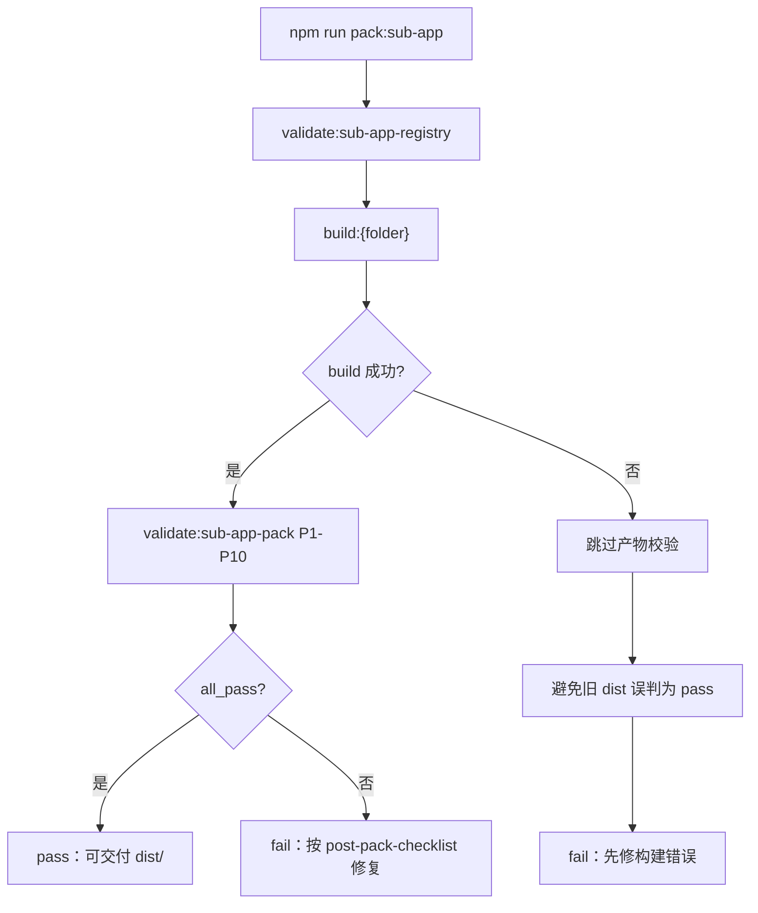

# 子应用打包指南

## 1. 概述

本指南旨在为编译器提供详细的子应用打包配置和步骤，确保每个子应用都能被正确打包为独立运行的静态文件。

## 2. 打包架构

### 2.1 多子应用架构

项目采用多子应用架构，每个子应用具有以下特点：

- 独立的源代码目录
- 独立的入口文件
- 独立的打包配置
- 可独立运行的静态文件

### 2.2 核心配置文件

| 文件类型    | 作用                 | 位置                          |
| ------- | ------------------ | --------------------------- |
| 入口 HTML | 子应用的 HTML 入口       | `build/appX.html`           |
| Vite 配置 | 子应用的打包配置           | `build/vite.appX.config.js` |
| 应用入口    | 子应用的 JavaScript 入口 | `src/apps/appX/main.js`     |
| 布局组件    | 子应用的主布局            | `src/apps/appX/AppX.vue`    |

## 3. 打包配置详解

### 3.1 Vite 配置文件

**HTML 后处理插件（单一真值）**：`AIEP-WEB/build/sub-app-copy-html-plugin.mjs` 中的 `createSubAppCopyHtmlPlugin('{folder}')`。禁止在各子应用 vite 配置内再复制一份内联插件。

**核心配置项**（以 `sample-app` 为例）：

```javascript
// build/vite.sample-app.config.js
import { defineConfig } from 'vite'
import vue from '@vitejs/plugin-vue'
import { resolve, dirname } from 'path'
import { fileURLToPath } from 'url'
import { createSubAppCopyHtmlPlugin } from './sub-app-copy-html-plugin.mjs'

const __dirname = dirname(fileURLToPath(import.meta.url))

export default defineConfig({
  plugins: [vue(), createSubAppCopyHtmlPlugin('sample-app')],
  base: './',
  root: resolve(__dirname, '..'),
  build: {
    outDir: resolve(__dirname, '../dist/sample-app'),
    emptyOutDir: true,
    rollupOptions: {
      input: { main: resolve(__dirname, 'sample-app.html') },
      output: {
        format: 'iife',
        inlineDynamicImports: true,
        entryFileNames: 'assets/[name]-[hash].js',
        chunkFileNames: 'assets/[name]-[hash].js',
        assetFileNames: 'assets/[name]-[hash].[ext]'
      }
    }
  },
  resolve: {
    alias: { '@': resolve(__dirname, '../src') }
  }
})
```

**插件职责**（`closeBundle`）：
- 从 `dist/{folder}/build/{folder}.html`（或根目录已有 HTML）生成 `{folder}.html` 与 `index.html`
- `normalizeBuiltHtml`：将 `../assets/` 改为 `./assets/`；脚本移至 `<body>` 且去掉 `type="module"`（满足 P8）
- 复制 `build/start.html` 并替换 `./assets/main.js` 为实际 hash 文件名（满足 P7）
- 删除残留 `build/` 目录（满足 P5）

### 3.2 入口 HTML 文件

**配置要点**：

```html
<!doctype html>
<html lang="zh-CN">
  <head>
    <meta charset="UTF-8" />
    <link rel="icon" type="image/svg+xml" href="./vite.svg" />
    <meta name="viewport" content="width=device-width, initial-scale=1.0" />
    <title>子应用名称</title>
  </head>
  <body>
    <div id="app"></div>
    <!-- 注意：src 路径必须是相对于 HTML 文件的路径 -->
    <script type="module" src="../src/apps/appX/main.js"></script>
  </body>
</html>
```

### 3.3 子应用入口文件

**配置要点**：

```javascript
// src/apps/appX/main.js
import { createApp } from 'vue'
import '../../style.css' // 导入全局样式
import AppX from './AppX.vue'
import { createRouter, createWebHashHistory } from 'vue-router'

// 路由配置
const routes = [
  {
    path: '/',
    redirect: '/home'
  },
  {
    path: '/home',
    name: 'AppXHome',
    component: () => import('./views/Home.vue')
  },
  // 其他路由...
]

// 创建路由实例
const router = createRouter({
  // 使用 Hash 模式，支持本地文件访问
  history: createWebHashHistory(),
  routes
})

// 创建并挂载应用
const app = createApp(AppX)
app.use(router)
app.mount('#app')
```

**重要注意事项**：
- 子应用独立运行时，路由的 base 路径是 `/`，因此路由配置和路由链接都应该使用相对于根路径的路径（如 `/home`），而不是包含子应用名称的路径（如 `/appX/home`）
- 当子应用在主系统中运行时，主系统的路由会自动处理子应用的路径前缀

## 4. 打包流程

### 4.0 推荐编排（pack-sub-app Skill + 脚本）

> **Skill**：`AIEP-WEB/src/skills/pack-sub-app/SKILL.md`  
> **脚本真值**：`AIEP-WEB/scripts/pack-sub-app.mjs` · `validate-sub-app-pack.mjs`

**推荐一键命令**（含注册表校验 + 构建 + 产物 P1～P10 机读校验）：

```bash
# 仓库根目录；{app-code} 见 subApps.js（可能与 folder 不同，如 ai-smart-crm → ai-smart-crm-admin）
npm run pack:sub-app -- --app {app-code}

# 仅指定构建目录名
npm run pack:sub-app -- --folder sample-app

# 仅校验已有 dist（不重跑 vite）
npm run pack:sub-app -- --app sample-app --skip-build

# 本地调试 vite 配置时跳过嵌入注册表校验
npm run pack:sub-app -- --app sample-app --skip-registry
```

**流程图**：



**与 AI+ 六步**：步骤 3 **U5**、步骤 6 **release-deployment** 均优先 `pack:sub-app`，不要仅用裸 `build:{folder}`（后者不做 P1～P10 校验）。

**app-code 与 folder 不一致时**（示例：`ai-smart-crm` / `ai-smart-crm-admin`）：

| 用途 | 取值 |
|------|------|
| `--app`、文档目录、gate-config | `ai-smart-crm` |
| `build:` / `dist/` / vite 配置 | `ai-smart-crm-admin` |

脚本会根据 `subApps.js` 自动解析 folder。

### 4.1 打包命令

**推荐**：

```bash
npm run pack:sub-app -- --app sample-app
```

**底层构建**（无产物校验，排错用）：

```bash
npm run build:sample-app
```

**命令配置**（package.json）：

```json
{
  "scripts": {
    "build:sample-app": "cd AIEP-WEB && vite build --config build/vite.sample-app.config.js",
    "pack:sub-app": "node AIEP-WEB/scripts/pack-sub-app.mjs",
    "validate:sub-app-pack": "node AIEP-WEB/scripts/validate-sub-app-pack.mjs"
  }
}
```

### 4.2 打包步骤

1. **清理输出目录**：Vite 会自动清空 `dist/appX/` 目录
2. **编译源代码**：将 Vue 组件编译为 JavaScript
3. **打包资源**：将所有依赖打包为静态文件
4. **生成 HTML**：生成包含资源引用的 HTML 文件
5. **优化输出**：对输出文件进行压缩和优化

### 4.3 输出文件结构（严格遵守）

**最终打包结果**：

```
dist/appX/
├── appX.html         # 主入口 HTML 文件
├── index.html        # 备用入口 HTML 文件
├── start.html        # CDN 版本
├── assets/           # 静态资源目录
│   ├── main-xxx.js   # 主 JavaScript 文件
│   └ ...           # 其他资源文件
└── vite.svg          # 图标文件
```

**打包过程中的中间状态**：

在打包过程中，可能会短暂出现 `build` 目录，这是 Vite 构建过程的中间产物。打包完成后，`createSubAppCopyHtmlPlugin`（`build/sub-app-copy-html-plugin.mjs`）会自动：
1. 将 HTML 文件从 `build` 目录复制到 `dist/appX/` 根目录
2. 修正资源引用路径
3. 删除 `build` 目录

**验证标准**（机读：`npm run validate:sub-app-pack -- --folder {folder}`）：

| # | 检查项 |
|---|--------|
| P1 | `dist/{folder}/` 存在 |
| P2 | `index.html` |
| P3 | `{folder}.html` |
| P4 | `assets/*.js` |
| P5 | 无残留 `dist/{folder}/build/` |
| P6 | `index.html` 与 `{folder}.html` 使用 `./assets/` |
| P7 | `start.html` 存在且引用 hash 后的 `./assets/*.js` |
| P8 | 入口 HTML 为 IIFE `<script src="...">`，无 `type="module"` |
| P9 | 入口脚本在 `<body>` 内、位于 `#app` 之后（禁止仅在 `<head>` 加载 IIFE） |
| P10 | 若存在 `standaloneRoutes()`：独立路由 `path` 须以 `/` 开头，禁止 `path.slice(1)` |

**常见问题及解决方案**：

| 问题 | 症状 | 原因 | 解决方案 |
|------|------|------|----------|
| 只看到 assets 和 build 文件夹 | 打包后只有两个文件夹 | `createSubAppCopyHtmlPlugin` 未执行或执行失败 | 检查 `vite.{folder}.config.js` 是否 `import { createSubAppCopyHtmlPlugin } from './sub-app-copy-html-plugin.mjs'` |
| 缺少 start.html | 没有 CDN 版本文件 | 缺少 `build/start.html` 模板 | 确保 `AIEP-WEB/build/start.html` 存在 |
| 资源加载失败 | 404 错误 | 资源引用路径错误 | 检查 `base: './'`，确认插件已把 `../assets/` 改为 `./assets/` |
| build 失败但 P 项全绿 | pack 总评 fail、校验 skipped | 旧 dist 残留 | 先修构建；勿依赖跳过校验前的旧产物 |
| **打包后 index 白屏** | `#app` 为空、控制台无 404 | IIFE 脚本仍在 `<head>`，在 `#app` 渲染前执行 | 确认使用 `sub-app-copy-html-plugin` 且 **P9 pass**；脚本须在 `</body>` 前、`#app` 后 |
| **打包后白屏（路由）** | 控制台 `Invalid path "xxx"` | 独立 `main.js` 路由 `path` 未以 `/` 开头（生产 Vue Router 抛错） | `standaloneRoutes()` 用 `` `/${path}` `` 补全前缀；**禁止**对独立路由 `slice(1)`；见 §5.4 |
| start 正常、index 白屏 | 仅 `start.html` 能打开 | 同上：历史产物 `index` 脚本在 head | 重新 `pack:sub-app`，核对 P9 |

## 5. 技术要点

### 5.1 路径处理

- **base 配置**：必须设置为 `'./'`，确保资源使用相对路径
- **路由模式**：必须使用 `createWebHashHistory()`，支持本地文件访问
- **资源引用**：所有资源引用必须使用相对路径
- **路由路径**：子应用独立运行时，路由配置和路由链接应使用 `/home` 这样的路径，而不是 `/appX/home`
- **菜单链接处理**：在子应用的布局组件中，需要根据运行模式动态调整路由链接的前缀。例如：
  ```javascript
  const base = computed(() => {
    // 检查是否在独立运行模式下
    // 独立运行模式包括：
    // 1. Hash 模式：URL 包含 #/
    // 2. 直接打开 HTML 文件：URL 以 file:// 开头
    const isStandalone = window.location.hash.startsWith('#/') || window.location.protocol === 'file:'
    return isStandalone ? '' : '/appX'
  })
  ```
  这样可以确保子应用在独立运行时和在主应用中运行时都能正确处理路由路径
- **HTML 路径修正**：使用 `createSubAppCopyHtmlPlugin` 修正资源路径，并将 IIFE 脚本移至 `<body>`（见 §5.4）

### 5.4 独立打包白屏防线（强制 — 2026-06-08 起）

以下两条为 **marketing-demo 打包白屏** 复盘结论，新建/修改子应用必须遵守。

#### 5.4.1 IIFE 脚本加载顺序（对应 P9）

| 阶段 | 要求 |
|------|------|
| 开发入口 `build/{folder}.html` | `<script type="module">` 放在 **`<body>` 末尾**、`#app` 之后（模板已如此） |
| 生产 `dist/{folder}/index.html` | Vite 默认把 script 注入 `<head>` 且带 `type="module"`；**必须由** `normalizeBuiltHtml` 改为普通 `<script src="./assets/*.js">` 并 **移到 `#app` 之后** |
| 原因 | IIFE 在 head 同步执行时 `#app` 尚不存在，`mount('#app')` 失败 → 白屏；`type="module"` 在 `file://` 下亦可能异常 |

**禁止**：在 vite 配置中手写内联 `copyHtmlPlugin` 且只做路径替换、不移动脚本位置。

#### 5.4.2 独立 Hash 路由 path（对应 P10）

| 运行模式 | `routes[].path` 写法 |
|----------|----------------------|
| **独立** `main.js` + `createWebHashHistory()` | 每项须 **`/dashboard`** 形式（以 `/` 开头） |
| **嵌入** `router/index.js` 子路由 | 可为相对路径 `dashboard`（父级已带 `/{folder}`） |

`standaloneRoutes()` 推荐写法（与 `marketing-demo/routes.js` 一致）：

```javascript
export function standaloneRoutes() {
  return [
    { path: '/', redirect: '/dashboard' },
    ...sharedRoutes
      .filter((r) => r.path !== '')
      .map((r) => ({
        ...r,
        path: r.path.startsWith('/') ? r.path : `/${r.path}`
      }))
  ]
}
```

**禁止**：`path: r.path.slice(1)` 或任何去掉前导 `/` 的写法 — 开发模式可能不报错，**生产构建**会抛 `Invalid path` 导致白屏。

**验收**：`npm run pack:sub-app -- --app {app-code}` 须 **P1～P10 全 pass**；并打开 `dist/{folder}/index.html` 冒烟（勿仅测 `start.html`）。

### 5.2 兼容性考虑

- **浏览器支持**：打包后的文件应支持主流浏览器
- **安全限制**：考虑浏览器对本地文件的安全限制
- **备选方案**：提供 CDN 版本作为备选

### 5.3 性能优化

- **代码分割**：利用 Vite 的代码分割功能
- **资源压缩**：Vite 会自动压缩输出文件
- **缓存策略**：使用哈希文件名，支持浏览器缓存

## 6. 错误处理

### 6.1 常见错误

| 错误类型   | 症状       | 原因            | 解决方案                      |
| ------ | -------- | ------------- | ------------------------- |
| 资源加载失败 | 404 错误   | 路径配置错误        | 检查 base 配置和资源路径           |
| 路由跳转失败 | 路由不生效    | 路由模式错误        | 使用 createWebHashHistory() |
| 路由跳转失败 | 菜单点击后跳转错误 | 菜单链接处理逻辑错误 | 在子应用的布局组件中，根据运行模式动态调整路由链接的前缀，确保独立运行时和在主应用中运行时都能正确处理路由路径 |
| 页面空白   | 无内容显示    | JavaScript 错误 | 检查控制台错误信息                 |
| 页面空白   | `#app` 为空   | IIFE 在 `<head>` 提前执行 | 修复插件使 P9 pass；脚本须在 `#app` 之后（§5.4.1） |
| 页面空白   | 控制台 `Invalid path` | 独立路由 path 无 `/` 前缀 | 修正 `standaloneRoutes()`（§5.4.2）；P10 |
| 页面空白   | 无内容显示    | 路由路径不匹配       | 确保路由配置和路由链接使用正确的路径格式（独立运行时使用 `/home`，而不是 `/appX/home`） |
| 功能异常   | 部分功能无法使用 | 浏览器安全限制       | 使用本地服务器或 CDN 版本           |

### 6.2 调试技巧

1. **检查控制台**：查看浏览器控制台的错误信息
2. **验证路径**：确认所有资源路径正确
3. **测试本地服务器**：使用 `npx serve dist/appX` 测试
4. **使用 CDN 版本**：如果直接打开 HTML 失败，尝试 CDN 版本

## 7. 新子应用集成

### 7.1 集成步骤

1. **创建目录结构**：

   ```
   src/apps/appX/
   ├── AppX.vue
   ├── main.js
   └── views/
       └── Home.vue
   ```

2. **创建打包配置**：
- `build/appX.html`
- `build/vite.appX.config.js`

3. **更新 package.json**：添加 `build:appX`、`dev:appX`；验收用 `npm run pack:sub-app -- --app {app-code}`

4. **更新主系统**（详见 **`主应用子应用接入规范.md`**）：
- 在 `src/config/subApps.js` 注册（单一真值）
- 添加 `router/index.js` 嵌入路由
- 更新 `App.vue` → `SUB_APP_EMBED_PREFIXES`
- 执行 `npm run validate:sub-app-registry`

### 7.2 配置模板

**vite.appX.config.js 模板**（将 `appX` 替换为实际 folder；插件见 §3.1）：

```javascript
import { defineConfig } from 'vite'
import vue from '@vitejs/plugin-vue'
import { resolve, dirname } from 'path'
import { fileURLToPath } from 'url'
import { createSubAppCopyHtmlPlugin } from './sub-app-copy-html-plugin.mjs'

const __dirname = dirname(fileURLToPath(import.meta.url))

export default defineConfig({
  plugins: [vue(), createSubAppCopyHtmlPlugin('appX')],
  base: './',
  root: resolve(__dirname, '..'),
  build: {
    outDir: resolve(__dirname, '../dist/appX'),
    emptyOutDir: true,
    rollupOptions: {
      input: { main: resolve(__dirname, 'appX.html') },
      output: {
        format: 'iife',
        inlineDynamicImports: true,
        entryFileNames: 'assets/[name]-[hash].js',
        chunkFileNames: 'assets/[name]-[hash].js',
        assetFileNames: 'assets/[name]-[hash].[ext]'
      }
    }
  },
  resolve: {
    alias: { '@': resolve(__dirname, '../src') }
  }
})
```

**appX.html 模板**：

```html
<!doctype html>
<html lang="zh-CN">
  <head>
    <meta charset="UTF-8" />
    <link rel="icon" type="image/svg+xml" href="./vite.svg" />
    <meta name="viewport" content="width=device-width, initial-scale=1.0" />
    <title>子应用名称</title>
  </head>
  <body>
    <div id="app"></div>
    <script type="module" src="../src/apps/appX/main.js"></script>
  </body>
</html>
```

## 8. 验证标准

### 8.1 打包验证

**机读（推荐）**：

```bash
npm run pack:sub-app -- --app {app-code}
# 或仅校验已有 dist
npm run validate:sub-app-pack -- --folder {folder} --json
```

须 **P1～P10 全 pass**（见 §4.3 表）。build 失败时 `pack:sub-app` 会跳过产物校验，避免旧 dist 误判。

**人工冒烟**：

1. **文件生成**：确认 `dist/{folder}/` 含 `{folder}.html`、`index.html`、`start.html`、`assets/*.js`
2. **资源引用**：HTML 均为 `./assets/` 相对路径，入口脚本无 `type="module"`
3. **功能测试**：**必须**打开 `index.html` 冒烟（不仅 `start.html`）；可用 `npx serve AIEP-WEB/dist/{folder}`
4. **路由测试**：Hash 路由首页与各 P0 页可达；控制台无 `Invalid path`

### 8.2 部署验证

1. **本地服务器**：使用 `npx serve dist/appX` 测试
2. **静态部署**：部署到静态文件服务器测试
3. **跨浏览器**：在不同浏览器中测试兼容性

## 9. 无 Git 子应用交接（导出 / 集成）

> **Skill**：`AIEP-WEB/src/skills/export-import-sub-app/SKILL.md`  
> **脚本真值**：`AIEP-WEB/scripts/export-sub-app.mjs` · `import-sub-app.mjs`

与 `pack:sub-app`（打 **dist 静态包**）不同，**导出包**携带子应用 **源码 + 注册信息 + 路由块 + npm scripts**，供同事在另一份 ltc-demo 仓库中一键接入。

### 9.0 Agent 自然语言怎么说（规范）

在 **Cursor / TRAE Agent 对话**中，**无需**输入 `/skill-name` 或手写完整 npm 命令；Agent 会根据 `agent-skills-auto-exec.mdc` 自动 Read `export-import-sub-app` Skill 并代跑脚本。

#### 9.0.1 推荐说法（导出 / 导入）

| 意图 | 对 Agent 怎么说 | Agent 将执行 |
|------|-----------------|--------------|
| 导出源码交接包 | 「导出子应用 marketing-demo」 | `npm run export:sub-app -- --app marketing-demo` |
| 导出并打 zip | 「导出子应用 marketing-demo，打成 zip」 | 同上 + `--zip` |
| 导入（自动找 bundle） | 「导入子应用 marketing-demo」 | 在 `dist/sub-app-bundles/` 找最新 `{app-code}-bundle-*`，再 `import:sub-app --yes` |
| 导入（指定路径） | 「导入子应用 marketing-demo，bundle 在 D:/handoff/xxx」 | `import:sub-app -- --bundle D:/handoff/xxx --yes` |
| 离线交接 | 「把 marketing-demo 子应用交给同事（源码）」 | 先确认要 **源码包** 而非静态 dist，再 `export:sub-app` |
| 预览导入 | 「预览导入 marketing-demo」 | `import:sub-app -- --bundle ... --dry-run` |

`{app-code}` 与 `subApps.js` 一致；`app-code ≠ folder` 时（如 `ai-smart-crm` → `ai-smart-crm-admin`），**说 app-code**，脚本从注册表解析 folder。

#### 9.0.2 三种交接方式如何区分（必记）

用户只说「导出」「交给同事」时，Agent **必须先确认** 属于下表哪一列，**禁止**默认混用：

| 用户意图（关键词） | 走哪条链路 | 对 Agent 怎么说（示例） | 产物 |
|--------------------|------------|-------------------------|------|
| **源码交接**（对方继续开发） | `export:sub-app` → `import:sub-app` | 「**导出子应用** xxx（源码）」 | `dist/sub-app-bundles/{app-code}-bundle-{日期}/` |
| **静态演示 / 部署**（只看页面效果） | `pack:sub-app` | 「**打包子应用** xxx」「导出**静态页**」 | `AIEP-WEB/dist/{folder}/` |
| **框架升级**（保留自建子应用） | 离线更新包 | 「**生成更新分发包**」「**更新框架**」「跑 update.js」 | `dist/ltc-demo-update-v*/` |

**易混反例**：

| 错误说法 | 正确理解 |
|----------|----------|
| 「导出子应用给客户看演示」 | 应走 **pack:sub-app**（静态 dist），不是 export:sub-app |
| 「打包交给同事继续改代码」 | 应走 **export:sub-app**（源码 bundle），不是 pack:sub-app |
| 「把仓库给同事」 | 可能是整仓拷贝或 **update.js**；若只交一个子应用，用 export/import |

#### 9.0.3 Agent 行为红线

- **禁止**要求用户手工输入 `/export-import-sub-app` 或先 `sync:skills`（`npm install` 已同步）
- **导出前**：子应用须已在 `subApps.js` + `router/index.js` 完成接入（否则 export 失败）
- **导入前**：建议 `--dry-run`；同名子应用已存在时默认 **skip** 注册，需覆盖时用户说「强制导入」→ `--force`
- **导入后**：须跑 `validate:sub-app-registry` 与 `dev:{folder}` 冒烟（见 §9.2）

**Skill / Rules 真值**：`AIEP-WEB/src/skills/export-import-sub-app/SKILL.md` · `.cursor/rules/agent-skills-auto-exec.mdc` §横切导出集成

#### 9.0.4 子应用一键打包（pack）怎么说

与 **§9.0.2**「静态演示」行对应；细则见 **§4.0**、`pack-sub-app` Skill。

| 意图 | 对 Agent 怎么说 | 命令 |
|------|-----------------|------|
| 一键打静态包 | 「**打包子应用** {app-code}」「**一键打包** marketing-demo」 | `npm run pack:sub-app -- --app {app-code}` |
| U5 / 可构建验收 | 「{app-code} **U5 打包**」「验证 **可构建**」 | 同上 |
| 发布前静态包 | 「**发布前打包** {app-code}」 | 同上 |

**定义**：注册表校验 → `build:{folder}` → dist 产物 **P1～P10**；产物 `AIEP-WEB/dist/{folder}/`。不用于源码交接（export）或框架升级（update.js）。

### 9.1 导出方（A）

在 ltc-demo **仓库根目录**：

```bash
npm run export:sub-app -- --app {app-code}
# 可选：同时打 zip，便于 U 盘 / 网盘
npm run export:sub-app -- --app marketing-demo --zip
```

产物目录：`dist/sub-app-bundles/{app-code}-bundle-{日期}/`

| 内容 | 说明 |
|------|------|
| `files/` | `src/apps/{folder}/`、文档、`build/vite.*.config.js`、`build/{folder}.html` 等 |
| `manifest.json` | subApps 条目、router 前缀、package.json scripts |
| `integration/router-block.js` | 从 `router/index.js` 提取的顶层路由块 |
| `integrate.mjs` | 接收方可独立运行的一键集成脚本 |
| `README.md` | 交接说明 |

将 **整个 bundle 文件夹**（或 zip 解压后）交给 B。

### 9.2 接收方（B）

1. 将 bundle 放到任意路径（或复制到 ltc-demo 根目录下）
2. 在 **ltc-demo 仓库根目录** 执行其一：

```bash
# 方式 A：bundle 内自带脚本（不依赖是否已更新到含 import 脚本的框架版本）
node path/to/marketing-demo-bundle-2026-06-09/integrate.mjs --yes

# 方式 B：框架 npm 命令（需仓库已含 export/import 脚本）
npm run import:sub-app -- --bundle path/to/marketing-demo-bundle-2026-06-09 --yes
```

3. 校验与冒烟：

```bash
npm run validate:sub-app-registry
npm run dev:{folder}
```

**选项**：`--dry-run` 仅预览；`--force` 覆盖已有同名子应用的 subApps / router 注册。

### 9.3 与 pack / 框架更新的关系

| 场景 | 命令 |
|------|------|
| 交接子应用 **源码**（开发继续） | `export:sub-app` → `import:sub-app` |
| 交接 **可部署静态页**（只看效果） | `pack:sub-app` → 发 `dist/{folder}/` |
| 同步 **框架本身**（保留自建子应用） | 离线更新包 `update.js`（见《更新分发方案》） |

## 10. 总结

本指南提供了详细的子应用打包配置和步骤，确保每个子应用都能被正确打包为独立运行的静态文件。通过遵循这些配置和步骤，编译器可以准确地进行子应用的打包，满足不同场景的需求。

### 关键要点

- **路径配置**：使用相对路径，确保资源正确加载
- **路由模式**：使用 Hash 模式，支持本地文件访问
- **打包格式**：使用 IIFE 格式，避免模块加载问题
- **备选方案**：提供 CDN 版本，应对浏览器安全限制
- **标准化**：遵循统一的配置模板，确保一致性

通过严格遵循本指南的配置和步骤，您可以确保子应用的打包过程顺利进行，生成高质量的静态文件。
