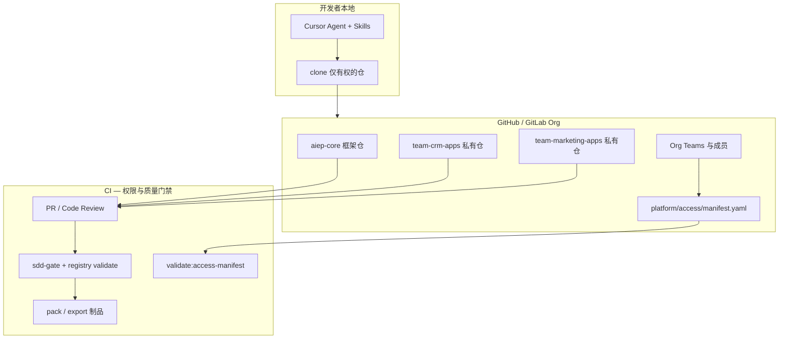
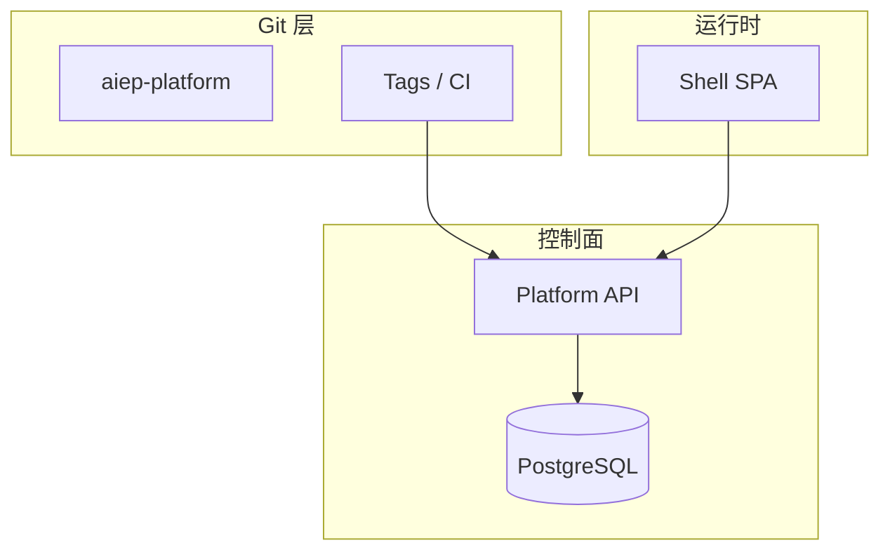

# AIEP 平台化方案（讨论稿）

> **文档状态**：v0.3（讨论稿）  
> **最后更新**：2026-06-11  
> **适用范围**：将 AIEP-DEV 从「单机 + 本地 Git 工程框架」升级为「Git 托管的多团队协作：团队可用、平台共享、权限分离」  
> **默认路径**：**Git-Only 模式** — 不部署 Platform 运行时，权限与版本真值均在 Git / GitHub·GitLab 上完成  
> **可选演进**：完整 Platform 模式（PostgreSQL + API + SSO），见 §2.2、§5.2  
> **关联文档**：`产品设计文档.md`、`更新分发方案.md`、`主应用子应用接入规范.md`、`过程规范文档.md`  
> **前置背景**：在现有子应用架构、Gate/SDD、Skills 全流程、bundle 导出导入、离线更新包能力之上演进，而非推倒重来。

---

## 1. 目标与边界

### 1.1 要达成的四件事

| 目标 | 含义 | 成功标准（示例） |
|------|------|------------------|
| **团队可用** | 多团队在同一 Git 组织协作，互不干扰 | A 团队无法 clone/merge B 团队未授权子应用源码 |
| **平台共享** | 框架、规范、Skills、设计系统一次升级全员受益 | 框架 tag `framework-v2.2.0` + 离线更新包 |
| **权限分离** | 每人独立权限；总管理员拥有全部子应用 | 张三仅 marketing viewer；王总（super_admin）全 app |
| **Git 版本管理** | 代码、配置、发布物可追溯 | 子应用 `app-code@vX.Y.Z` tag + CI 制品 |

### 1.2 部署模式选型（必读）

| 模式 | 是否部署 AIEP 服务 | 权限真值 | 适用 |
|------|-------------------|----------|------|
| **Git-Only（默认）** | ❌ 不部署 Shell/API/DB | Git 托管方 Team + 声明式 manifest + CI | **本平台可能仅 Git 代码管理** |
| **完整 Platform（可选）** | ✅ 部署 Shell + Platform API | PostgreSQL + JWT | 需要应用中心动态鉴权、在线 Gate 签字 |

**本文档以下章节**：§4.5～§4.7、§7.1、§9 **Git-Only 轨道**为默认实施路径；带「Platform 可选」标记的条目可在二期启用。

### 1.3 Git-Only 下「平台管什么 vs Git 管什么」

| 职责 | Git-Only 由谁负责 |
|------|-------------------|
| 用户身份 | GitHub / GitLab 账号 + Org 成员 |
| 每人独立权限 | Org Team 成员关系 + `platform/access/manifest.yaml` |
| 总管理员 | Git **Org Owner**（或 manifest 中 `super_admins` 名单，CI 对照） |
| 子应用登记 | `subApps.js` + manifest 中 `apps[]`（CI 校验一致） |
| 源码不可下给无权限者 | **仓库读权限**（独立仓 / 私有 submodule）+ CI artifact 权限 |
| 版本 | Git tag + Releases + 现有 `create-update-package` |
| Gate 签字 | Git 内 `19-G2-A.md` 等 + PR Review（真人） |
| 应用中心 / 运行时 | **不部署**则不做动态过滤；本地 dev 仍用全量 `subApps.js` 或开发者自有 clone 范围 |

### 1.4 第一期边界（暂不纳入）

| 暂不纳入 | 说明 |
|----------|------|
| Platform API / PostgreSQL | Git-Only 路径不依赖 |
| 在线 IDE | 仍用 Cursor/TRAE + Skills |
| 应用中心动态鉴权 | 无运行时则跳过；权限在 Git 层生效 |

---

## 2. 总体架构

### 2.1 Git-Only 架构（默认）



**要点**：无 Platform 运行时；**能不能拿到某子应用源码 = 有没有对应 Git 仓库的 read 权限**。

### 2.2 完整 Platform 架构（可选演进）



动态应用中心、JWT、在线 Gate 等见 §5.2、§6（Platform 可选）。

### 2.3 核心转变（Git-Only）

| 维度 | 现状 | Git-Only 平台化后 |
|------|------|-------------------|
| 子应用源码隔离 | 全在同一 monorepo，clone 即全量 | **Hub 框架仓 + Spoke 团队私有仓**（推荐） |
| 每人权限 | 无 | Org Team + manifest 直绑 |
| 总管理员 | 无 | Org Owner ≡ super_admin，全部私有仓 Admin |
| 版本 | 框架 semver + 离线包 | + 子应用 tag + GitHub Release 制品 |
| 导出源码 | 本地 `export:sub-app` 无鉴权 | 仅能 export 已 clone 的仓；跨团队走 PR / bundle Release |

---

## 3. Git 与仓库模型

### 3.1 Git-Only 推荐：方案 B（Hub + Spoke）

```
org/aiep-core              # 框架、Skills、manifest、CI 模板（全员 read）
org/team-crm-apps          # 私有：仅 CRM 团队
org/team-marketing-apps    # 私有：仅营销团队
```

| 优点 | 说明 |
|------|------|
| **源码权限 = Git 权限** | 无 Platform 也能「非本人 app 不能下载代码」 |
| 总管理员 | Org Owner 自动拥有全部私有仓权限 |
| 与现有脚本兼容 | `export:sub-app` 在各自 Spoke 仓内执行 |

**Monorepo（方案 A）在 Git-Only 下的局限**：GitHub/GitLab 对单仓**无法按目录禁止 read**；clone 一次即获全部源码。若坚持 Monorepo，须接受「读权限无法按子应用细分」，或改用 **git submodule / subtree** 把子应用放在私有子仓。

### 3.2 方案 A：Monorepo + 团队命名空间（仅适合弱隔离）

```
aiep-platform/
├── AIEP-WEB/
├── teams/team-marketing/apps/marketing-demo/
└── platform/access/manifest.yaml
```

- **merge 权限**：CODEOWNERS + Branch protection ✅  
- **read / clone 权限**：无法按目录拆分 ❌  
- **结论**：Git-Only 且要求「代码不能下给无权限的人」时，**不推荐**纯 Monorepo。

### 3.3 方案 C：Monorepo + Submodule（折中）

- `aiep-core` 含框架与 manifest；各子应用为 **private submodule**  
- 开发者：`git submodule update --init` 仅初始化有权的 submodule（需配合 Team 对 submodule URL 的访问权）

### 3.4 待决策项（Q1）

- [ ] Git-Only 下确认采用 **B（Spoke 私有仓）** 或 **C（Submodule）**
- [ ] 总管理员名单是否与 Git Org Owner 对齐

---

## 4. 权限与治理设计

### 4.1 声明式权限真值：`platform/access/manifest.yaml`

Git-Only 模式下，**权限配置进 Git**，由 CODEOWNERS 保护，CI 校验。

```yaml
# platform/access/manifest.yaml（放在 aiep-core 或各 Spoke 仓）
version: 1

super_admins:
  # 与 Git Org Owner 对齐；CI 可 gh api 校验均为 org owner
  - github: wangzong
  - github: li-admin

teams:
  team-crm:
    git_team: org/team-crm          # GitHub Team slug
    repos: [team-crm-apps]
    default_role: developer
    apps:
      - app_code: ai-smart-crm
        folder: ai-smart-crm-admin
        repo: org/team-crm-apps

  team-marketing:
    git_team: org/team-marketing
    repos: [team-marketing-apps]
    default_role: developer
    apps:
      - app_code: marketing-demo
        folder: marketing-demo
        repo: org/team-marketing-apps

# 每人独立权限：跨团队直绑（override 团队默认）
user_grants:
  - user: github:zhangsan
    app_code: marketing-demo
    role: viewer
    capabilities: [app:access, app:artifact:download:prod]
    grant_type: allow

  - user: github:lisi
    app_code: ai-smart-crm
    role: viewer
    grant_type: allow

  - user: github:zhangsan
    app_code: ai-smart-crm
    grant_type: deny          # 个人例外：在 team-crm 仍不能访问 CRM 源码仓

roles:
  super_admin:
    capabilities: ['*']
  developer:
    capabilities:
      - app:access
      - app:code:read
      - app:code:export
      - app:artifact:download
  reviewer:
    capabilities:
      - app:access
      - app:artifact:download:staging
      - app:gate:sign
  viewer:
    capabilities:
      - app:access
      - app:artifact:download:prod
```

**真值优先级（与 Platform 模式相同算法，改为离线解析）：**

1. `super_admins` → 全部 app、全部 capability（**总管理员不需逐 app 配置**）  
2. 团队 `git_team` 成员 → 继承团队 `apps` 的 `default_role`  
3. `user_grants` 中 `allow` → 合并  
4. `user_grants` 中 `deny` → 覆盖（个人例外）

### 4.2 总管理员（super_admin）

| 项 | Git-Only 实现 |
|----|---------------|
| 身份 | manifest `super_admins` + **Git Org Owner**（二者建议一致） |
| 子应用权限 | 全部私有 Spoke 仓的 Admin/Maintainer；**无需**在 manifest 逐 app 列出 |
| 框架升级 | 可 merge `aiep-core`；打 `framework-v*` tag；跑 `create-update-package` |
| 赋权他人 | 修改 manifest + 调整 Git Team 成员（PR 由 Owner review） |
| 审计 | Git log + PR history |

### 4.3 每人独立权限

| 方式 | 操作 | 效果 |
|------|------|------|
| **加入 Git Team** | Org 设置 → team-crm 加张三 | 继承 CRM 全部 app 的 developer |
| **manifest 直绑** | `user_grants` 给张三 `marketing-demo: viewer` | 仅演示权，**无** marketing 私有仓 read |
| **个人 deny** | 张三 deny `ai-smart-crm` | 即使在 team-crm，也**不应**保留 CRM 私有仓成员（须同步移出 Team 或仅保留 manifest 记录供 CI 审计） |

**重要**：Git-Only 下「deny」必须 **Git Team 成员关系与 manifest 一致** — 不能 manifest 写 deny 但人仍在 `team-crm` 且对私有仓有 read。运维规则：

> 改 manifest deny → 同一 PR 内从对应 Git Team / repo collaborator 移除该用户。

### 4.4 子应用权限三层（Git-Only）

| 层级 | 含义 | Git-Only  enforcement |
|------|------|------------------------|
| **L1 入口 / 可见** | 能否知道某 app 存在 | manifest 解析；无运行时则不对应用中心做过滤 |
| **L2 源码 read/export** | 能否 clone / export | **私有仓 read 权限**；`export:sub-app` 仅在已有 clone 的仓内 |
| **L3 业务数据** | app 内 RBAC | 各子应用内实现（与 Git 无关） |

### 4.5 源码与制品：非权限者不能下载

| 通道 | Git-Only 控制 |
|------|---------------|
| **git clone** | 无私有仓权限 → clone 失败（根本手段） |
| **GitHub Release / CI artifact** | Release 建在 Spoke 仓；下载需 repo read；按 environment 限制 |
| **`npm run export:sub-app`** | 只在 Spoke 仓根目录执行；无 clone 则无法运行 |
| **bundle 进 Git** | **禁止** `dist/sub-app-bundles/*.zip` 提交含源码的 bundle 到 core 仓 |
| **跨团队交接** | 由 Team Admin 在目标仓开 PR 或打 Release；viewer 仅收 **pack 静态包**（无 src） |

**viewer 与 developer 区分：**

| 角色 | clone 源码 | 下载 prod 静态包（Release） |
|------|------------|----------------------------|
| viewer | ❌ | ✅（GitHub Release，只含 dist） |
| developer | ✅ | ✅ |
| super_admin | ✅ 全部仓 | ✅ |

### 4.6 角色与能力矩阵

| 动作 | super_admin | Team Admin | developer | reviewer (PO) | viewer |
|------|-------------|------------|-----------|---------------|--------|
| merge 框架 core | ✅ | ❌ | ❌ | ❌ | ❌ |
| merge 本团队 Spoke | ✅ | ✅ | PR | ❌ | ❌ |
| clone 本团队源码 | ✅ | ✅ | ✅ | ❌* | ❌ |
| export 源码 bundle | ✅ | ✅ | ✅ | ❌ | ❌ |
| 下载 prod 静态包 | ✅ | ✅ | ✅ | ✅ | ✅ |
| G2-A 签字 | ✅ | ❌ | ❌ | ✅ | ❌ |
| 改 manifest 赋权 | ✅ | 本 team 范围 | ❌ | ❌ | ❌ |

\* PO 若需看 staging 源码，单独给只读 collaborator 或通过 PR preview，**不给**长期 clone。

### 4.7 Platform 模式权限（可选，未部署则跳过）

若未来部署 Platform API，manifest 可 **导入为 DB 初始数据**；运行时以 `resolveEffectivePermissions()` + JWT 拦截应用中心与 export API。算法与 §4.1 优先级一致。详见历史 v0.1 草案 §4.4～§6.3（JWT、动态 `subApps`、路由守卫）。

### 4.8 团队成员管理（Git-Only）

不部署 Platform 时，**成员管理 = Git 托管方 Org/Team + manifest 登记 + PR 留痕**。manifest 不替代 Git Team，二者必须一致。

#### 4.8.1 职责分工（谁管什么）

| 角色 | Git 上是谁 | 能做什么 |
|------|------------|----------|
| **总管理员** | Org Owner | 建 Team、建私有仓、设 Team↔Repo 权限、指定 Team Maintainer |
| **Team Admin** | GitHub Team **Maintainer**（或 GitLab Maintainer） | 本 Team **加人/移人**、提 manifest PR、审批本团队 PR |
| **Team Member** | GitHub Team **Member** | clone Spoke、提 PR、本地开发 |
| **跨团队 PO/viewer** | 不进 Team；manifest `user_grants` + Release 只读 | 只看静态包或 staging Release，**不加** Spoke 仓 |

Org Owner 不必日常加人；把各 `team-*` 的 Maintainer 交给 Team Admin。

#### 4.8.2 组织与仓库绑定（一次性）

在 **GitHub Org**（GitLab 同理）完成：

```text
1. 创建 Team：team-crm、team-marketing …
2. 创建私有仓：team-crm-apps、team-marketing-apps …
3. 仓库 Settings → Collaborators and teams：
   - team-crm-apps：team-crm → Role: Maintain（或 Write）
   - aiep-core：全员 Team 或 org members → Read；framework-maintainers → Write
4. 各仓 CODEOWNERS：* @org/team-crm 等
5. Branch protection：main 须 PR + CODEOWNERS review + CI 绿
6. 在 aiep-core 写入 platform/access/manifest.yaml（teams.* 与 git_team 对齐）
```

**权限真值顺序**：Git Team 成员关系决定 **能否 clone**；manifest 记录 **业务角色** 与 **跨团队例外**，供 CI 与文档对齐。

#### 4.8.3 日常操作 SOP

**A. 新人加入某团队（最常见）**

| 步骤 | 操作 | 执行人 |
|------|------|--------|
| 1 | Org → Teams → `team-crm` → Add member `@zhangsan` | Team Admin / Owner |
| 2 | 确认 `@zhangsan` 对 `team-crm-apps` 已有 read（随 Team 自动继承） | Team Admin |
| 3 | （可选）PR 更新 `manifest.yaml` → `teams.team-crm.members` 或 CHANGELOG 留痕 | Team Admin |
| 4 | 发 onboard：`git clone git@github.com:org/team-crm-apps.git` + `npm install` | Team Admin |

**无需**改 `subApps.js`；**无需**部署 Platform。

**B. 成员离职 / 调岗**

| 步骤 | 操作 |
|------|------|
| 1 | 从**所有**相关 Git Team 移除该用户 |
| 2 | 检查是否 Spoke 仓 **直接 collaborator**（有则删除） |
| 3 | 删除 manifest 中该用户全部 `user_grants`（PR + Owner/Maintainer review） |
| 4 | （可选）轮换 deploy key / PAT |

**C. 跨团队只读（PO 看 marketing Demo）**

| 步骤 | 操作 |
|------|------|
| 1 | **不要**把 PO 加进 `team-marketing` |
| 2 | manifest 增加 `user_grants`：`role: viewer`，`grant_type: allow` |
| 3 | 在 `team-marketing-apps` Release 给 PO 发 **dist 包链接**（或 org 级 GitHub Release 只读） |
| 4 | PR 由 marketing Team Admin + Org Owner review |

**D. 个人例外 deny（在 team 内但禁止某 app）**

| 步骤 | 操作 |
|------|------|
| 1 | manifest 增加 `user_grants` + `grant_type: deny` |
| 2 | **同一变更窗口**从 `team-crm` 移除该用户，或改用更细子 Team（推荐：`team-crm-marketing-only`） |

deny 不能只写 manifest 而不动 Git Team。

**E. 新建团队 / 新子应用**

| 步骤 | 操作 | 执行人 |
|------|------|--------|
| 1 | 建 Git Team + 私有 Spoke 仓 | Org Owner |
| 2 | PR：`manifest.yaml` 增加 `teams.team-xxx` + `apps[]` | Team Admin |
| 3 | PR：`aiep-core` 的 `subApps.js` 增加**元数据**（无源码路径） | Team Admin |
| 4 | `scaffold:sub-app` 在 Spoke 仓执行 | Developer |

#### 4.8.4 manifest 中的成员登记（可选但推荐）

除 `user_grants` 外，可增加 **只读名册** 便于 CI 对账（**不以名册代替 Git Team**）：

```yaml
teams:
  team-crm:
    git_team: org/team-crm
    maintainers:          # 对应 Git Team Maintainer，文档化
      - github: chen-admin
    members:              # 可选；CI 用 gh api 与 Git Team 对账
      - github: zhangsan
      - github: lisi
    default_role: developer
```

CI 规则示例：`validate:access-manifest` 发现 `members` 里有 `@wang` 但 Git Team 无此人 → **warning**；Git Team 有人但 manifest 无 → **info**（允许，以 Git 为准）。

#### 4.8.5 GitHub / GitLab 命令速查

**GitHub（Team Admin 或 Owner）**

```bash
# 加人
gh api orgs/{org}/teams/team-crm/memberships/{username} -X PUT -f role=member

# 移人
gh api orgs/{org}/teams/team-crm/memberships/{username} -X DELETE

# 列出团队成员（CI 对账）
gh api orgs/{org}/teams/team-crm/members --paginate
```

**GitLab**：Group → Subgroups → Members；或 `gitlab.group_members` API。Project 级用 **Project access** + **Group share**。

#### 4.8.6 与 CODEOWNERS、Review 的关系

| 机制 | 作用 |
|------|------|
| **Git Team** | 能否访问仓库（read/write/admin） |
| **CODEOWNERS** | PR 改哪些路径须哪个 Team review |
| **Branch protection** | 禁止直 push main；须 CI + review |
| **manifest PR** | 跨团队 viewer/deny、团队↔app 映射变更须 Owner/Maintainer 批 |

Team Member 管理**主要在 Git 网页或 `gh`**；manifest 变更走 **aiep-core 的 PR**，形成审计链。

#### 4.8.7 建议目录（aiep-core）

```text
platform/access/
├── manifest.yaml           # 团队↔app、user_grants、super_admins
├── CODEOWNERS              # * @org/platform-admins ；manifest 须 Owner review
└── onboarding/
    ├── team-crm.md         # 新人 clone 哪几个仓、找谁加 Team
    └── team-marketing.md
```

---

## 5. 部署拓扑

### 5.1 Git-Only（默认）：无 AIEP 服务

```
GitHub/GitLab Org
├── aiep-core（公开或内部公开）
├── team-*-apps（私有）
├── Teams / CODEOWNERS
├── Actions: sdd-gate, validate:access-manifest, pack on tag
└── Releases: 框架更新包 zip + 子应用静态包

开发者 ← clone 有权的仓 ← 本地 npm run dev / Agent
```

**不需要**：PostgreSQL、SSO 服务、Shell 部署域名。

### 5.2 完整 Platform 拓扑（可选）

```
Git → CI → Platform API → PostgreSQL
         ↘ Shell SPA（动态注册表 + 登录）
```

组件表见 v0.1 §5.1（Shell、AIEP-SERVER、IdP 等）；**仅在选择部署运行时时实施**。

### 5.3 与「离线更新包」的关系

| 场景 | Git-Only 做法 |
|------|---------------|
| 框架升级 | `framework-v*` tag → `create-update-package` → GitHub Release 附件 |
| 子应用演示 | Spoke 仓 tag → CI `pack:sub-app` → Release 仅 dist |
| 源码交接 | Spoke 仓内 `export:sub-app` 或仓库 transfer；不走 core 仓 |

详见 `更新分发方案.md`。

---

## 6. 仓库内改造要点

### 6.1 Git-Only 必做

| 项 | 路径 / 命令 | 说明 |
|----|-------------|------|
| 权限 manifest | `platform/access/manifest.yaml` | 单人直绑、super_admins |
| CODEOWNERS | 各仓根目录 | 框架 / 各团队路径 |
| CI 校验 | `npm run validate:access-manifest` | manifest 与 subApps、Team 成员一致性 |
| CI 路径门禁 | PR 变更 `teams/x/**` → 须 team-x review | 已有 sdd-gate 扩展 |
| Submodule 登记 | `aiep-core/.gitmodules` | 若用方案 C |
| 文档 | 本方案 §4 | 团队 onboard 流程 |

### 6.2 `subApps.js` 与 manifest 关系

- **core 仓**：`subApps.js` 可保留**全量登记**（元数据：名称、路由前缀），供框架 dev 与 validate  
- **敏感信息不进 core**：Spoke 源码路径不在 core 仓出现  
- CI：`validate:access-manifest` 校验 `app_code` ↔ manifest ↔（可选）submodule URL

### 6.3 Platform 可选改造

| 页面 / API | 条件 |
|------------|------|
| 动态 AppCenter、登录、JWT | 部署 Shell 时 |
| `GET /apps/visible` | 部署 Platform API 时 |

本地开发无 Platform：继续使用静态 `subApps.js`。

---

## 7. CI / CD（Git-Only）

### 7.1 现有基线

`.github/workflows/sdd-gate.yml`：PR → G2 + `validate:sub-app-registry`。

### 7.2 Git-Only 扩展

| 触发 | 动作 |
|------|------|
| PR 改 `platform/access/**` | 须 Org Owner / super_admin review |
| PR 改某 Spoke 路径 | 对应 Git Team CODEOWNERS approve |
| PR 任意 | `validate:access-manifest`（actor 权限 vs 变更路径） |
| tag `app@v*.*.*` | `pack:sub-app` → GitHub Release（dist only） |
| tag `framework-v*.*.*` | `create-update-package` → Release |

### 7.3 `validate:access-manifest`（建议实现）

```bash
npm run validate:access-manifest -- --actor @zhangsan --changed paths.txt
# exit 1：变更路径超出 actor 在 manifest 中的 effective permissions
```

可选：调用 `gh api` 核对 `super_admins` 是否为 org owners。

### 7.4 Platform 可选：Webhook 回调

部署 Platform 后 CI 上报 Release；Git-Only **不需要**。

---

## 8. 与 AI Agent 流程的关系

| 项 | Git-Only |
|----|----------|
| Gate 签字 | Git 内 `19-G2-A.md` + PR Review；Agent **不得**自行填「通过」 |
| 步骤推断 | `infer:process-step` 仅读 Git 文档 |
| Skills | 不变；Agent 在**用户 clone 的仓范围**内工作 |
| 权限提示 | Agent 改 Spoke 外路径 → 应拒绝并提示「无 Git 权限 / 非本团队 app」 |

---

## 9. 分阶段实施路线

### Git-Only 轨道（默认）

#### Phase 0 — 决策（约 1 周）

- [ ] 选定 **Hub + Spoke 私有仓**（或 Submodule）
- [ ] 创建 Git Org Teams；指定 Org Owner = super_admin
- [ ] 起草 `platform/access/manifest.yaml`
- [ ] 明确 viewer 仅 Release dist，不含 src

#### Phase 1 — 权限落地（2～3 周）

- [ ] Spoke 仓从 monorepo 迁出（或 submodule 化）
- [ ] CODEOWNERS + branch protection
- [ ] 实现 `validate:access-manifest` + CI 接入
- [ ] 禁止含源码 bundle 进 core 仓

#### Phase 2 — 版本与制品（2～3 周）

- [ ] 子应用 tag → CI pack → GitHub Release
- [ ] 框架 tag → 离线更新包 → Release
- [ ] manifest 中登记 `user_grants` 跨团队 viewer

#### Phase 3 — 协作规范（持续）

- [ ] 新子应用：Spoke 建仓 + manifest 登记 + subApps 元数据 PR
- [ ] 跨团队 demo：只分享 Release 静态包或只读 manifest viewer
- [ ] onboard 文档：Team 加入 + clone 哪些仓

### Platform 轨道（可选，未部署则跳过）

Phase 1～3 见 v0.1（Platform API、JWT、动态 AppCenter）；manifest 作为 DB 种子。

---

## 10. 待决策清单

### Q1：Git 组织形态（Git-Only）

- **B Hub+Spoke（推荐）** / **C Submodule** / A Monorepo（仅弱隔离）

### Q2：是否部署 Platform 运行时

- **当前倾向：否** — 仅 Git 代码管理  
- 若未来部署：manifest → DB 导入，补动态 AppCenter

### Q3：总管理员

- 是否与 Git **Org Owner** 1:1？是否需双人 Owner？

### Q4：PO / viewer

- 是否仅通过 **GitHub Release** 看 prod 包、绝不加 Spoke 仓 read？

### Q5：跨团队单人权限

- 是否全部走 manifest `user_grants` + PR 由 Team Admin/Owner 批准？

---

## 11. 风险与缓解（Git-Only）

| 风险 | 缓解 |
|------|------|
| Monorepo 无法按 app 禁 read | 用 Spoke 私有仓 |
| manifest deny 但 Git Team 未同步 | PR 检查清单：deny 必须移出 Team |
| 本地 export 绕过 | 无 clone 无法 export；禁止 bundle 进 core |
| super_admin 离职 | Org Owner 交接流程 |
| 无运行时应用中心过滤 | 接受；或二期部署 Platform |

---

## 12. 方案小结

| 维度 | Git-Only（默认） |
|------|------------------|
| **Git** | Hub core + Spoke 私有仓；tag / Release 管版本 |
| **每人权限** | manifest `user_grants` + Git Team 成员 |
| **成员管理** | Git Team 加人/移人（§4.8）；manifest PR 留痕 |
| **总管理员** | Org Owner + `super_admins`；全部仓权限 |
| **源码隔离** | 私有仓 read = 能否下载代码 |
| **制品** | Release 静态包给 viewer；源码仅在 Spoke |
| **Platform** | 不部署；manifest 为未来 API 预留 |

**原则**：不部署运行时也能做到**团队可用、权限分离、代码不可越权下载** — 关键是 **Spoke 私有仓 + manifest + CI**，而不是先建 Platform API。

---

## 13. 修订记录

| 版本 | 日期 | 说明 |
|------|------|------|
| v0.1 | 2026-06-11 | 初稿：Platform 运行时架构 |
| v0.2 | 2026-06-11 | **默认 Git-Only**；每人独立权限、super_admin、源码下载控制；Platform 降为可选演进 |
| v0.3 | 2026-06-11 | 新增 §4.8 团队成员管理（Git Team SOP、日常加人/离职/跨团队 viewer） |
