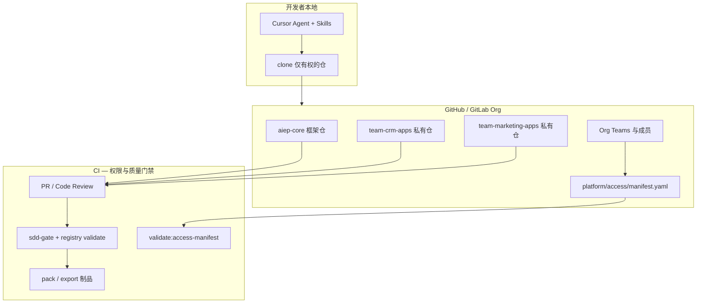
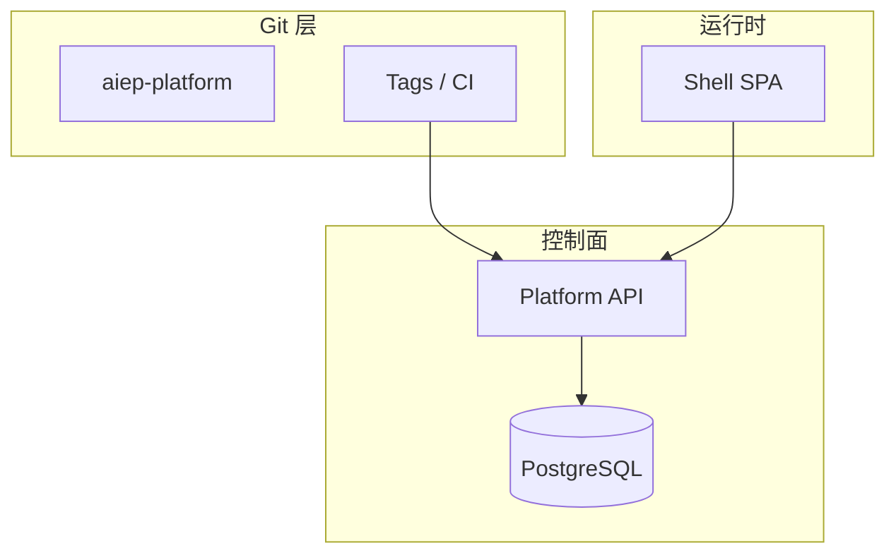
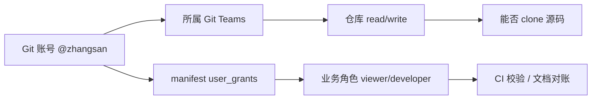
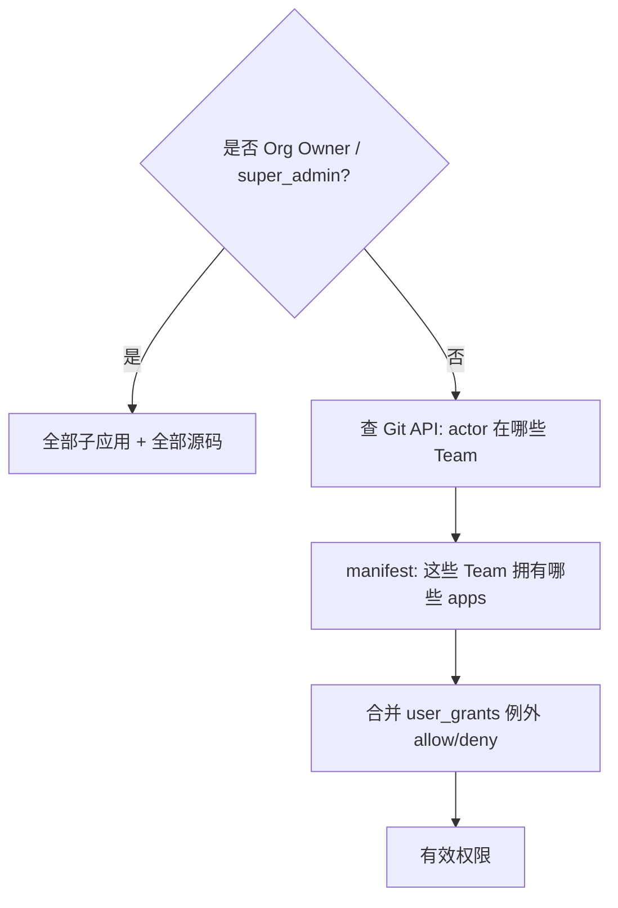
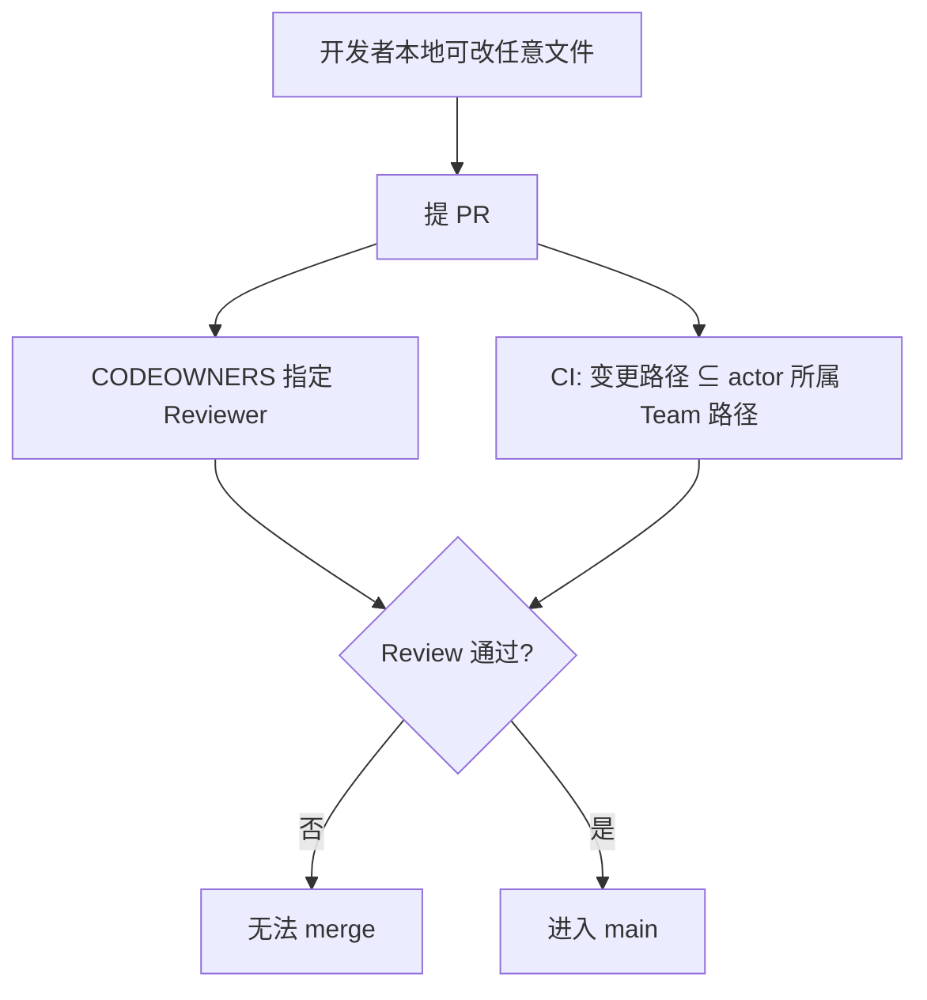

# AIEP 平台化方案（讨论稿）

> **文档状态**：v1.0（讨论稿）  
> **最后更新**：2026-06-11  
> **适用范围**：将 AIEP-DEV 从「单机 + 本地 Git 工程框架」升级为「Git 托管的多团队协作：团队可用、平台共享、权限分离」  
> **默认路径**：**Git-Only 模式** — 不部署 Platform 运行时，权限与版本真值均在 Git / GitHub·GitLab 上完成  
> **推荐落地场景（§1.0）**：**防错改** — 阻止成员误改主平台或其他团队子应用（Monorepo + CODEOWNERS 即可，**不必**拆 Spoke 私有仓）  
> **可选演进**：完整 Platform 模式（PostgreSQL + API + SSO），见 §2.2、§5.2  
> **关联文档**：`产品设计文档.md`、`更新分发方案.md`、`主应用子应用接入规范.md`、`过程规范文档.md`  
> **前置背景**：在现有子应用架构、Gate/SDD、Skills 全流程、bundle 导出导入、离线更新包能力之上演进，而非推倒重来。

---

## 1. 目标与边界

### 1.0 权限目标：先选对场景（必读）

团队加权限往往有两种目的，**手段差很多**。请先确认属于哪一种：

| 场景 | 目的 | 能否继续 Monorepo | 推荐手段 |
|------|------|-------------------|----------|
| **A. 防错改（推荐优先）** | 成员**不能 merge** 主平台 / 其他团队子应用；避免误改、误删 | ✅ **可以** | **CODEOWNERS** + 分支保护 + CI 路径校验 |
| **B. 防泄露** | 成员**不能 clone/read** 无权限子应用源码 | ❌ 单仓做不到按目录禁 read | Hub + Spoke 私有仓（§3.1 B） |

**若你的目标是 A（防止团队成员错改主平台或其他子应用）**：

- **不必**拆 Spoke 私有仓、**不必**部署 Platform、**不必**每人每 app 写 manifest 权限  
- **继续现有 Monorepo**（`AIEP-WEB/src/apps/`）即可  
- 在 Git 上保证：**改哪块路径，必须哪块 Owner Review；非 Owner 无法 merge**  
- 本地仍可 clone 全仓（便于本地跑主应用）；**写回远程**时由 PR 门禁拦住误改  

下文 §4.11 为场景 A 的**最小落地方案**；§3.1 B、§4.5 源码下载等主要针对场景 B，可暂不实施。

### 1.1 要达成的四件事

| 目标 | 含义 | 场景 A（防错改）成功标准 |
|------|------|--------------------------|
| **团队可用** | 多团队同仓协作，互不误改 | CRM 团队 PR 改 `marketing-demo/` → 须营销 Team review，否则不能 merge |
| **平台共享** | 框架、Skills 统一升级 | 仅 `framework-maintainers` 可 merge `AIEP-WEB/src/` 主壳与根脚本 |
| **权限分离** | 各团队只管自己的子应用路径 | CODEOWNERS 按 `src/apps/<folder>/` 划分 |
| **Git 版本管理** | 变更可追溯 | PR + Review + CI |

场景 B（防泄露）成功标准仍见 §3.1、§4.5（clone/私有仓）。

### 1.2 部署模式选型（必读）

| 模式 | 是否部署 AIEP 服务 | 权限真值 | 适用 |
|------|-------------------|----------|------|
| **Git-Only（默认）** | ❌ 不部署 Shell/API/DB | Git 托管方 Team + 声明式 manifest + CI | **本平台可能仅 Git 代码管理** |
| **完整 Platform（可选）** | ✅ 部署 Shell + Platform API | PostgreSQL + JWT | 需要应用中心动态鉴权、在线 Gate 签字 |

**本文档以下章节**：§4.5～§4.7、§7.1、§9 **Git-Only 轨道**为默认实施路径；带「Platform 可选」标记的条目可在二期启用。

### 1.3 Git-Only 下「平台管什么 vs Git 管什么」

| 职责 | Git-Only 由谁负责 |
|------|-------------------|
| 用户身份 | GitHub / GitLab 账号 + Org 成员 |
| 每人独立权限 | Org Team 成员关系 + `platform/access/manifest.yaml` |
| 总管理员 | Git **Org Owner**（或 manifest 中 `super_admins` 名单，CI 对照） |
| 子应用登记 | `subApps.js` + manifest 中 `apps[]`（CI 校验一致） |
| 源码不可下给无权限者 | **仓库读权限**（独立仓 / 私有 submodule）+ CI artifact 权限 |
| 版本 | Git tag + Releases + 现有 `create-update-package` |
| Gate 签字 | Git 内 `19-G2-A.md` 等 + PR Review（真人） |
| 应用中心 / 运行时 | **不部署**则不做动态过滤；本地 dev 仍用全量 `subApps.js` 或开发者自有 clone 范围 |

### 1.4 第一期边界（暂不纳入）

| 暂不纳入 | 说明 |
|----------|------|
| Platform API / PostgreSQL | Git-Only 路径不依赖 |
| 在线 IDE | 仍用 Cursor/TRAE + Skills |
| 应用中心动态鉴权 | 无运行时则跳过；权限在 Git 层生效 |

---

## 2. 总体架构

### 2.1 Git-Only 架构（默认）



**要点**：无 Platform 运行时；**能不能拿到某子应用源码 = 有没有对应 Git 仓库的 read 权限**。

### 2.2 完整 Platform 架构（可选演进）



动态应用中心、JWT、在线 Gate 等见 §5.2、§6（Platform 可选）。

### 2.3 核心转变（Git-Only）

| 维度 | 现状 | Git-Only 平台化后 |
|------|------|-------------------|
| 子应用源码隔离 | 全在同一 monorepo，clone 即全量 | **Hub 框架仓 + Spoke 团队私有仓**（推荐） |
| 每人权限 | 无 | Org Team + manifest 直绑 |
| 总管理员 | 无 | Org Owner ≡ super_admin，全部私有仓 Admin |
| 版本 | 框架 semver + 离线包 | + 子应用 tag + GitHub Release 制品 |
| 导出源码 | 本地 `export:sub-app` 无鉴权 | 仅能 export 已 clone 的仓；跨团队走 PR / bundle Release |

---

## 3. Git 与仓库模型

### 3.1 Git-Only 推荐：方案 B（Hub + Spoke）

```
org/aiep-core              # 框架、Skills、manifest、CI 模板（全员 read）
org/team-crm-apps          # 私有：仅 CRM 团队
org/team-marketing-apps    # 私有：仅营销团队
```

| 优点 | 说明 |
|------|------|
| **源码权限 = Git 权限** | 无 Platform 也能「非本人 app 不能下载代码」 |
| 总管理员 | Org Owner 自动拥有全部私有仓权限 |
| 与现有脚本兼容 | `export:sub-app` 在各自 Spoke 仓内执行 |

**Monorepo（方案 A）在 Git-Only 下的局限**：GitHub/GitLab 对单仓**无法按目录禁止 read**；clone 一次即获全部源码。若坚持 Monorepo，须接受「读权限无法按子应用细分」，或改用 **git submodule / subtree** 把子应用放在私有子仓。

### 3.2 方案 A：Monorepo + 团队命名空间（仅适合弱隔离）

```
aiep-platform/
├── AIEP-WEB/
├── teams/team-marketing/apps/marketing-demo/
└── platform/access/manifest.yaml
```

- **merge 权限**：CODEOWNERS + Branch protection ✅  
- **read / clone 权限**：无法按目录拆分 ❌  
- **结论**：Git-Only 且要求「代码不能下给无权限的人」时，**不推荐**纯 Monorepo。

### 3.3 方案 C：Monorepo + Submodule（折中）

- `aiep-core` 含框架与 manifest；各子应用为 **private submodule**  
- 开发者：`git submodule update --init` 仅初始化有权的 submodule（需配合 Team 对 submodule URL 的访问权）

### 3.4 待决策项（Q1）

- [ ] Git-Only 下确认采用 **B（Spoke 私有仓）** 或 **C（Submodule）**
- [ ] 总管理员名单是否与 Git Org Owner 对齐

---

## 4. 权限与治理设计

### 4.0 Git 账号即权限主体（推荐）

Git-Only 模式下 **不单独维护用户表**；**GitHub / GitLab 登录账号**（如 `@zhangsan`）就是权限区分的唯一身份 ID。



| 能力 | 由 Git 账号什么决定 |
|------|---------------------|
| 能否 clone 某 Spoke 私有仓 | 该账号是否在对应 **Git Team**（或 repo collaborator） |
| 能否 push / merge | Team 角色（Member/Maintainer）+ Branch protection |
| 是否总管理员 | Org **Owner** 或 manifest `super_admins` 中的同一账号 |
| 跨团队只看 Demo | manifest 里 `user: github:zhangsan` + **不加** Spoke Team |
| PR 谁审 | CODEOWNERS 绑 Team；Git 知道 `actor` 是谁 |

**manifest 中的用户写法**（与 Git 账号一一对应）：

```yaml
super_admins:
  - github: wangzong        # GitHub 用户名；GitLab 用 gitlab:zhangsan

user_grants:
  - user: github:zhangsan   # 必须与实际 Org 成员账号一致
    app_code: marketing-demo
    role: viewer
```

**CI 如何用 Git 账号鉴权**（PR / Actions）：

```bash
# GitHub Actions 自动注入
echo "${{ github.actor }}"          # 触发者，如 zhangsan
echo "${{ github.event.pull_request.user.login }}"

# 本地 / 脚本
gh api user --jq .login
npm run validate:access-manifest -- --actor zhangsan --changed paths.txt
```

规则：**变更路径 ⊆ 该 actor 在 manifest + Git Team 下的有效权限**，否则 CI fail。

**与 SSO / 企业邮箱**：企业 GitHub/GitLab 仍是一个账号进 Org；权限挂在 **Org 成员身份** 上，不需要 AIEP 再记邮箱密码。

**局限（需知晓）**：

| 场景 | 说明 |
|------|------|
| 本地 `git` 命令 | 权限由 **remote 认证** 决定（SSH key / PAT 绑哪个账号） |
| 一人多账号 | 应用公司 Org 账号；个人 fork 不计入权限 |
| 机器账号 | CI 用 `GITHUB_TOKEN` / Deploy bot → manifest 可列 `github: org-bot`，单独 Team |
| 无 Git 的纯访客 | 不能靠 Git 账号；只发 **Release 链接**（匿名下载若 Org 允许） |

**结论**：可以用、且应该用 Git 账号区分权限；Team 管「仓库级」，manifest 管「app 级角色与例外」，CI 用 `github.actor` 做机读校验。

### 4.1 声明式权限真值：`platform/access/manifest.yaml`

Git-Only 模式下，**权限配置进 Git**，由 CODEOWNERS 保护，CI 校验。

```yaml
# platform/access/manifest.yaml（放在 aiep-core 或各 Spoke 仓）
version: 1

super_admins:
  # 与 Git Org Owner 对齐；CI 可 gh api 校验均为 org owner
  - github: wangzong
  - github: li-admin

teams:
  team-crm:
    git_team: org/team-crm          # GitHub Team slug
    repos: [team-crm-apps]
    default_role: developer
    apps:
      - app_code: ai-smart-crm
        folder: ai-smart-crm-admin
        repo: org/team-crm-apps

  team-marketing:
    git_team: org/team-marketing
    repos: [team-marketing-apps]
    default_role: developer
    apps:
      - app_code: marketing-demo
        folder: marketing-demo
        repo: org/team-marketing-apps

# 每人独立权限：跨团队直绑（override 团队默认）
user_grants:
  - user: github:zhangsan
    app_code: marketing-demo
    role: viewer
    capabilities: [app:access, app:artifact:download:prod]
    grant_type: allow

  - user: github:lisi
    app_code: ai-smart-crm
    role: viewer
    grant_type: allow

  - user: github:zhangsan
    app_code: ai-smart-crm
    grant_type: deny          # 个人例外：在 team-crm 仍不能访问 CRM 源码仓

roles:
  super_admin:
    capabilities: ['*']
  developer:
    capabilities:
      - app:access
      - app:code:read
      - app:code:export
      - app:artifact:download
  reviewer:
    capabilities:
      - app:access
      - app:artifact:download:staging
      - app:gate:sign
  viewer:
    capabilities:
      - app:access
      - app:artifact:download:prod
```

**真值优先级（与 Platform 模式相同算法，改为离线解析）：**

1. `super_admins` → 全部 app、全部 capability（**总管理员不需逐 app 配置**）  
2. 团队 `git_team` 成员 → 继承团队 `apps` 的 `default_role`  
3. `user_grants` 中 `allow` → 合并  
4. `user_grants` 中 `deny` → 覆盖（个人例外）

### 4.2 总管理员（super_admin）

| 项 | Git-Only 实现 |
|----|---------------|
| 身份 | manifest `super_admins` + **Git Org Owner**（二者建议一致） |
| 子应用权限 | 全部私有 Spoke 仓的 Admin/Maintainer；**无需**在 manifest 逐 app 列出 |
| 框架升级 | 可 merge `aiep-core`；打 `framework-v*` tag；跑 `create-update-package` |
| 赋权他人 | 修改 manifest + 调整 Git Team 成员（PR 由 Owner review） |
| 审计 | Git log + PR history |

### 4.3 每人独立权限

| 方式 | 操作 | 效果 |
|------|------|------|
| **加入 Git Team** | Org 设置 → team-crm 加张三 | 继承 CRM 全部 app 的 developer |
| **manifest 直绑** | `user_grants` 给张三 `marketing-demo: viewer` | 仅演示权，**无** marketing 私有仓 read |
| **个人 deny** | 张三 deny `ai-smart-crm` | 即使在 team-crm，也**不应**保留 CRM 私有仓成员（须同步移出 Team 或仅保留 manifest 记录供 CI 审计） |

**重要**：Git-Only 下「deny」必须 **Git Team 成员关系与 manifest 一致** — 不能 manifest 写 deny 但人仍在 `team-crm` 且对私有仓有 read。运维规则：

> 改 manifest deny → 同一 PR 内从对应 Git Team / repo collaborator 移除该用户。

### 4.4 子应用权限三层（Git-Only）

| 层级 | 含义 | Git-Only  enforcement |
|------|------|------------------------|
| **L1 入口 / 可见** | 能否知道某 app 存在 | manifest 解析；无运行时则不对应用中心做过滤 |
| **L2 源码 read/export** | 能否 clone / export | **私有仓 read 权限**；`export:sub-app` 仅在已有 clone 的仓内 |
| **L3 业务数据** | app 内 RBAC | 各子应用内实现（与 Git 无关） |

### 4.5 源码与制品：非权限者不能下载

| 通道 | Git-Only 控制 |
|------|---------------|
| **git clone** | 无私有仓权限 → clone 失败（根本手段） |
| **GitHub Release / CI artifact** | Release 建在 Spoke 仓；下载需 repo read；按 environment 限制 |
| **`npm run export:sub-app`** | 只在 Spoke 仓根目录执行；无 clone 则无法运行 |
| **bundle 进 Git** | **禁止** `dist/sub-app-bundles/*.zip` 提交含源码的 bundle 到 core 仓 |
| **跨团队交接** | 由 Team Admin 在目标仓开 PR 或打 Release；viewer 仅收 **pack 静态包**（无 src） |

**viewer 与 developer 区分：**

| 角色 | clone 源码 | 下载 prod 静态包（Release） |
|------|------------|----------------------------|
| viewer | ❌ | ✅（GitHub Release，只含 dist） |
| developer | ✅ | ✅ |
| super_admin | ✅ 全部仓 | ✅ |

### 4.6 角色与能力矩阵

| 动作 | super_admin | Team Admin | developer | reviewer (PO) | viewer |
|------|-------------|------------|-----------|---------------|--------|
| merge 框架 core | ✅ | ❌ | ❌ | ❌ | ❌ |
| merge 本团队 Spoke | ✅ | ✅ | PR | ❌ | ❌ |
| clone 本团队源码 | ✅ | ✅ | ✅ | ❌* | ❌ |
| export 源码 bundle | ✅ | ✅ | ✅ | ❌ | ❌ |
| 下载 prod 静态包 | ✅ | ✅ | ✅ | ✅ | ✅ |
| G2-A 签字 | ✅ | ❌ | ❌ | ✅ | ❌ |
| 改 manifest 赋权 | ✅ | 本 team 范围 | ❌ | ❌ | ❌ |

\* PO 若需看 staging 源码，单独给只读 collaborator 或通过 PR preview，**不给**长期 clone。

### 4.7 Platform 模式权限（可选，未部署则跳过）

若未来部署 Platform API，manifest 可 **导入为 DB 初始数据**；运行时以 `resolveEffectivePermissions()` + JWT 拦截应用中心与 export API。算法与 §4.1 优先级一致。详见历史 v0.1 草案 §4.4～§6.3（JWT、动态 `subApps`、路由守卫）。

### 4.8 团队成员管理（Git-Only）

不部署 Platform 时，**成员管理 = Git 托管方 Org/Team + manifest 登记 + PR 留痕**。manifest 不替代 Git Team，二者必须一致。

#### 4.8.1 职责分工（谁管什么）

| 角色 | Git 上是谁 | 能做什么 |
|------|------------|----------|
| **总管理员** | Org Owner | 建 Team、建私有仓、设 Team↔Repo 权限、指定 Team Maintainer |
| **Team Admin** | GitHub Team **Maintainer**（或 GitLab Maintainer） | 本 Team **加人/移人**、提 manifest PR、审批本团队 PR |
| **Team Member** | GitHub Team **Member** | clone Spoke、提 PR、本地开发 |
| **跨团队 PO/viewer** | 不进 Team；manifest `user_grants` + Release 只读 | 只看静态包或 staging Release，**不加** Spoke 仓 |

Org Owner 不必日常加人；把各 `team-*` 的 Maintainer 交给 Team Admin。

#### 4.8.2 组织与仓库绑定（一次性）

在 **GitHub Org**（GitLab 同理）完成：

```text
1. 创建 Team：team-crm、team-marketing …
2. 创建私有仓：team-crm-apps、team-marketing-apps …
3. 仓库 Settings → Collaborators and teams：
   - team-crm-apps：team-crm → Role: Maintain（或 Write）
   - aiep-core：全员 Team 或 org members → Read；framework-maintainers → Write
4. 各仓 CODEOWNERS：* @org/team-crm 等
5. Branch protection：main 须 PR + CODEOWNERS review + CI 绿
6. 在 aiep-core 写入 platform/access/manifest.yaml（teams.* 与 git_team 对齐）
```

**权限真值顺序**：Git Team 成员关系决定 **能否 clone**；manifest 记录 **业务角色** 与 **跨团队例外**，供 CI 与文档对齐。

#### 4.8.3 日常操作 SOP

**A. 新人加入某团队（最常见）**

| 步骤 | 操作 | 执行人 |
|------|------|--------|
| 1 | Org → Teams → `team-crm` → Add member `@zhangsan` | Team Admin / Owner |
| 2 | 确认 `@zhangsan` 对 `team-crm-apps` 已有 read（随 Team 自动继承） | Team Admin |
| 3 | ~~（可选）PR 更新 manifest 成员列表~~ **不必**；成员真值在 Git Team | — |
| 4 | 发 onboard：`git clone …/team-crm-apps.git`（仓内含该团队**全部**子应用代码） | Team Admin |

**无需**改 `subApps.js`；**无需**部署 Platform。

**B. 成员离职 / 调岗**

| 步骤 | 操作 |
|------|------|
| 1 | 从**所有**相关 Git Team 移除该用户 |
| 2 | 检查是否 Spoke 仓 **直接 collaborator**（有则删除） |
| 3 | 删除 manifest 中该用户全部 `user_grants`（PR + Owner/Maintainer review） |
| 4 | （可选）轮换 deploy key / PAT |

**C. 跨团队只读（PO 看 marketing Demo）**

| 步骤 | 操作 |
|------|------|
| 1 | **不要**把 PO 加进 `team-marketing` |
| 2 | manifest 增加 `user_grants`：`role: viewer`，`grant_type: allow` |
| 3 | 在 `team-marketing-apps` Release 给 PO 发 **dist 包链接**（或 org 级 GitHub Release 只读） |
| 4 | PR 由 marketing Team Admin + Org Owner review |

**D. 个人例外 deny（在 team 内但禁止某 app）**

| 步骤 | 操作 |
|------|------|
| 1 | manifest 增加 `user_grants` + `grant_type: deny` |
| 2 | **同一变更窗口**从 `team-crm` 移除该用户，或改用更细子 Team（推荐：`team-crm-marketing-only`） |

deny 不能只写 manifest 而不动 Git Team。

**E. 新建团队 / 新子应用**

| 步骤 | 操作 | 执行人 |
|------|------|--------|
| 1 | 建 Git Team + 私有 Spoke 仓 | Org Owner |
| 2 | PR：`manifest.yaml` 增加 `teams.team-xxx` + `apps[]` | Team Admin |
| 3 | PR：`aiep-core` 的 `subApps.js` 增加**元数据**（无源码路径） | Team Admin |
| 4 | `scaffold:sub-app` 在 Spoke 仓执行 | Developer |

#### 4.8.4 manifest 中的成员登记（可选但推荐）

除 `user_grants` 外，可增加 **只读名册** 便于 CI 对账（**不以名册代替 Git Team**）：

```yaml
teams:
  team-crm:
    git_team: org/team-crm
    maintainers:          # 对应 Git Team Maintainer，文档化
      - github: chen-admin
    members:              # 可选；CI 用 gh api 与 Git Team 对账
      - github: zhangsan
      - github: lisi
    default_role: developer
```

CI 规则示例：`validate:access-manifest` 发现 `members` 里有 `@wang` 但 Git Team 无此人 → **warning**；Git Team 有人但 manifest 无 → **info**（允许，以 Git 为准）。

#### 4.8.5 GitHub / GitLab 命令速查

**GitHub（Team Admin 或 Owner）**

```bash
# 加人
gh api orgs/{org}/teams/team-crm/memberships/{username} -X PUT -f role=member

# 移人
gh api orgs/{org}/teams/team-crm/memberships/{username} -X DELETE

# 列出团队成员（CI 对账）
gh api orgs/{org}/teams/team-crm/members --paginate
```

**GitLab**：Group → Subgroups → Members；或 `gitlab.group_members` API。Project 级用 **Project access** + **Group share**。

#### 4.8.6 与 CODEOWNERS、Review 的关系

| 机制 | 作用 |
|------|------|
| **Git Team** | 能否访问仓库（read/write/admin） |
| **CODEOWNERS** | PR 改哪些路径须哪个 Team review |
| **Branch protection** | 禁止直 push main；须 CI + review |
| **manifest PR** | 跨团队 viewer/deny、团队↔app 映射变更须 Owner/Maintainer 批 |

Team Member 管理**主要在 Git 网页或 `gh`**；manifest 变更走 **aiep-core 的 PR**，形成审计链。

#### 4.8.7 建议目录（aiep-core）

```text
platform/access/
├── manifest.yaml           # 团队↔app、user_grants、super_admins
├── CODEOWNERS              # * @org/platform-admins ；manifest 须 Owner review
└── onboarding/
    ├── team-crm.md         # 新人 clone 哪几个仓、找谁加 Team
    └── team-marketing.md
```

### 4.9 避免「每人每 app 单独配」：团队默认 + 例外才写人

常见误解：每个 Git 账号、每个子应用都要在 manifest 里写一条。**不必。** 按下面模型，**80% 场景只动 Git Team 一次**。

#### 4.9.1 配置分层（配什么、配几次）

| 配置对象 | 配几次 | 谁配 | 新人入团队要不要再配 |
|----------|--------|------|----------------------|
| **Git Team ↔ 私有仓** | 每团队 **1 次** | Org Owner | ❌ 不用 |
| **团队 ↔ 子应用列表** | 每团队 **1 次**（manifest `teams.*.apps`） | Team Admin | ❌ 不用 |
| **子应用代码位置** | 每 app **1 次**（在 Spoke 仓目录里，非按人） | Developer scaffold | ❌ 不用 |
| **每个账号** | 仅 **加/移 Git Team** | Team Admin | ✅ **只此一步** |
| **每个账号×每个 app** | 仅 **例外**（跨团队 viewer、deny） | Team Admin + PR | 大多数人不配 |

```text
team-crm-apps/                 ← 一个私有仓 = 团队内所有子应用代码
├── apps/
│   ├── ai-smart-crm-admin/    ← 子应用 A（配一次目录）
│   └── another-crm-app/       ← 子应用 B（同仓，团队成员自动都能 clone）
└── platform/access/manifest.yaml   ← 可选：仅写 apps 列表，不写每个成员
```

**结论**：

- **账号权限**：默认 = 所在 Git Team 的仓库权限，**不用**在 manifest 逐人列出。  
- **子应用代码**：挂在 **团队 Spoke 仓** 下，**不用**给每人单独拷一份或单独开 repo（除非要极强隔离到「一 app 一仓」）。

#### 4.9.2 有效权限怎么算（无需逐人维护 manifest）



**CI / 脚本**在运行时执行：

1. `gh api` 拉取 `actor` 所属 Teams  
2. 读 manifest 中 `teams.*.apps`  
3. 合并 `user_grants`（通常 <10 条例外）  
4. 判定 PR 变更路径是否合法  

**manifest 里不需要 `members: [zhangsan, lisi, …]` 全量名册**（§4.8.4 名册仅为可选对账）。

#### 4.9.3 三种场景分别配什么

| 场景 | 你要做的 | 要不要改 manifest |
|------|----------|-------------------|
| 张三加入 CRM 团队 | Git：`team-crm` 加 @zhangsan | **否** |
| 张三 **新建** CRM 子应用 | scaffold + `teams/team-crm.yaml` 加 1 行（含 `created_by`） | **否**（创建者随 Team 自动赋权，§4.10） |
| CRM 新增子应用（他人建） | 同上 | **否**（Team 全员继承） |
| 李四（非营销）只看 marketing Demo | manifest `user_grants` 李四 viewer；**不加** team-marketing | **是（1 条例外）** |
| 王总总管理员 | Git Org Owner | **否**（或 manifest 仅登记 super_admins） |

#### 4.9.4 推荐 manifest 结构（团队为主文件）

减少单文件膨胀，**仍不按人拆 app**：

```text
platform/access/
├── manifest.yaml              # super_admins + user_grants（仅例外）
└── teams/
    ├── team-crm.yaml          # git_team、repo、apps[] — 团队级一次
    └── team-marketing.yaml
```

`team-crm.yaml` 示例：

```yaml
git_team: org/team-crm
repo: org/team-crm-apps
default_role: developer
apps:
  - app_code: ai-smart-crm
    folder: ai-smart-crm-admin
  # 新增子应用只在这里追加，团队现有成员自动拥有访问权
```

`manifest.yaml` **只放例外**：

```yaml
version: 1
super_admins: [github: wangzong]
user_grants:
  - user: github:po-li
    app_code: marketing-demo
    role: viewer
    grant_type: allow
```

#### 4.9.5 可选：一条命令完成「加人进团队」（仍非逐 app）

Team Admin 不必记 manifest 规则，封装脚本（规划命令）：

```bash
# 只改 Git Team，不改 manifest（常规 onboarding）
npm run access:team-add -- --team team-crm --user zhangsan

# 跨团队 viewer 例外（写 manifest + 开 PR）
npm run access:grant -- --user po-li --app marketing-demo --role viewer
```

实现：`access:team-add` → 调 `gh api` 加 Team 成员；`access:grant` → 改 `user_grants` 并提示提 PR。

#### 4.9.6 何时才需要「一 app 一仓 / 逐人细配」

| 需求 | 做法 |
|------|------|
| 团队内多人，app 权限完全相同 | **默认模型**（一 Team 一 Spoke 多 app） |
| 同团队两人只能看不同 app | 拆 **子 Team**（`team-crm-fe` / `team-crm-be`）或 **一 app 一私有仓** |
| 同一人跨团队多个 viewer | 多条 `user_grants`（仍比全量名册少） |
| 商业机密 app 物理隔离 | 单独私有仓 + 单独 Git Team |

**默认不推荐**「每个账号 × 每个子应用」各写一条；只有隔离级别升高时才拆细。

### 4.10 新建子应用时默认赋权给创建者

**可以，且应作为默认行为。** 在 Git-Only 模式下不需要单独写一条 `user_grants` 给创建者——通过 **「在已有 Team 权限的 Spoke 仓内创建 + 登记 app」** 自动完成。

#### 4.10.1 默认规则

| 规则 | 说明 |
|------|------|
| **创建者已在 Team** | 新 app 代码落在该 Team 的 Spoke 仓 → 创建者 **已有 clone/push 权**，无需再配 |
| **整 Team 继承** | manifest `teams.*.apps` 登记后，**同 Team 其他成员**也自动拥有该 app 源码访问权 |
| **创建者记录** | app 条目写 `created_by: github:zhangsan`（审计 / CODEOWNERS，**非**额外赋权） |
| **无 Team 不得建** | CI 校验：PR 新增 `apps/<folder>/` 时，`github.actor` 须属于 manifest 中对应 `git_team` |
| **跨 Team 创建** | 不允许（除非 Org Owner）；避免「上传了 app 但 Team 对不上」 |

```text
张三（team-crm 成员）执行 scaffold / 提 PR
    → apps/crm-report/ 出现在 team-crm-apps 仓
    → teams/team-crm.yaml 追加 app 条目（可带 created_by）
    → 张三 + team-crm 全员：developer（默认，无需 user_grants）
```

#### 4.10.2 一次 scaffold 应自动完成的登记（规划）

扩展 `npm run scaffold:sub-app`（或 Spoke 仓内 `scaffold:sub-app`）在 **同一 PR** 内：

| 序号 | 产物 | 说明 |
|------|------|------|
| 1 | `apps/<folder>/` | 子应用源码 |
| 2 | `platform/access/teams/team-xxx.yaml` | 追加 `app_code`、`folder`、`created_by`（从 `gh api user` 或 `--creator` 读取） |
| 3 | `CODEOWNERS`（可选） | 新路径默认 `@org/team-crm`；或 `# apps/crm-report @zhangsan` 创建者首审 |
| 4 | aiep-core PR（可选） | `subApps.js` 元数据一行，由 CI bot 或第二 PR 同步 |

**不必**在 `manifest.yaml` 的 `user_grants` 为创建者单独加一行。

`teams/team-crm.yaml` 登记示例：

```yaml
apps:
  - app_code: crm-report
    folder: crm-report
    created_by: github:zhangsan    # 审计；权限仍来自 Team + default_role
    created_at: 2026-06-11
    default_role: developer        # 可省略，继承团队 default_role
```

#### 4.10.3 CI 门禁（防止「上传了但无 Team」）

PR 触发条件：新增 `apps/*/` 或修改 `teams/*.yaml` 的 `apps` 列表。

```yaml
# .github/workflows/access-sub-app-create.yml（规划）
- name: Verify creator in team
  run: |
    npm run validate:sub-app-create -- \
      --actor ${{ github.actor }} \
      --app crm-report \
      --team team-crm
```

校验逻辑：

1. `actor` ∈ Git Team `team-crm`（`gh api`）  
2. 新 app 只出现在 **actor 所属 Team** 的 yaml 中  
3. 若 actor 不在任何 Team → **fail**（仅 Org Owner / super_admin 可代建）

#### 4.10.4 与「上传」的对应关系

| 用户说法 | Git 实际操作 | 赋权结果 |
|----------|--------------|----------|
| 上传 / 新建子应用 | Spoke 仓 PR merge scaffold | 创建者 + 本 Team 全员 developer |
| 导入 bundle | `import:sub-app` PR | 执行 import 的 actor 须在 Team；同上 |
| 总管理员代建 | Owner PR | 全员可见元数据；源码仍在对应 Team Spoke |

#### 4.10.5 仅创建者一人、不给全 Team 的特殊情况

若业务要求 **「谁建谁用，Team 其他人暂时不能看」**（少见）：

- 方案 A：建 **个人 fork** 或独立私有仓，成熟后再迁入 Team Spoke + 登记  
- 方案 B：manifest app 条目加 `visibility: restricted` + `owners: [github:zhangsan]`，CI 用路径级 CODEOWNERS 限制；Team 其他人暂不加该路径 read（Git 难细粒度，**更推荐 A**）

**默认仍推荐**：新 app 对 **整个 Team 开放**，符合协作假设。

#### 4.10.6 更新 §4.9.3 对照

| 场景 | 创建者要单独赋权吗 |
|------|-------------------|
| Team 内新建子应用 | **否**（Team + 登记自动覆盖创建者） |
| 跨 Team PO 只看 Demo | **是**（`user_grants` viewer，§4.9） |
| 创建者不在 Team 却提交了 PR | **CI 拒绝** |

### 4.11 场景 A：防错改（Monorepo + CODEOWNERS）— 推荐落地

适用于：**防止团队成员 merge 错主平台或其他子应用**；不要求禁止 clone。

#### 4.11.1 机制（三层）



| 层 | 作用 | 防什么 |
|----|------|--------|
| **Branch protection** | 禁止直 push `main` | 绕过 Review 强推 |
| **CODEOWNERS** | 改 `apps/marketing-demo/` 必须 `@org/team-marketing` approve | 错改他人子应用 merge 进去 |
| **CI 路径校验**（可选） | PR 作者不属于该路径 Team → CI fail | 仅有 reviewer 代点不够时补强 |

**说明**：本地 / Cursor **仍能打开**其他 app 文件；权限卡在 **merge 到 main**，这正是「防错改」所需。

#### 4.11.2 路径与 Team 划分（对应当前 AIEP-DEV 结构）

| 路径 | CODEOWNERS | 谁可 merge |
|------|------------|------------|
| `AIEP-WEB/src/App.vue` `router/` `config/subApps.js` `views/` | `@org/framework-maintainers` | 框架维护组 |
| `AIEP-WEB/src/apps/marketing-demo/` | `@org/team-marketing` | 营销团队 |
| `AIEP-WEB/src/apps/ai-smart-crm-admin/` | `@org/team-crm` | CRM 团队 |
| 根 `package.json`、根脚本、`vite.config.js` | `@org/framework-maintainers` | 框架维护组 |
| `核心文档/框架核心文档/` | `@org/framework-maintainers` | 框架维护组 |

#### 4.11.3 根目录 `CODEOWNERS` 示例（规划）

```text
*                                   @org/framework-maintainers

/AIEP-WEB/src/App.vue               @org/framework-maintainers
/AIEP-WEB/src/router/               @org/framework-maintainers
/AIEP-WEB/src/config/subApps.js     @org/framework-maintainers
/AIEP-WEB/src/views/                @org/framework-maintainers

/AIEP-WEB/src/apps/marketing-demo/  @org/team-marketing
/AIEP-WEB/src/apps/ai-smart-crm-admin/ @org/team-crm
/AIEP-WEB/src/docs/子应用文档/marketing-demo/ @org/team-marketing
/AIEP-WEB/src/docs/子应用文档/ai-smart-crm/   @org/team-crm

/package.json                       @org/framework-maintainers
```

新建子应用：PR 中 **追加一行** CODEOWNERS + 改 `subApps.js` / router 须 **framework-maintainers** review。

#### 4.11.4 分支保护清单

- Require PR before merge to `main`
- Require review from **Code Owners**
- Require CI（`validate:sub-app-registry`、`sdd-gate`）
- 禁止 force push

#### 4.11.5 新建子应用赋权（场景 A）

1. 创建者在对应 Git Team  
2. scaffold 出 `src/apps/<folder>/`  
3. 同 PR 追加 CODEOWNERS 路径 → 创建者与 Team 可 merge **该目录**  
4. 接入主平台（`subApps.js`、router、`package.json`）→ **仅 framework-maintainers** 可 merge  

**不必** Spoke 拆仓；**不必** manifest 逐人配置。

#### 4.11.6 场景 A 不需要做什么

| 不必做 | 原因 |
|--------|------|
| Spoke 私有仓 | 不防 read，只防 merge |
| Platform API | 无运行时 |
| manifest 逐人 `user_grants` | Team + CODEOWNERS 足够 |

#### 4.11.7 限制

- 本地误改未 push：Git 拦不住 → 靠 PR  
- Org Admin 可绕过 → Owner 仅少数人  
- Agent 可能改错路径 → **提交 PR 时** CODEOWNERS + CI 拦截  

**仓库落地文件**（v0.9）：

| 文件 | 说明 |
|------|------|
| `.github/CODEOWNERS` | 路径 → Team；新建 app 须追加 |
| `platform/access/manifest.yaml` | super_admins、跨团队 `user_grants` 留痕 |
| `platform/access/teams/*.yaml` | 团队 ↔ app 登记 |
| `platform/access/README.md` | Org 一次性配置与 PR Checklist |

#### 4.11.8 跨团队：管理者 A 改管理者 B 的子应用

场景 A（防错改）下，先分清 **「能改代码」** 与 **「能 merge 进 main」**：

| 能力 | 默认规则 |
|------|----------|
| 提 PR、改 B 的路径 | 同仓有 write 的成员**通常可以**（改在自己分支） |
| **merge** B 的子应用 | 须 **B 的 Team** 或 **CODEOWNERS 列出的其他 Owner** approve |

因此「A 改 B 的子应用」有 **四种配置**，按管控强度从低到高：

**方式 1 — 仅协助：A 提 PR，B 团队 merge（推荐默认）**

- **配置**：无需给 A 额外赋权；CODEOWNERS 仍只写 `@org/team-marketing`（B 的团队）。
- **流程**：A 开分支 → 改 `marketing-demo/` → PR → **B 的管理者/成员 approve** → merge。
- **适用**：临时协助、跨团队评审、不希望 A 长期能 merge B 的 app。

**方式 2 — A 可 merge B 的子应用：共享管理者 Team**

- **配置**：
  1. 建 Git Team **`team-leads`**（或 `app-admins`），成员含管理者 A、B 及各自 Tech Lead。
  2. CODEOWNERS **同一行写两个 Team**（GitHub：**任一** Owner approve 即可 merge）：

```text
/AIEP-WEB/src/apps/marketing-demo/  @org/team-marketing @org/team-leads
/AIEP-WEB/src/apps/ai-smart-crm-admin/ @org/team-crm @org/team-leads
```

- **效果**：A 在 `team-leads` 内 → 可 **approve 并 merge** B 子应用的 PR；普通 CRM 成员仍只能改 CRM 路径。
- **适用**：少数跨 app 管理者；**不必**把 A 加进 B 的全体 `team-marketing`。

**方式 3 — A 长期代管 B 的 app：A 加入 B 的 Team**

- **配置**：GitHub → `team-marketing` → Add **A**（角色 Maintainer 或 Member）。
- **效果**：A 与 B 团队 **同等** merge 权；A 也能 approve 该路径所有 PR。
- **适用**：A 实质兼任 B 的负责人；**权限面最大**，离职时记得移除。

**方式 4 — 总管理员：Org Owner / framework-maintainers**

- **配置**：A 为 **Org Owner** 或在 `@org/framework-maintainers`；CODEOWNERS 主壳路径已覆盖；子应用路径可再加 `@org/framework-maintainers` 或使用方式 2 的 `team-leads`。
- **效果**：A 可审/merge 框架 +（若列在子应用行）全部子应用。
- **适用**：平台总负责人；**人数控制在 1～2 人**。

**可选登记（manifest，非必须）**：跨团队长期代管可在 `platform/access/manifest.yaml` 留痕，供 CI/文档对账，**不替代 Git Team**：

```yaml
user_grants:
  - user: github:manager-a
    app_code: marketing-demo
    role: developer
    grant_type: allow
    reason: cross-team-maintain   # 须同步：A 已在 team-leads 或 team-marketing
```

若启用 `validate:pr-path-ownership`，CI 应认可 `team-leads` / manifest 例外；**merge 仍以 CODEOWNERS approve 为准**。

**需要 B 也同意才能 merge 时**（双签）：

- GitHub 默认「多个 Owner **任一** approve 即可」；要 **A 和 B 都必须 approve** 须：
  - Branch protection：**Required approvals = 2**，且 PR 须分别由 `team-marketing` 与 `team-leads` 各一人 review；或
  - 使用 **ruleset / 自定义 CI** 检查 approvals 来自不同 Team。

**对照表**

| 需求 | 推荐方式 |
|------|----------|
| A 偶尔帮 B 改一次 | **方式 1**（PR + B approve） |
| 多个管理者互相能 merge 各 app | **方式 2**（`team-leads` + CODEOWNERS 双 Team） |
| A 实质接管 B 团队 app | **方式 3**（A 加入 B Team） |
| 平台总负责人 | **方式 4**（Owner / framework-maintainers） |
| 必须 A、B 两人都点 approve | 方式 2 + **2 approvals** + 流程约定 |

**主平台**：A、B 要改 `subApps.js` / router → 始终需要 **`framework-maintainers`** review，与子应用 Team 无关。

### 4.12 公司内网私有 Git（不一定支持 Teams / CODEOWNERS）

§4.11 默认假设 **GitHub Enterprise / GitLab 等** 支持 Code Owners 与 Org Team。**内网私有仓**常见为 **GitLab 风格项目成员**（Maintainer / Developer / Reporter），见 `platform/access/README.md` **§0.1**。

| 原方案组件 | 内网无高级权限时 |
|------------|------------------|
| GitHub Team / `team-leads` | 改为 `platform/access/teams/*.yaml` 的 **`maintainers` _git 用户名_ 名单** |
| `.github/CODEOWNERS` 自动指派 | 保留为**对照表**；MR **手工**指定 Reviewer |
| Require review from Code Owners | 改为 **保护分支 + 至少 1 人审批**（任意或指定维护人） |
| 路径级强制 | 依赖 **CI**（`validate:pr-path-ownership`，规划）或 **拆 Spoke 仓**（仅仓库级写权限时） |

**推荐档位**（详见 `platform/access/README.md` §0）：

- **L2**：保护 `main` + MR 指定 Reviewer（对照 maintainers）+ 现有 `validate:sdd` / `validate:sub-app-registry`  
- **L3**：在 L2 上增加 CI 校验「变更文件路径 ⊆ 提交者所属 team 的 apps 路径」  
- **L4**：若连 MR/CI 都弱，只能 **框架仓 + 各团队独立私有仓**，用仓库写权限防错改  

**管理者 A 改 B 的子应用（内网）**：

1. A 提 MR → **手工**添加 B 方 maintainers 为 Reviewer（方式 1）  
2. 或将 A 写入 B 的 `maintainers` / 项目成员组（方式 3）  
3. `team-leads` 改为 `platform/access/teams/leads.yaml` 仅列 `maintainers` 名单，MR 时指定  

**不必因为内网不支持而放弃防错改**；最强约束来自 **MR + 维护人 Review + CI**，CODEOWNERS 只是自动化增强。

---

## 5. 部署拓扑

### 5.1 Git-Only（默认）：无 AIEP 服务

```
GitHub/GitLab Org
├── aiep-core（公开或内部公开）
├── team-*-apps（私有）
├── Teams / CODEOWNERS
├── Actions: sdd-gate, validate:access-manifest, pack on tag
└── Releases: 框架更新包 zip + 子应用静态包

开发者 ← clone 有权的仓 ← 本地 npm run dev / Agent
```

**不需要**：PostgreSQL、SSO 服务、Shell 部署域名。

### 5.2 完整 Platform 拓扑（可选）

```
Git → CI → Platform API → PostgreSQL
         ↘ Shell SPA（动态注册表 + 登录）
```

组件表见 v0.1 §5.1（Shell、AIEP-SERVER、IdP 等）；**仅在选择部署运行时时实施**。

### 5.3 与「离线更新包」的关系

| 场景 | Git-Only 做法 |
|------|---------------|
| 框架升级 | `framework-v*` tag → `create-update-package` → GitHub Release 附件 |
| 子应用演示 | Spoke 仓 tag → CI `pack:sub-app` → Release 仅 dist |
| 源码交接 | Spoke 仓内 `export:sub-app` 或仓库 transfer；不走 core 仓 |

详见 `更新分发方案.md`。

---

## 6. 仓库内改造要点

### 6.1 Git-Only 必做

| 项 | 路径 / 命令 | 说明 |
|----|-------------|------|
| 权限 manifest | `platform/access/manifest.yaml` | 单人直绑、super_admins |
| CODEOWNERS | 各仓根目录 | 框架 / 各团队路径 |
| CI 校验 | `npm run validate:access-manifest` | manifest 与 subApps、Team 成员一致性 |
| CI 路径门禁 | PR 变更 `teams/x/**` → 须 team-x review | 已有 sdd-gate 扩展 |
| Submodule 登记 | `aiep-core/.gitmodules` | 若用方案 C |
| 文档 | 本方案 §4 | 团队 onboard 流程 |

### 6.2 `subApps.js` 与 manifest 关系

- **core 仓**：`subApps.js` 可保留**全量登记**（元数据：名称、路由前缀），供框架 dev 与 validate  
- **敏感信息不进 core**：Spoke 源码路径不在 core 仓出现  
- CI：`validate:access-manifest` 校验 `app_code` ↔ manifest ↔（可选）submodule URL

### 6.3 Platform 可选改造

| 页面 / API | 条件 |
|------------|------|
| 动态 AppCenter、登录、JWT | 部署 Shell 时 |
| `GET /apps/visible` | 部署 Platform API 时 |

本地开发无 Platform：继续使用静态 `subApps.js`。

---

## 7. CI / CD（Git-Only）

### 7.1 现有基线

`.github/workflows/sdd-gate.yml`：PR → G2 + `validate:sub-app-registry`。

### 7.2 Git-Only 扩展

| 触发 | 动作 |
|------|------|
| PR 改 `platform/access/**` | 须 Org Owner / super_admin review |
| PR 改某 Spoke 路径 | 对应 Git Team CODEOWNERS approve |
| PR 任意 | `validate:access-manifest`（actor 权限 vs 变更路径） |
| tag `app@v*.*.*` | `pack:sub-app` → GitHub Release（dist only） |
| tag `framework-v*.*.*` | `create-update-package` → Release |

### 7.3 `validate:access-manifest`（建议实现）

```bash
npm run validate:access-manifest -- --actor @zhangsan --changed paths.txt
# exit 1：变更路径超出 actor 在 manifest 中的 effective permissions
```

可选：调用 `gh api` 核对 `super_admins` 是否为 org owners。

### 7.4 Platform 可选：Webhook 回调

部署 Platform 后 CI 上报 Release；Git-Only **不需要**。

---

## 8. 与 AI Agent 流程的关系

| 项 | Git-Only |
|----|----------|
| Gate 签字 | Git 内 `19-G2-A.md` + PR Review；Agent **不得**自行填「通过」 |
| 步骤推断 | `infer:process-step` 仅读 Git 文档 |
| Skills | 不变；Agent 在**用户 clone 的仓范围**内工作 |
| 权限提示 | Agent 改 Spoke 外路径 → 应拒绝并提示「无 Git 权限 / 非本团队 app」 |

---

## 9. 分阶段实施路线

### Git-Only 轨道（默认）

#### Phase 0 — 决策（约 1 周）

- [ ] 选定 **Hub + Spoke 私有仓**（或 Submodule）
- [ ] 创建 Git Org Teams；指定 Org Owner = super_admin
- [ ] 起草 `platform/access/manifest.yaml`
- [ ] 明确 viewer 仅 Release dist，不含 src

#### Phase 1 — 权限落地（2～3 周）

- [ ] Spoke 仓从 monorepo 迁出（或 submodule 化）
- [ ] CODEOWNERS + branch protection
- [ ] 实现 `validate:access-manifest` + CI 接入
- [ ] 禁止含源码 bundle 进 core 仓

#### Phase 2 — 版本与制品（2～3 周）

- [ ] 子应用 tag → CI pack → GitHub Release
- [ ] 框架 tag → 离线更新包 → Release
- [ ] manifest 中登记 `user_grants` 跨团队 viewer

#### Phase 3 — 协作规范（持续）

- [ ] 新子应用：Spoke 建仓 + manifest 登记 + subApps 元数据 PR
- [ ] 跨团队 demo：只分享 Release 静态包或只读 manifest viewer
- [ ] onboard 文档：Team 加入 + clone 哪些仓

### Platform 轨道（可选，未部署则跳过）

Phase 1～3 见 v0.1（Platform API、JWT、动态 AppCenter）；manifest 作为 DB 种子。

---

## 10. 待决策清单

### Q1：Git 组织形态（Git-Only）

- **B Hub+Spoke（推荐）** / **C Submodule** / A Monorepo（仅弱隔离）

### Q2：是否部署 Platform 运行时

- **当前倾向：否** — 仅 Git 代码管理  
- 若未来部署：manifest → DB 导入，补动态 AppCenter

### Q3：总管理员

- 是否与 Git **Org Owner** 1:1？是否需双人 Owner？

### Q4：PO / viewer

- 是否仅通过 **GitHub Release** 看 prod 包、绝不加 Spoke 仓 read？

### Q5：跨团队单人权限

- 是否全部走 manifest `user_grants` + PR 由 Team Admin/Owner 批准？

---

## 11. 风险与缓解（Git-Only）

| 风险 | 缓解 |
|------|------|
| Monorepo 无法按 app 禁 read | 用 Spoke 私有仓 |
| manifest deny 但 Git Team 未同步 | PR 检查清单：deny 必须移出 Team |
| 本地 export 绕过 | 无 clone 无法 export；禁止 bundle 进 core |
| super_admin 离职 | Org Owner 交接流程 |
| 无运行时应用中心过滤 | 接受；或二期部署 Platform |

---

## 12. 方案小结

| 维度 | 场景 A 防错改（推荐） | 场景 B 防泄露 |
|------|---------------------|---------------|
| **仓库** | **继续 Monorepo** | Hub + Spoke 私有仓 |
| **核心手段** | **CODEOWNERS + 分支保护 + CI** | 私有仓 read + manifest |
| **每人权限** | Git Team + 路径 Owner | Team + user_grants |
| **新建 app** | 加 CODEOWNERS 一行 + 接入双 review | Spoke 登记 + Team |
| **Platform** | 不需要 | 不需要（Git-Only） |

**原则（场景 A）**：防的是 **merge 进 main 的错改**，不是禁止本地看代码；与现 AIEP-DEV 结构**最契合**，执行成本最低。

---

## 13. 修订记录

| 版本 | 日期 | 说明 |
|------|------|------|
| v0.1 | 2026-06-11 | 初稿：Platform 运行时架构 |
| v0.2 | 2026-06-11 | **默认 Git-Only**；每人独立权限、super_admin、源码下载控制；Platform 降为可选演进 |
| v0.3 | 2026-06-11 | 新增 §4.8 团队成员管理（Git Team SOP、日常加人/离职/跨团队 viewer） |
| v0.4 | 2026-06-11 | 新增 §4.0 Git 账号即权限主体（与 Team/manifest/CI actor 对齐） |
| v0.5 | 2026-06-11 | 新增 §4.9 团队默认 + 例外配置，避免每人每 app 重复维护 |
| v0.6 | 2026-06-11 | 新增 §4.10 新建子应用默认赋权创建者（Team 继承 + CI + scaffold 登记） |
| v0.7 | 2026-06-11 | 新增 §1.0 场景 A/B 区分；§4.11 防错改（Monorepo + CODEOWNERS 推荐落地） |
| v0.8 | 2026-06-11 | 新增 §4.11.8 跨团队：管理者 A 改 B 子应用的四种赋权方式 |
| v0.9 | 2026-06-11 | 仓库落地：`.github/CODEOWNERS`、`platform/access/`、PR 模板 checklist |
| v1.0 | 2026-06-11 | §4.12 内网私有 Git 兼容；README §0；teams 增加 maintainers / leads.yaml |
